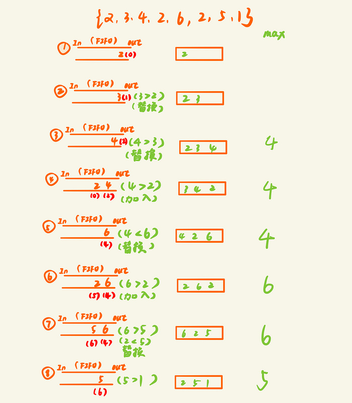

# [滑动窗口最大值](https://leetcode-cn.com/problems/sliding-window-maximum/)

### 信息卡片

- 时间： 2020-2-10
- 难度：困难
- 题目描述：

```
给定一个数组 nums，有一个大小为 k 的滑动窗口从数组的最左侧移动到数组的最右侧。你只可以看到在滑动窗口内的 k 个数字。滑动窗口每次只向右移动一位。

返回滑动窗口中的最大值。


示例:

输入: nums = [1,3,-1,-3,5,3,6,7], 和 k = 3
输出: [3,3,5,5,6,7] 
解释: 

  滑动窗口的位置                最大值
---------------               -----
[1  3  -1] -3  5  3  6  7       3
 1 [3  -1  -3] 5  3  6  7       3
 1  3 [-1  -3  5] 3  6  7       5
 1  3  -1 [-3  5  3] 6  7       5
 1  3  -1  -3 [5  3  6] 7       6
 1  3  -1  -3  5 [3  6  7]      7

 

提示：

你可以假设 k 总是有效的，在输入数组不为空的情况下，1 ≤ k ≤ 输入数组的大小。
```


### 参考答案

[博客](https://blog.csdn.net/u010429424/article/details/73692248)

借助一个辅助队列，从头遍历数组，根据如下规则进行入队列或出队列操作：

1. 如果队列为空，则当前数字入队列
2. 如果当前数字大于队列尾，则删除队列尾，直到当前数字小于等于队列尾，或者队列空，然后当前数字入队列
3. 如果当前数字小于队列尾，则当前数字入队列
4. 如果队列头超出滑动窗口范围，则删除队列头


**这样能始终保证队列头为当前的最大值，队列保存的是元素的下标，以此可以判断新进的元素和队列头元素是否在一个滑动窗口**





> 代码

```java
class Solution {
    public int[] maxSlidingWindow(int[] nums, int k) {
        if(nums==null || nums.length == 0)
            return new int[0];
        int[] a = new int[nums.length - k + 1];
        Deque<Integer> queue = new LinkedList<>();

        for (int i = 0; i < nums.length; i++) {
            //超出窗口范围的去掉
            if(!queue.isEmpty() && (i - queue.peekFirst()) >= k ){
                queue.pollFirst();
            }
			//  //如果当前值大于队列末的值，说明队列末这个值不可能是窗口最大值，删掉队列末值
            while(!queue.isEmpty() && nums[i] > nums[queue.peekLast()]){
                queue.pollLast();
            }
            queue.add(i);

			//将队列头元素加入res，因为队列头保存的始终是最大的窗口元素
            //假设size=3，必须保证遍历到i=2才能确定前三个中的最大值，所以要保证i>=size-1
            if(i >= k - 1){
                a[i - k + 1] = nums[queue.peekFirst()];
            }
        }
        return a;
    }

}
```


### 其他优秀解答

> 思路

大顶堆


> 代码

```java
    public int[] maxSlidingWindow(int[] nums, int k) {
        if(nums==null || nums.length == 0)
            return new int[0];
        int[] a = new int[nums.length - k + 1];
        PriorityQueue<Integer> queue = new PriorityQueue<>((o1,o2) -> o2 - o1);
        for (int i = 0; i < k; i++) {
            queue.add(nums[i]);
        }

        a[0] = queue.peek();

        for (int i = 0,j = i + k; j < nums.length; i++,j++) {
            queue.remove(nums[i]);
            queue.add(nums[j]);
            a[i+1] = queue.peek();
        }

        return a;
    }

```

