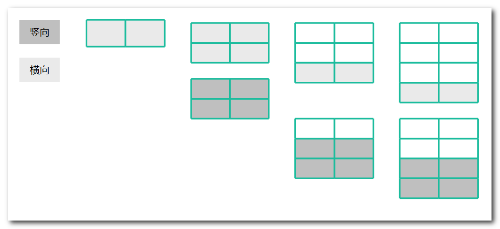

# 矩阵覆盖 

### 信息卡片 

- 时间： 2019-1-22
- 题目描述：

```
我们可以用2*1的小矩形横着或者竖着去覆盖更大的矩形。请问用n个2*1的小矩形无重叠地覆盖一个2*n的大矩形，总共有多少种方法？
```


### 参考答案

> 思路

* n = 1 的时候 ：

  只能横着覆盖，一种      

* n = 2 的时候：

   可以横着和竖着覆盖，两种     

* n = 3 的时候 ：

  第三级横着覆盖，用了一级，剩下 n = 2，有两种覆盖方法   

  第三级竖着覆盖，用了两级，剩下 n = 1，有一种覆盖方法   

  总共有 3 种      

* n = 4 的时候 ：

  第 4 级横着覆盖，用了一级，剩下 n = 3，有三种覆盖方法   

  第 4 级竖着覆盖，用了两级，剩下 n = 2，有两种覆盖方法   

总共有 5 种方法      

* n = n 的时候 ：

  第 n 级横着覆盖，用了一级，剩下 n = n - 1，所以关注第 n - 1 种有几种覆盖方法  

   第 n 级竖着覆盖，用了两级，剩下 n = n - 2，所以关注第 n - 2 种有几种覆盖方法   

  总和为两种情况的总和          

从 n = 1 到 n = 4 的示意图如下：  




所以回答上面的问题，涂掉最后一级矩阵的时候，可以选择使用横向完成，也可以使用竖向完成，横向涂剩下 n - 1 阶，竖向涂剩下 n - 2 阶  **,f(n) = f(n-1)+f(n-2)**

 关注 n - 1 与 n - 2 时的涂法有几种，这就是斐波那契数列.


> 代码-和跳台阶的代码一模一样

```js
public class Solution {
    public int JumpFloor(int target) {
        int sum = 0,a = 0,b = 1;
        for (int i = 0; i < target; i++) {
            sum = a + b;
            a = b;
            b = sum;
        }
        return sum;

    }
}
```


> 复杂度分析

时间复杂度：O(n)

空间复杂度：O(1)


### 其他优秀解答 

> 暂无


参考博客：https://blog.nowcoder.net/n/cd6309f586174fda98f8c9bdf2e2df07

