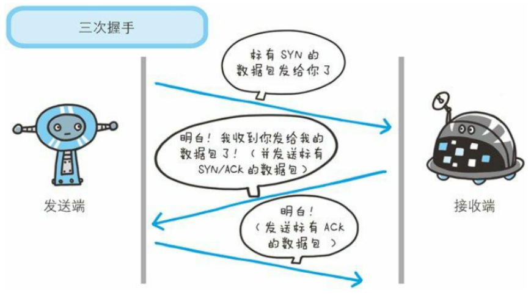

[知识点在这里][https://snailclimb.gitee.io/javaguide/#/docs/network/%E8%AE%A1%E7%AE%97%E6%9C%BA%E7%BD%91%E7%BB%9C]

# 1 OSI(七层模型)

OSI（Open System Interconnection，开放系统互连）七层网络模型称为开放式系统互联参考模型 ，是一个逻辑上的定义，一个规范，它把网络从逻辑上分为了7层。每一层都有相关、相对应的物理设备，比如路由器，交换机。OSI 七层模型是一种框架性的设计方法 ，建立七层模型的主要目的是为解决异种网络互连时所遇到的兼容性问题，其最主要的功能使就是帮助不同类型的主机实现数据传输。它的最大优点是将服务、接口和协议这三个概念明确地区分开来，通过七个层次化的结构模型使不同的系统不同的网络之间实现可靠的通讯。

 

**模型优点**

建立七层模型的主要目的是为解决异种网络互连时所遇到的兼容性问题。它的最大优点是将服务、接口和协议这三个概念明确地区分开来：服务说明某一层为上一层提供一些什么功能，接口说明上一层如何使用下层的服务，而协议涉及如何实现本层的服务；这样各层之间具有很强的独立性，互连网络中各实体采用什么样的协议是没有限制的，只要向上提供相同的服务并且不改变相邻层的接口就可以了。网络七层的划分也是为了使网络的不同功能模块（不同层次）分担起不同的职责，从而带来如下好处： 　　

- 减轻问题的复杂程度，一旦网络发生故障，可迅速定位故障所处层次，便于查找和纠错； 　　
- 在各层分别定义标准接口，使具备相同对等层的不同网络设备能实现互操作，各层之间则相对独立，一种高层协议可放在多种低层协议上运行； 　　
-  能有效刺激网络技术革新，因为每次更新都可以在小范围内进行，不需对整个网络动大手术； 　　
- 便于研究和教学。

# 2 物理层（Physical Layer）

O S I 模型的最低层或第一层，该层包括物理连网媒介，如电缆连线连接器。物理层的协议产生并检测电压以便发送和接收携带数据的信号。在你的[桌面](http://baike.baidu.com/view/79807.htm)P C 上插入[网络接口卡](http://baike.baidu.com/view/547393.htm)，你就建立了计算机连网的基础。换言之，你提供了一个物理层。尽管物理层不提供纠错服务，但它能够设定[数据传输速率](http://baike.baidu.com/view/434019.htm)并监测数据出错率。网络物理问题，如电线断开，将影响物理层。 　　用户要传递信息就要利用一些物理媒体，如双绞线、同轴电缆等，但具体的物理媒体并不在OSI的7层之内，有人把物理媒体当做第0层，物理层的任务就是为它的上一层提供一个物理连接，以及它们的机械、电气、功能和过程特性。如规定使用电缆和接头的类型、传送信号的电压等。在这一层，数据还没有被组织，仅作为原始的位流或电气电压处理，单位是bit比特。

# 2 数据链路层（Datalink Layer）

OSI模型的第二层，它控制[网络层](http://baike.baidu.com/view/239600.htm)与物理层之间的通信。它的主要功能是如何在不可靠的物理线路上进行数据的可靠传递。为了保证传输，从网络层接收到的数据被分割成特定的可被物理层传输的帧。帧是用来移动数据的结构包，它不仅包括原始数据，还包括发送方和接收方的物理地址以及检错和控制信息。其中的地址确定了帧将发送到何处，而纠错和控制信息则确保帧无差错到达。 如果在传送数据时，接收点检测到所传数据中有差错，就要通知发送方重发这一帧。 　　数据链路层的功能独立于网络和它的节点和所采用的物理层类型，它也不关心是否正在运行 Wo r d 、E x c e l 或使用I n t e r n e t 。有一些连接设备，如[交换机](http://baike.baidu.com/view/1077.htm)，由于它们要对帧解码并使用帧信息将数据发送到正确的接收方，所以它们是工作在数据链路层的。 　　数据链路层（DataLinkLayer):在物理层提供比特流服务的基础上，建立相邻结点之间的数据链路，通过差错控制提供数据帧（Frame）在信道上无差错的传输，并进行各电路上的动作系列。 　　数据链路层在不可靠的物理介质上提供可靠的传输。该层的作用包括：物理地址寻址、数据的[成帧](http://baike.baidu.com/view/3871125.htm)、流量控制、数据的检错、重发等。 　　数据链路层协议的代表包括：[SDLC](http://baike.baidu.com/view/206610.htm)、[HDLC](http://baike.baidu.com/view/89174.htm)、[PPP](http://baike.baidu.com/view/30514.htm)、[STP](http://baike.baidu.com/view/28816.htm)、[帧中继](http://baike.baidu.com/view/21773.htm)等。

# 3 网络层（Network Layer）

O S I 模型的第三层，其主要功能是将网络地址翻译成对应的物理地址，并决定如何将数据从发送方路由到接收方。 　　网络层通过综合考虑发送优先权、[网络拥塞](http://baike.baidu.com/view/1452069.htm)程度、服务质量以及可选路由的花费来决定从一个网络中节点A 到另一个网络中节点B 的最佳路径。由于网络层处理，并智能指导数据传送，[路由器](http://baike.baidu.com/view/1360.htm)连接网络各段，所以路由器属于网络层。在网络中，“路由”是基于编址方案、使用模式以及可达性来指引数据的发送。 　　网络层负责在源机器和目标机器之间建立它们所使用的路由。这一层本身没有任何错误检测和修正机制，因此，网络层必须依赖于端端之间的由D L L提供的可靠传输服务。 　　网络层用于本地L A N网段之上的[计算机系统](http://baike.baidu.com/view/1130583.htm)建立通信，它之所以可以这样做，是因为它有自己的路由地址结构，这种结构与第二层机器地址是分开的、独立的。这种协议称为路由或可路由协议。路由协议包括I P、N o v e l l公司的I P X以及A p p l e Ta l k协议。 　　网络层是可选的，它只用于当两个计算机系统处于不同的由路由器分割开的网段这种情况，或者当通信应用要求某种网络层或传输层提供的服务、特性或者能力时。例如，当两台主机处于同一个L A N网段的直接相连这种情况，它们之间的通信只使用L A N的通信机制就可以了(即OSI 参考模型的一二层)。

# 4 传输层（Transport Layer） 

O S I 模型中最重要的一层。传输协议同时进行流量控制或是基于接收方可接收数据的快慢程度规定适当的发送速率。除此之外，传输层按照网络能处理的最大尺寸将较长的数据包进行强制分割。例如，以太网无法接收大于1 5 0 0 字节的数据包。发送方节点的传输层将[数据分割](http://baike.baidu.com/view/4466818.htm)成较小的数据片，同时对每一数据片安排一序列号，以便数据到达接收方节点的传输层时，能以正确的顺序重组。该过程即被称为排序。 　　工作在传输层的一种服务是 T C P / I P 协议套中的T C P （[传输控制协议](http://baike.baidu.com/view/544903.htm)），另一项传输层服务是I P X / S P X 协议集的S P X （序列包交换）。

**运输层主要使用以下两种协议:**

1. **传输控制协议 TCP**（Transmission Control Protocol）--提供**面向连接**的，**可靠的**数据传输服务。
2. **用户数据协议 UDP**（User Datagram Protocol）--提供**无连接**的，尽最大努力的数据传输服务（**不保证数据传输的可靠性**）。

## 4.1 TCP

[博客][https://blog.csdn.net/qq_38950316/article/details/81087809]

### 4.1.1 首部

1. **源端口和目的端口**，各占2个字节，分别写入源端口和目的端口；
2. **序号**，占4个字节，TCP连接中传送的字节流中的每个字节都按顺序编号。例如，一段报文的序号字段值是 301 ，而携带的数据共有100字段，显然下一个报文段（如果还有的话）的数据序号应该从401开始；
3. **确认号**，占4个字节，是期望收到对方下一个报文的第一个数据字节的序号。例如，B收到了A发送过来的报文，其序列号字段是501，而数据长度是200字节，这表明B正确的收到了A发送的到序号700为止的数据。因此，B期望收到A的下一个数据序号是701，于是B在发送给A的确认报文段中把确认号置为701； 
4. **数据偏移**，占4位，它指出TCP报文的数据距离TCP报文段的起始处有多远；
5. **保留**，占6位，保留今后使用，但目前应都位0；
6. **紧急URG**，当URG=1，表明紧急指针字段有效。告诉系统此报文段中有紧急数据；
7. **确认ACK**，仅当ACK=1时，确认号字段才有效。TCP规定，在连接建立后所有报文的传输都必须把ACK置1；
8. **推送PSH**，当两个应用进程进行交互式通信时，有时在一端的应用进程希望在键入一个命令后立即就能收到对方的响应，这时候就将PSH=1；
9. **复位RST，**当RST=1，表明TCP连接中出现严重差错，必须释放连接，然后再重新建立连接；
10. **同步SYN，**在连接建立时用来同步序号。当SYN=1，ACK=0，表明是连接请求报文，若同意连接，则响应报文中应该使SYN=1，ACK=1；
11. **终止FIN**，用来释放连接。当FIN=1，表明此报文的发送方的数据已经发送完毕，并且要求释放；
12. **窗口**，占2字节，指的是通知接收方，发送本报文你需要有多大的空间来接受；
13. **检验和**，占2字节，校验首部和数据这两部分；
14. **紧急指针**，占2字节，指出本报文段中的紧急数据的字节数；
15. **选项，**长度可变，定义一些其他的可选的参数。

### 4.1.2 三次握手

**三次握手的目的是建立可靠的通信信道，说到通讯，简单来说就是数据的发送与接收，而三次握手最主要的目的就是双方确认自己与对方的发送与接收是正常的。**

第一次握手：Client 什么都不能确认；Server 确认了对方发送正常，自己接收正常

第二次握手：Client 确认了：自己发送、接收正常，对方发送、接收正常；Server 确认了：对方发送正常，自己接收正常

第三次握手：Client 确认了：自己发送、接收正常，对方发送、接收正常；Server 确认了：自己发送、接收正常，对方发送、接收正常

所以三次握手就能确认双发收发功能都正常，缺一不可。

## 4.2 UDP

# 5 会话层（Session Layer）

负责在网络中的两节点之间建立、维持和终止通信。 会话层的功能包括：建立通信链接，保持会话过程通信链接的畅通，同步两个节点之间的对话，决定通信是否被中断以及通信中断时决定从何处重新发送。 　　你可能常常听到有人把会话层称作网络通信的“交通警察”。当通过拨号向你的 ISP （[因特网服务提供商](http://baike.baidu.com/view/275701.htm)）请求连接到因特网时，ISP 服务器上的会话层向你与你的 PC 客户机上的会话层进行协商连接。若你的电话线偶然从墙上插孔脱落时，你终端机上的会话层将检测到连接中断并重新发起连接。会话层通过决定节点通信的优先级和通信时间的长短来设置通信期限

# 6 表示层（Presentation Layer）

应用程序和网络之间的翻译官，在表示层，数据将按照网络能理解的方案进行格式化；这种格式化也因所使用网络的类型不同而不同。 　　表示层管理数据的解密与加密，如系统口令的处理。例如：在 Internet上查询你银行账户，使用的即是一种安全连接。你的账户数据在发送前被加密，在网络的另一端，表示层将对接收到的数据解密。除此之外，表示层协议还对图片和[文件格式](http://baike.baidu.com/view/1066926.htm)信息进行解码和编码。

# 7 应用层（Application Layer） 

应用层也称为[应用实体](http://baike.baidu.com/view/3456117.htm)（AE），它由若干个特定应用服务元素（SASE）和一个或多个公用应用服务元素（CASE）组成。每个SASE提供特定的应用服务，例如文件运输访问和管理（FTAM）、电子文电处理（MHS）、[虚拟终端](http://baike.baidu.com/view/694267.htm)协议（VAP）等。CASE提供一组公用的应用服务，例如联系控制服务元素（ACSE）、可靠运输服务元素（RTSE）和远程操作服务元素（ROSE）等。主要负责对[软件](http://baike.baidu.com/view/37.htm)提供接口以使程序能使用网络服务。术语“应用层”并不是指运行在网络上的某个特别应用程序 ，应用层提供的服务包括[文件传输](http://baike.baidu.com/view/543341.htm)、文件管理以及[电子邮件](http://baike.baidu.com/view/1524.htm)的信息处理。

## 7.1 域名系统DNS

我们都知道，TCP/IP中使用的是IP地址和端口号来确定网络上某一台主机上的某一个程序，不免有人有疑问，为什么不用域名来直接进行通信呢？

1. 因为IP地址是固定长度的，IPv4是32位，IPv6是128位，而域名是变长的，不便于计算机处理。
2. IP地址对于用户来说不方便记忆，但域名便于用户使用，例如www.baidu.com这是百度的域名。
  总结一点就是IP地址是面向主机的，而域名则是面向用户的。
  

### 7.1.1 域名结构

域名系统必须要保持唯一性。
为了达到唯一性的目的，因特网在命名的时候采用了层次结构的命名方法：

1. 每一个域名（本文只讨论英文域名）都是一个标号序列（labels），用字母（A-Z，a-z，大小写等价）、数字（0-9）和连接符（-）组成
2. 标号序列总长度不能超过255个字符，它由点号分割成一个个的标号（label）
3. 每个标号应该在63个字符之内，每个标号都可以看成一个层次的域名。
4. 级别最低的域名写在左边，级别最高的域名写在右边。

  **域名服务主要是基于UDP实现的，服务器的端口号为53。**
  

### 7.1.2 域名分级

其中顶级域名分为：国家顶级域名、通用顶级域名、反向域名。

| 国家顶级域名 | 中国:cn， 美国:us，英国uk…                                   |
| ------------ | ------------------------------------------------------------ |
| 通用顶级域名 | com公司企业，edu教育机构，gov政府部门，int国际组织，mil军事部门 ，net网络，org非盈利组织… |
| 反向域名     | arpa，用于PTR查询（IP地址转换为域名）                        |

### 7.1.3 域名服务器

域名需要由遍及全世界的域名服务器去解析，域名服务器实际上就是装有域名系统的主机。由高向低进行层次划分，可分为以下几大类：

- 根域名服务器：    最高层次的域名服务器，也是最重要的域名服务器，本地域名服务器如果解析不了域名就会向根域名服务器求助。由于每分钟都要解析的名称数量多得令人难以置信，所以实际上每个根服务器都有镜像服务器，**每个根服务器与它的镜像服务器共享同一个  IP 地址，**当你对某个根服务器发出请求时，请求会被路由到该根服务器离你最近的镜像服务器。所有的根域名服务器都知道所有的顶级域名服务器的域名和地址，如果向根服务器发出对 `“jocent.me”` 的请求，则根服务器是不能在它的记录文件中找到与` “jocent.me”` 匹配的记录。但是它会找到 `“me”` 的顶级域名记录，并把负责` “me”` 地址的顶级域名服务器的地址发回给请求者。
- 顶级域名服务器：负责管理在该顶级域名服务器下注册的二级域名。当根域名服务器告诉查询者顶级域名服务器地址时，查询者紧接着就会到顶级域名服务器进行查询。比如还是查询`"jocent.me"`，根域名服务器已经告诉了查询者`“me”`顶级域名服务器的地址，`“me”`顶级域名服务器会找到 `“jocent.me”`的域名服务器的记录，域名服务器检查其区域文件，并发现它有与 `“jocent.me”` 相关联的区域文件。在此文件的内部，有该主机的记录。此记录说明此主机所在的 IP 地址，并向请求者返回最终答案。
- 权限域名服务器：负责一个区的域名解析工作
- 本地域名服务器：当一个主机发出DNS查询请求的时候，这个查询请求首先就是发给本地域名服务器的。

### 7.1.4 域名解析过程

1. 主机先向本地域名服务器进行递归查询
2. 本地域名服务器采用迭代查询，向一个根域名服务器进行查询
3. 根域名服务器告诉本地域名服务器，下一次应该查询的顶级域名服务器的IP地址
4. 本地域名服务器向顶级域名服务器进行查询
5. 顶级域名服务器告诉本地域名服务器，下一步查询权限服务器的IP地址
6. 本地域名服务器向权限服务器进行查询
7. 权限服务器告诉本地域名服务器所查询的主机的IP地址
8. 本地域名服务器最后把查询结果告诉主机 
  

## 7.2 HTTP协议

[博客1][https://blog.csdn.net/a19881029/article/details/14002273]

[博客2][https://www.cnblogs.com/EricaMIN1987_IT/p/3837436.html]

##### 7.2.1 概念

协议是指计算机通信网络中两台计算机之间进行通信所必须共同遵守的规定或规则，超文本传输协议(HTTP)是一种通信协议，它允许将超文本标记语言(HTML)文档从Web服务器传送到客户端的浏览器。 

HTTP是一个应用层协议，由请求和响应构成，是一个标准的客户端服务器模型。HTTP是一个无状态的协议。 

在Internet中所有的传输都是通过TCP/IP进行的。HTTP协议作为TCP/IP模型中应用层的协议也不例外。HTTP协议通常承载于TCP协议之上，有时也承载于TLS或SSL协议层之上，这个时候，就成了我们常说的HTTPS。如下图所示：

 

HTTP默认的端口号为80，HTTPS的端口号为443。 

浏览网页是HTTP的主要应用，但是这并不代表HTTP就只能应用于网页的浏览。HTTP是一种协议，只要通信的双方都遵守这个协议，HTTP就能有用武之地。比如咱们常用的QQ，迅雷这些软件，都会使用HTTP协议(还包括其他的协议)。

 

##### 7.2.2 特点

1.支持客户/服务器模式。

2.简单快速：客户向服务器请求服务时，只需传送请求方法和路径。请求方法常用的有GET、HEAD、POST。每种方法规定了客户与服务器联系的类型不同。由于HTTP协议简单，使得HTTP服务器的程序规模小，因而通信速度很快。

3.灵活：HTTP允许传输任意类型的数据对象。正在传输的类型由Content-Type（Content-Type是HTTP包中用来表示内容类型的标识）加以标记。

4.无连接：每次请求一次，释放一次连接。所以无连接表示每次连接只能处理一个请求。优点就是节省传输时间，实现简单。我们有时称这种无连接为短连接。对应的就有了长链接，长连接专门解决效率问题。当建立好了一个连接之后，可以多次请求。但是缺点就是容易造成占用资源不释放的问题。当HTTP协议头部中字段Connection：keep-alive表示支持长链接。

5.无状态：HTTP协议是无状态协议。无状态是指协议对于事务处理没有记忆能力。缺少状态意味着如果后续处理需要前面的信息，则它必须重传，这样可能导致每次连接传送的数据量增大。另一方面，在服务器不需要先前信息时它的应答就较快。为了解决HTTP协议无状态，于是，两种用于保持HTTP连接状态的技术就应运而生了，一个是Cookie，而另一个则是Session。

##### 7.2.3 Connection: keep-alive

无状态是指协议对于事务处理没有记忆能力，服务器不知道客户端是什么状态。从另一方面讲，打开一个服务器上的网页和你之前打开这个服务器上的网页之间没有任何联系。

从HTTP/1.1起，默认都开启了Keep-Alive，保持连接特性，简单地说，当一个网页打开完成后，客户端和服务器之间用于传输HTTP数据的TCP连接不会关闭，如果客户端再次访问这个服务器上的网页，会继续使用这一条已经建立的连接。

Keep-Alive不会永久保持连接，它有一个保持时间，可以在不同的服务器软件（如Apache）中设定这个时间。

 

 

##### 7.2.4 工作流程

一次HTTP操作称为一个事务，其工作过程可分为四步：

1. 首先客户机与服务器需要建立连接。只要单击某个超级链接，HTTP的工作开始。
2. 建立连接后，客户机发送一个请求给服务器，请求方式的格式为：统一资源标识符（URL）、协议版本号，后边是MIME信息包括请求修饰符、客户机信息和可能的内容。
3. 服务器接到请求后，给予相应的响应信息，其格式为一个状态行，包括信息的协议版本号、一个成功或错误的代码，后边是MIME信息包括服务器信息、实体信息和可能的内容。
4. 客户端接收服务器所返回的信息通过浏览器显示在用户的显示屏上，然后客户机与服务器断开连接。

如果在以上过程中的某一步出现错误，那么产生错误的信息将返回到客户端，有显示屏输出。

**HTTP是基于传输层的TCP协议，所以HTTP在开始传输之前，首先需要建立TCP连接，而TCP连接的过程需要所谓的三次握手和四次挥手。**

**在TCP三次握手之后，建立了TCP连接，此时HTTP就可以进行传输了。一个重要的概念是面向连接，既HTTP在传输完成之间并不断开TCP连接。在HTTP1.1中(通过Connection头设置)这是默认行为。**

 

##### 7.2.5 HTTP请求报文格式

HTTP请求报文主要由请求行、请求头部、请求正文3部分组成。

**1.请求行**

| 组成部分(之间由空格分隔) | 内容                                                         |
| ------------------------ | ------------------------------------------------------------ |
| 请求方法                 | 包括GET、HEAD、PUT、POST、TRACE、OPTIONS、DELETE以及扩展方法 当然并不是所有的服务器都实现了所有的方法，部分方法即便支持，处于安全性的考虑也是不可用的 |
| URL                      | ---                                                          |
| 以及协议版本             | HTTP/主版本号.次版本号，常用的有HTTP/1.0和HTTP/1.1           |

**2.请求头部**

请求头部为请求报文添加了一些附加信息，由“名/值”对组成，每行一对，名和值之间使用冒号分隔

常见请求头如下：

请求头部的最后会有一个空行，表示请求头部结束，接下来为请求正文，这一行非常重要，必不可少 

**3.请求正文**

可选部分，比如GET请求就没有请求正文

##### 7.2.6 HTTP响应报文格式

HTTP响应报文主要由状态行、响应头部、响应正文3部分组成

**1.状态行**

由3部分组成，分别为：协议版本，状态码，状态码描述，之间由空格分隔。

| 状态代码 | 含义                               |
| -------- | ---------------------------------- |
| 1xx      | HTTP/1.1向协议中引入了信息性状态码 |
| 2xx      | 表示成功                           |
| 3xx      | 指资源重定向                       |
| 4xx      | 指客户端请求出错                   |
| 5xx      | 指服务端出错                       |

这里列举几个常见的：

**2.响应头部**

与请求头部类似，为响应报文添加了一些附加信息

常见响应头部如下：

##### 7.3 STMP协议

[博客][https://blog.csdn.net/qq_35644234/article/details/68961603]

**SMTP协议** 

# 8 总结

| OSI七层模型 | 功能                                                         | 对应的网络协议                                               | TCP/IP四层概念模型 |
| ----------- | ------------------------------------------------------------ | ------------------------------------------------------------ | ------------------ |
| 应用层      | 是最靠近用户的OSI层。这一层为用户的应用程序（例如电子邮件、文件传输和终端仿真）提供网络服务。 | HTTP、TFTP, FTP, NFS, WAIS、SMTP                             | 应用层             |
| 表示层      | 可确保一个系统的应用层所发送的信息可以被另一个系统的应用层读取。例如，PC程序与另一台计算机进行通信，其中一台计算机使用扩展二一十进制交换码（EBCDIC），而另一台则使用美国信息交换标准码（ASCII）来表示相同的字符。如有必要，表示层会通过使用一种通格式来实现多种数据格式之间的转换。 | Telnet, Rlogin, SNMP, Gopher                                 |                    |
| 会话层      | 通过传输层（端口号：传输端口与接收端口）建立数据传输的通路。主要在你的系统之间发起会话或者接受会话请求（设备之间需要互相认识可以是IP也可以是MAC或者是主机名） | SMTP, DNS                                                    |                    |
| 传输层      | 定义了一些传输数据的协议和端口号（WWW端口80等），如：TCP（传输控制协议，传输效率低，可靠性强，用于传输可靠性要求高，数据量大的数据），UDP（[用户数据报协议](http://baike.baidu.com/view/468464.htm)，与TCP特性恰恰相反，用于传输可靠性要求不高，数据量小的数据，如QQ聊天数据就是通过这种方式传输的）。 主要是将从下层接收的数据进行分段和传输，到达目的地址后再进行重组。常常把这一层数据叫做段。 | TCP, UDP                                                     | 传输层             |
| 网络层      | 在位于不同地理位置的网络中的两个主机系统之间提供连接和路径选择。Internet的发展使得从世界各站点访问信息的用户数大大增加，而网络层正是管理这种连接的层。 | IP, ICMP, ARP, RARP, AKP, UUCP                               | 网络层             |
| 数据链路层  | 定义了如何让格式化数据以进行传输，以及如何让控制对物理介质的访问。这一层通常还提供错误检测和纠正，以确保数据的可靠传输。 | FDDI, Ethernet, Arpanet, PDN,  SLIP, PPP，STP。HDLC,SDLC,帧中继 | 数据链路层         |
| 物理层      | 主要定义物理设备标准，如网线的接口类型、光纤的接口类型、各种传输介质的传输速率等。它的主要作用是传输比特流（就是由1、0转化为电流强弱来进行传输,到达目的地后在转化为1、0，也就是我们常说的数模转换与模数转换）。这一层的数据叫做比特。 | IEEE 802.1A, IEEE 802.2到IEEE  802.                          |                    |

[博客][https://blog.csdn.net/superjunjin/article/details/7841099]