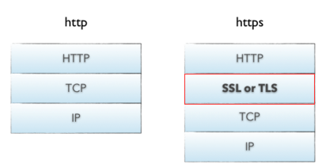
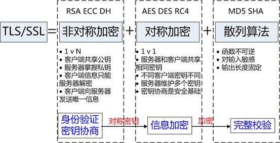

# 1 单点登录

[博客](https://www.jianshu.com/p/613e44d4a464)

单点登录SSO（Single Sign  On），也就是用户的一次登录能得到其他所有系统的信任。

### 1.1 以Cookie作为凭证媒介

 最简单的单点登录实现方式，是使用cookie作为媒介，存放用户凭证。 
 用户登录父应用之后，应用返回一个加密的cookie，当用户访问子应用的时候，携带上这个cookie，授权应用解密cookie并进行校验，校验通过则登录当前用户。

不难发现以上方式把信任存储在客户端的Cookie中，这种方式很容易令人质疑：

- Cookie不安全
- 不能跨域实现免登

对于第一个问题，通过加密Cookie可以保证安全性，当然这是在源代码不泄露的前提下。如果Cookie的加密算法泄露，攻击者通过伪造Cookie则可以伪造特定用户身份，这是很危险的。 
 对于第二个问题，更是硬伤。

### 2 通过JSONP实现

 对于跨域问题，可以使用JSONP实现。 

这种方式虽然能解决跨域问题，但是安全性其实跟把信任存储到Cookie是差不多的。

##### 3.1 jsonp实现原理

动态添加一个<script>标签，script标签的src属性是没有跨域的限制的。 

### 3 通过页面重定向的方式 

 父应用提供一个GET方式的登录接口，用户通过子应用重定向连接的方式访问这个接口，如果用户还没有登录，则返回一个的登录页面，用户输入账号密码进行登录。如果用户已经登录了，则生成加密的Token，并且重定向到子应用提供的验证Token的接口，通过解密和校验之后，子应用登录当前用户。

这种方式较前面两种方式，接解决了上面两种方法暴露出来的安全性问题和跨域的问题，但是并没有前面两种方式方便。 
 安全与方便，本来就是一对矛盾。

### 4 使用独立登录系统 

 一般说来，大型应用会把授权的逻辑与用户信息的相关逻辑独立成一个应用，称为用户中心。 
 用户中心不处理业务逻辑，只是处理用户信息的管理以及授权给第三方应用。第三方应用需要登录的时候，则把用户的登录请求转发给用户中心进行处理，用户处理完毕返回凭证，第三方应用验证凭证，通过后就登录用户。

要点：

token是识别客户端身份的唯一标示，如果加密不够严密，被人伪造那就完蛋了。

采用何种方式加密才是安全可靠的呢？

可以采用`JWT + RSA非对称加密`

### 4.1 jwt

包括Header，Payload，Signature三部分。

流程：

- 1、用户登录
- 2、服务的认证，通过后根据secret生成token
- 3、将生成的token返回给浏览器
- 4、用户每次请求携带token
- 5、服务端利用公钥解读jwt签名，判断签名有效后，从Payload中获取用户信息
- 6、处理请求，返回响应结果

因为JWT签发的token中已经包含了用户的身份信息，并且每次请求都会携带，这样服务的就无需保存用户信息，甚至无需去数据库查询，完全符合了Rest的无状态规范。

### 4.2 RSA

结合RSA的认证流程：

- 我们首先利用RSA生成公钥和私钥。私钥保存在授权中心，公钥保存在Zuul和各个信任的微服务
- 用户请求登录
- 授权中心校验，通过后用私钥对JWT的token进行签名加密
- 返回jwt给用户
- 用户携带JWT访问
- Zuul直接通过公钥解密JWT，进行验证，验证通过则放行
- 请求到达微服务，微服务直接用公钥解析JWT，获取用户信息，无需访问授权中心

# 2 HTTP是不保存状态的协议,如何保存用户状态

Cookie 和 Session都是用来跟踪浏览器用户身份的会话方式，但是两者的应用场景不太一样。

### 2.1 cookie

Cookie 一般用来保存用户信息 比如：

1. 一般的网站都会有保持登录也就是说下次你再访问网站的时候就不需要重新登录了，这是因为用户登录的时候我们可以存放了一个  Token 在 Cookie 中，下次登录的时候只需要根据 Token 值来查找用户即可(为了安全考虑，重新登录一般要将 Token  重写)；
2. 登录一次网站后访问网站其他页面不需要重新登录。

### 2.2 session

Session 的主要作用就是通过服务端记录用户的状态（session的本质就是cookie）,大部分情况下，我们都是通过在 Cookie 中附加一个 Session ID 来方式来跟踪。 

典型的场景是购物车，当你要添加商品到购物车的时候，系统不知道是哪个用户操作的，因为 HTTP 协议是无状态的。服务端给特定的用户创建特定的 Session 之后就可以标识这个用户并且跟踪这个用户了。

### 2.3  区别

1. cookie是存在于客户端的，而session是存在于服务器端的。因此cookie是可以关闭的，而session由于是存在于服务器端，所以是无法禁用关闭的，无论cookie工作与否，session都能正常工作。
2. 在存储的数据方面，session能够存储任意的java对象，而cookie只能存储string类型的对象。
3. cookie的存储限制了数据量，只允许4KB，而session是无限量的 
4. Cookie 存储在客户端中，而Session存储在服务器上，相对来说 Session 安全性更高。如果要在 Cookie 中存储一些敏感信息，不要直接写入 Cookie 中，最好能将 Cookie 信息加密然后使用到的时候再去服务器端解密。

### 2.4 如果单点登录Cookie 被禁用怎么办

单点登录的原理是后端生成一个 session ID，然后设置到 cookie，后面的所有请求浏览器都会带上 cookie，  然后服务端从 cookie 里获取 session ID，再查询到用户信息。所以，保持登录的关键不是 cookie，而是通过  cookie 保存和传输的 session ID，其本质是能获取用户信息的数据。除了 cookie，还通常使用 HTTP 请求头来传  输。但是这个请求头浏览器不会像 cookie 一样自动携带，需要手工处理。 

最常用的就是利用 URL 重写把 Session ID 直接附加在URL路径的后面。 

# 3 URI和URL的区别

* URI = Universal Resource Identifier 统一资源标志符，用来标识抽象或物理资源的一个紧凑字符串。
* URL = Universal Resource Locator 统一资源定位符，一种定位资源的主要访问机制的字符串，一个标准的URL必须包括：protocol、host、port、path、parameter、anchor。
* URN = Universal Resource Name 统一资源名称，通过特定命名空间中的唯一名称或ID来标识资源。

URI和URL都定义了资源是什么，但URL还定义了该如何访问资源。 URL是一种具体的URI，它是URI的一个子集，它不仅唯一标识资源，而且还提供了定位该资源的信息。URI 是一种语义上的抽象概念，可以是绝对的，也可以是相对的，而URL则必须提供足够的信息来定位，是绝对的。 

**示例：**

request.getRequestURI() 返回值类似：/xuejava/requestdemo.jsp  

 request.getRequestURL() 返回值类似：<http://localhost:8080/xuejava/requestdemo.jsp> 

**所以说URI更像一个人的名片，而URL是这个人的名片+地址。**

# 4 HTTPS 

[][https://blog.csdn.net/hherima/article/details/52469267]

[HTTPS协议详解(一)：HTTPS基础知识](http://blog.csdn.net/hherima/article/details/52469267)  

[HTTPS协议详解(二)：TLS/SSL工作原理](http://blog.csdn.net/hherima/article/details/52469360) 

[HTTPS协议详解(四)：TLS/SSL握手过程](http://blog.csdn.net/hherima/article/details/52469674)

[HTTPS协议详解(五)：HTTPS性能与优化](http://blog.csdn.net/hherima/article/details/52469787) 

## 4.1 基础知识

TLS/SSL全称安全传输层协议Transport Layer Security, 是介于TCP和HTTP之间的一层安全协议，不影响原有的TCP协议和HTTP协议，所以使用HTTPS基本上不需要对HTTP页面进行太多的改造。

##### 4.1.1 什么是HTTPS

HTTPS是在HTTP上建立SSL加密层，并对传输数据进行加密，是HTTP协议的安全版。HTTPS主要作用是：
（1）对数据进行加密，并建立一个信息安全通道，来保证传输过程中的数据安全;
（2）对网站服务器进行真实身份认证。

##### 4.1.2 什么是HTTP

​    HTTP是互联网上应用最为广泛的一种网络协议，是一个客户端和服务器端请求和应答的标准(TCP)，用于从WWW服务器传输超文本到本地浏览器的传输协议。HTTP是采用明文形式进行数据传输，极易被不法份子窃取和篡改。

##### 4.1.3 HTTPS和HTTP的区别是什么

1. HTTPS是加密传输协议，HTTP是明文传输协议;
2. HTTPS需要用到SSL证书，而HTTP不用;
3. HTTPS比HTTP更加安全，对搜索引擎更友好，利于SEO【参考：（1）为保护用户隐私安全,谷歌优先索引HTTPS网页、（2）百度开放收录https站点，https全网化势不可挡】;
4. HTTPS标准端口443，HTTP标准端口80;
5.  HTTPS基于传输层，HTTP基于应用层;
6.  HTTPS在浏览器显示绿色安全锁，HTTP没有显示;

​    总的来说HTTPS比HTTP更加安全，能够有效的保护网站用户的隐私信息安全，这也是为什么现在的HTTPS网站越来越多。

## 4.2 TLS/SSL工作原理

[博客](https://www.cnblogs.com/chenming-1998/p/11776204.html)

TLS/SSL的功能实现主要依赖于三类基本算法：散列函数 Hash、对称加密和非对称加密，其利用非对称加密实现身份认证和密钥协商，对称加密算法采用协商的密钥对数据加密，基于散列函数验证信息的完整性。   

**散列函数Hash**

​    常见的有 MD5、SHA1、SHA256，该类函数特点是函数单向不可逆、对输入非常敏感、输出长度固定，针对数据的任何修改都会改变散列函数的结果，用于防止信息篡改并验证数据的完整性;
    在信息传输过程中，散列函数不能单独实现信息防篡改，因为明文传输，中间人可以修改信息之后重新计算信息摘要，因此需要对传输的信息以及信息摘要进行加密;

**对称加密**

​    常见的有 AES-CBC、DES、3DES、AES-GCM等，相同的密钥可以用于信息的加密和解密，掌握密钥才能获取信息，能够防止信息窃听，通信方式是1对1;
    对称加密的优势是信息传输1对1，需要共享相同的密码，密码的安全是保证信息安全的基础，服务器和 N 个客户端通信，需要维持 N 个密码记录，且缺少修改密码的机制;

 **非对称加密**

​    即常见的 RSA 算法，还包括 ECC、DH 等算法，算法特点是，密钥成对出现，一般称为公钥(公开)和私钥(保密)，公钥加密的信息只能私钥解开，私钥加密的信息只能公钥解开。因此掌握公钥的不同客户端之间不能互相解密信息，只能和掌握私钥的服务器进行加密通信，服务器可以实现1对多的通信，客户端也可以用来验证掌握私钥的服务器身份。
    非对称加密的特点是信息传输1对多，服务器只需要维持一个私钥就能够和多个客户端进行加密通信，但服务器发出的信息能够被所有的客户端解密，且该算法的计算复杂，加密速度慢。
    结合三类算法的特点，TLS的基本工作方式是，客户端使用非对称加密与服务器进行通信，实现身份验证并协商对称加密使用的密钥，然后对称加密算法采用协商密钥对信息以及信息摘要进行加密通信，不同的节点之间采用的对称密钥不同，从而可以保证信息只能通信双方获取

## 4.3 CA证书的申请及其使用过程

上面客户端使用HTTPS与服务器通信中使用到了CA认证，这里可能大家会问为什么不直接使用非对称加密的形式直接进行.

非对称加密的优点：

非对称加密采用公有密匙和私有密匙的方式，解决了http中消息保密性问题，而且使得私有密匙泄露的风险降低。

因为公匙加密的消息只有对应的私匙才能解开，所以较大程度上保证了消息的来源性以及消息的准确性和完整性。

非对称加密的缺点：

非对称加密时需要使用到接收方的公匙对消息进行加密，但是公匙不是保密的，任何人都可以拿到，中间人也可以。那么中间人可以做两件事，第一件是中间人可以在客户端与服务器交换公匙的时候，将客户端的公匙替换成自己的。这样服务器拿到的公匙将不是客户端的，而是中间人的。服务器也无法判断公匙来源的正确性。第二件是中间人可以不替换公匙，但是他可以截获客户端发来的消息，然后篡改，然后用服务器的公匙加密再发往服务器，服务器将收到错误的消息。

非对称加密的性能相对对称加密来说会慢上几倍甚至几百倍，比较消耗系统资源。正是因为如此，https将两种加密结合了起来。

**为了应对上面非对称加密带来的问题，我们就引入了数字证书与数字签名:**

故CA认证介入我们的HTTPS连接的过程如下：

1、服务器拥有自己的私钥与公钥

2、服务器将公钥交给CA认证机构，请求给予一份数字证书

3、CA认证机构生成数字证书，并颁发给服务器

4、服务器将带有公钥信息的数字证书发给客户端

5、进入客户端生成对称密钥再进行对接的过程......

## 4.4 TLS/SSL握手过程

SSL：（Secure Socket Layer，安全套接字层），位于可靠的面向连接的网络层协议和应用层协议之间的一种协议层。SSL通过互相认证、使用数字签名确保完整性、使用加密确保私密性，以实现客户端和服务器之间的安全通讯。该协议由两层组成：SSL记录协议和SSL握手协议。

TLS：(Transport Layer Security，传输层安全协议)，用于两个应用程序之间提供保密性和数据完整性。该协议由两层组成：TLS记录协议和TLS握手协议。

## 4.5 HTTPS性能与优化

https缺点:

（1）HTTPS协议握手阶段比较费时，会使页面的加载时间延长近50%，增加10%到20%的耗电；

（2）HTTPS连接缓存不如HTTP高效，会增加数据开销和功耗，甚至已有的安全措施也会因此而受到影响；

（3）SSL证书需要钱，功能越强大的证书费用越高，个人网站、小网站没有必要一般不会用。

（4）SSL证书通常需要绑定IP，不能在同一IP上绑定多个域名，IPv4资源不可能支撑这个消耗。

（5）HTTPS协议的加密范围也比较有限，在黑客攻击、拒绝服务攻击、服务器劫持等方面几乎起不到什么作用。最关键的，SSL证书的信用链体系并不安全，特别是在某些国家可以控制CA根证书的情况下，中间人攻击一样可行。

>  见博客

# 5 HTTP长连接和短连接

[博客](https://www.cnblogs.com/gotodsp/p/6366163.html)

## 5.1 HTTP协议与TCP/IP协议的关系

HTTP的长连接和短连接本质上是TCP长连接和短连接。HTTP属于应用层协议，在传输层使用TCP协议，在网络层使用IP协议。  IP协议主要解决网络路由和寻址问题，TCP协议主要解决如何在IP层之上可靠地传递数据包，使得网络上接收端收到发送端所发出的所有包，并且顺序与发送顺序一致。TCP协议是可靠的、面向连接的。

## 5.2 什么是长连接、短连接？

在HTTP/1.0中默认使用短连接。也就是说，客户端和服务器每进行一次HTTP操作，就建立一次连接，任务结束就中断连接。当客户端浏览器访问的某个HTML或其他类型的Web页中包含有其他的Web资源（如JavaScript文件、图像文件、CSS文件等），每遇到这样一个Web资源，浏览器就会重新建立一个HTTP会话。

而从HTTP/1.1起，默认使用长连接，用以保持连接特性。使用长连接的HTTP协议，会在响应头加入这行代码：

> Connection:keep-alive

在使用长连接的情况下，当一个网页打开完成后，客户端和服务器之间用于传输HTTP数据的TCP连接不会关闭，客户端再次访问这个服务器时，会继续使用这一条已经建立的连接。Keep-Alive不会永久保持连接，它有一个保持时间，可以在不同的服务器软件（如Apache）中设定这个时间。实现长连接需要客户端和服务端都支持长连接。

## 5.3 长连接和短连接的优点和缺点

**长连接：**

- 优点：可以省去较多的TCP建立和关闭的操作，减少浪费，节约时间。对于频繁请求资源的客户端适合使用长连接。
- 缺点：在长连接的应用场景下，client端一般不会主动关闭连接，当client与server之间的连接一直不关闭，随着客户端连接越来越多，server会保持过多连接。这时候server端需要采取一些策略，如关闭一些长时间没有请求发生的连接，这样可以避免一些恶意连接导致server端服务受损；如果条件允许则可以限制每个客户端的最大长连接数，这样可以完全避免恶意的客户端拖垮整体后端服务。

**短连接：**

- 优点：对于服务器来说管理较为简单，存在的连接都是有用的连接，不需要额外的控制手段。
- 缺点：每个TCP连接都需要三步握手，这需要时间，如果每个操作都是先连接，再操作的话那么处理速度会降低很多。如果客户请求频繁，将在TCP的建立和关闭操作上浪费较多时间和带宽。

## 5.4 应用场景

**长连接**多用于操作频繁，点对点的通讯，而且连接数不能太多情况。例如：数据库的连接用长连接，  如果用短连接频繁的通信会造成socket错误，而且频繁的socket 创建也是对资源的浪费。 

**短链接**：一般用于像WEB网站的http服务，因为长连接对于服务端来说会耗费一定的资源，而像WEB网站这么频繁的成千上万甚至上亿客户端的连接用短连接会更省一些资源，如果用长连接，而且同时有成千上万的用户，如果每个用户都占用一个连接的话，那可想而知吧。所以并发量大，但每个用户无需频繁操作情况下需用短连好。

# 6 HTTP 1.0和HTTP 1.1的主要区别

HTTP1.1也是当前使用最为广泛的HTTP协议。 主要区别主要体现在：

1. **长连接** : **在HTTP/1.0中，默认使用的是短连接**，也就是说每次请求都要重新建立一次连接。HTTP 是基于TCP/IP协议的,每一次建立或者断开连接都需要三次握手四次挥手的开销，如果每次请求都要这样的话，开销会比较大。因此最好能维持一个长连接，可以用个长连接来发多个请求。**HTTP 1.1起，默认使用长连接** ,默认开启Connection： keep-alive。 **HTTP/1.1的持续连接有非流水线方式和流水线方式** 。流水线方式是客户在收到HTTP的响应报文之前就能接着发送新的请求报文。与之相对应的非流水线方式是客户在收到前一个响应后才能发送下一个请求。
2. **http1.1使用多个TCP链接**：

浏览器的开发时不会这么笨，浏览器允许我们打开N个TCP链接（大多说浏览器是6个TCP链接，这个数字越大，客户端和服务器的资源占用越多，这个数据也只是感觉安全的数字而已）。
带来的好处：

1. 客户端可以并行发送最多 N个请求；
2. 服务器可以并行处理最多 N个请求；
3. 第一次往返可以发送的累计分组数量（TCP cwnd）增长为原来的 N 倍。
  代价：
  1.更多的套接字会占用客户端、服务器以及代理的资源，包括内存缓冲区和 CPU时钟周期；
  2.并行 TCP 流之间竞争共享的带宽；
  3.由于处理多个套接字，实现复杂性更高；
  4.即使并行 TCP 流，应用的并行能力也受限制。

因此使用多个TCP链接只是权宜之计，后续的http 2.0支持多路复用，很好的解决了上述问题。

3. **错误状态响应码** :在HTTP1.1中新增了24个错误状态响应码，如409（Conflict）表示请求的资源与资源的当前状态发生冲突；410（Gone）表示服务器上的某个资源被永久性的删除。
4. **http的header的优化**：
   目前所有的header请求都是以没有经过压缩的纯文本的形式发送（通常会有600`1000字节），而通常使用的http请求body却很少（10~200字节），和header相比，显得很少，特别是在使用了cookie之后，这样的矛盾就更加突出，因此要减少header的数据。
5. **缓存处理**  :在HTTP1.0中主要使用header里的If-Modified-Since,Expires来做为缓存判断的标准，HTTP1.1则引入了更多的缓存控制策略例如Entity  tag，If-Unmodified-Since, If-Match, If-None-Match等更多可供选择的缓存头来控制缓存策略。
6. **带宽优化及网络连接的使用**   :HTTP1.0中，存在一些浪费带宽的现象，例如客户端只是需要某个对象的一部分，而服务器却将整个对象送过来了，并且不支持断点续传功能，HTTP1.1则在请求头引入了range头域，它允许只请求资源的某个部分，即返回码是206（Partial  Content），这样就方便了开发者自由的选择以便于充分利用带宽和连接。

# 7 在浏览器中输入url地址 ->> 显示主页的过程

**总体来说分为以下几个过程:**

1. DNS解析
2. TCP连接
3. 发送HTTP请求
4. 服务器处理请求并返回HTTP报文
5. 浏览器解析渲染页面
6. 连接结束

**DNS解析：将域名解析为ip地址**

1. 主机先向本地域名服务器进行递归查询
2. 本地域名服务器向一个根域名服务器进行查询
3. 根域名服务器告诉本地域名服务器，下一次应该查询的顶级域名服务器的IP地址
4. 本地域名服务器向顶级域名服务器进行查询
5. 顶级域名服务器告诉本地域名服务器，下一步查询权限服务器的IP地址
6. 本地域名服务器向权限服务器进行查询
7. 权限服务器告诉本地域名服务器所查询的主机的IP地址
8. 本地域名服务器最后把查询结果告诉主机 

（DNS缓存+DNS负载均衡）

**TCP连接：**

三次握手

**HTTPS协议：SSL和TLS加密**

**发送HTTP请求：**

请求报文

响应报文

渲染到浏览器上

[具体-博客](https://segmentfault.com/a/1190000006879700)

# 8 各种协议与HTTP协议之间的关系

[超级好的一篇博客，总结了ip/tcp协议簇](https://developer.51cto.com/art/201906/597961.htm#topx)

# （明天再看）9 CLOSE_WAIT状态的原因与解决方法 

https://blog.csdn.net/libaineu2004/article/details/78886182   