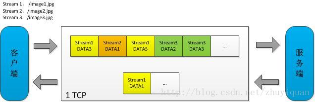

# 1 内网和外网 IP 地址的区别？ABC 三类 IP 地址的划分

1.公网ip具有世界范围的唯一性，外网IP地址就是除了私有地址和被保留的地址外的所有地址，需要申请才能使用。 

而内网ip只在局域网内部具有唯一性。内网网线都是连接在同一个 交换机上面的，也就是说它们的 IP 地址是由交换机或者路由器进行分配的并且，一个局域网里所有电脑的内网IP是互不相同的,但共用一个外网IP。

2.在局域网中，每台电脑都可以自己分配自己的IP，但是这个IP只在局域网中有效。而如果你将电脑连接到互联网，你的网络提供商的服务器会为你分配一个IP地址，这个IP地址才是你在外网的IP。两个IP同时存在，一个对内，一个对外。

3.互联网上的IP（即外网IP）地址统一由一个叫“IANA”(InternetAssigned  NumbersAuthority，互联网网络号分配机构)的组织来管理。由于分配不合理以及IPv4协议本身存在的局限，现在互联网的IP地址资源越来越紧张。IANA将A、B、C类IP地址的一部分保留下来，留作局域网使用。具体如下
 IP地址空间：
IP 地址 = 网络地址 + 主机地址。A 类前 8 位是（0+7 位网络地址）,B 类前 16 位是 

（10+14 位网络地址），C 类前 24 位是（110+21 位网络地址）。 

- A 类地址：以 0 开头， 第一个字节范围：0~127（1.0.0.0 – 126.255.255.255）； 
- B 类地址：以 10 开头， 第一个字节范围：128~191（128.0.0.0 – 191.255.255.255）； 
- C 类地址：以 110 开头， 第一个字节范围：192~223（192.0.0.0 – 223.255.255.255）； 

# 2 网关和子网掩码的关系

> 子网掩码

子网掩码(subnet  mask)又叫网络掩码、地址掩码、子网络遮罩，它是一种用来指明一个IP地址的哪些位**标识的是主机所在的子网以及哪些位标识的是主机的位掩码**。子网掩码不能单独存在，它必须结合IP地址一起使用。子网掩码只有一个作用，就是将某个IP地址划分成网络地址和主机地址两部分 

> 网关

网关实质上是一个在不同子段网路中传输数据的设备。比如有网络 A 和网络 B，若二 者子网掩码不同，即二者不属于同一个子网络。在没有路由器的情况下，两个网络之间是不能进行 TCP/IP 通信的，子网掩码相同，不需要网关即可通讯，子网掩码不同，需要网关才能通讯。

默认网关，数据包默认选择的出口。

# 3 MAC 地址和 IP 地址的关系

- MAC 地址是硬件地址，定位全球唯一主机机器，在网络底层的物理传输过程中，是通过物理地址来识别主机的，它一定是全球唯一的，对应数据链路层。
- IP 地址是网络拓扑地址，定位全球唯一网络结构中的主机。对应网路层 

链路层基于MAC地址转发数据帧，网络层基于IP地址转发报文。二层交换机基于MAC地址表转发数据，路由器基于路由表（IP地址）转发数据。 

# 4 IP 如何映射到 MAC 地址

使用的是 ARP （Address Resolution Protocol：地址解析协议），ARP 协议位于网络层。 

（1）    每一台主机都会在ARP cache缓冲区建立一个ARP表格，用来记录IP位置和实体（MAC）位置的对应关系，这个表的每一条资料会根据自身的存活时间递减而最终消失，以确保资料的真实性

（2）    当发送主机要发送数据包给目的主机的时候，会检查自己的ARP列表中是否存在该IP地址对应的MAC地址，如果有，直接将数据包发送到这个MAC地址，如果没有，就向本地网络发起一个ARP请求的广播包，查询目的主机对应的MAC地址。此ARP请求数据包里包括源主机的IP地址，硬件地址，以及目的主机的IP地址。

（3）   网络中所有主机收到这个请求之后，会检查数据包中的目的IP是否和自己的IP地址一致。如果不相同就忽略此数据包，如果相同，该主机首先将发端的MAC地址和IP地址添加到自己的ARP列表中，如果ARP列表中已经存在该IP信息，则将其覆盖，然后给源主机发送一个ARP相应数据包，告诉对方自己是他需要查找的MAC地址，源主机收到这个ARP响应数据包后，将得到的目的主机的IP地址和MAC地址添加到自己的ARP列表中，并利用此信息开始数据传输，如果源主机一直没有收到ARP的响应数据包，表示ARP查询失败【广播发送ARP请求，单播发送ARP响应】 

# 5 TCP 如何保证可靠传输数据

保证可靠稳定的传输最主要是通过： 

- 拥塞控制 
- 流量控制 
- ARQ 协议 

除此之外还有：超时传送、丢弃重复、校验和、分割合适数据包 

**拥塞控制**

- 慢启动：不要一开始就发送大量的数据，先探测一下网络的拥塞程度，也就是说由小到大逐渐增加拥塞窗口的大小； 
- 拥塞避免：拥塞避免算法让拥塞窗口缓慢增长，即每经过一个往返时间 RTT 就把发送方的拥塞窗口 cwnd 加 1，而不是加倍，这样拥塞窗口按线性规律缓慢增长。 
- 快重传：快重传要求接收方在收到一个 失序的报文段 后就立即发出 重复确认（为的是使发送方及早知道有报文段没有到达对方）而不要等到自己发送数据时捎带确认。快重传算法规定，发送方只要一连收到三个重复确认就应当立即重传对方尚未收到的报文段，而不必继续等待设置的重传计时器时间到期。 
- 快恢复：快重传配合使用的还有快恢复算法，当发送方连续收到三个重复确认时，就执行 “乘法减小” 算法，把 ssthresh 门限减半，但是接下去并不执行慢开始算法：因为如果网络出现拥塞的话就不会收到好几个重复的确认，所以发送方现在认为网络可能没 有出现拥塞。所以此时不执行慢开始算法，而是将 cwnd 设置为 ssthresh 的大小，然后执行拥塞避免算法。 

**流量控制** 

TCP 连接的每一方都有固定大小的缓冲空间，TCP 的接收端只允许发送端发送接收端缓冲区能接纳的数据。当接收方来不及处理发送方的数据，能提示发送方降低发送的速率，防止包丢失。TCP 使用的流量控制协议是可变大小的滑动窗口协议。（TCP 利用滑动窗口实现流量控制）

**ARQ 协议**  

- 停止等待 ARQ 协议：停止等待协议是为了实现可靠传输的，它的基本原理就是每发完一个分组就停止发送，等待对方确认（回复 ACK）。如果过了一段时间（超时时间后）， 还是没有收到 ACK 确认，说明没有发送成功，需要重新发送，直到收到确认后再发下 一个分组；在停止等待协议中，若接收方收到重复分组，就丢弃该分组，但同时还要发送确认； 
- 连续 ARQ 协议：连续 ARQ 协议可提高信道利用率。发送方维持一个发送窗口，凡位 于发送窗口内的分组可以连续发送出去，而不需要等待对方确认。接收方一般采用累计确认，对按序到达的最后一个分组发送确认，表明到这个分组为止的所有分组都已经正确收到了。

# 6 TCP 和 UDP 的区别

- TCP 是面向连接的，UDP 是面向无连接的。TCP 是面向字节流的，UDP 是基于数据报的。
- UDP程序结构较简单
- TCP 保证数据正确性，如果丢包就需要进行重传，UDP 可能丢包。TCP保证数据顺序，UDP 不保证
- TCP提供可靠的服务。也就是说，通过TCP连接传送的数据，无差错，不丢失，不重复，且按序到达;UDP尽最大努力交付，即不保证可靠交付
- TCP头部信息有20个字节，而UDP只有8个字节，UDP常用一次性传输比较少量数据的网络应用，如DNS,SNMP等，因为对于这些应用，若是采用TCP，为连接的创建，维护和拆除带来不小的开销。UDP也常用于多媒体应用（如IP电话，实时视频会议，流媒体等）数据的可靠传输对他们而言并不重要，TCP的拥塞控制会使他们有较大的延迟，也是不可容忍的。

 TCP 的优点：可靠，稳定.

TCP 的缺点：慢，效率低，占用系统资源高，易被攻击 

UDP 的优点：快，比 TCP 稍安全 UDP 没有 TCP 的握手、确认、窗口、重传、拥塞控制等机制，UDP 是一个无状态的传输协议 

UDP 的缺点： 不可靠，不稳定 

# 7 TCP 三次握手和四次挥手的过程

# 8 TCP 为什么需要三次握手？只进行两次会出现什么问题

# 9 TCP 第三次握手失败的情况 TCP 是如何处理的

第三次失败，只有客户端处于成功状态（因为第 2 次服务器返回了 ACK），服务器端没有接收到客户端的 ACK。这要分几种情况讨论： 

1. 客户端发出的 ACK 丢失了，发出的 下一个数据包 没有丢失，则服务端接收到下一个数据包（这个数据包里也会带上 ACK 信息），能够进入正常的 ESTABLISHED 状态 
2. 如果服务端和客户端都没有数据发送，或者服务端想发送数据（但是发不了，因为没有收到客户端的 ACK），服务器都会有定时器发送第二步 SYN+ACK 数据包，如果客户端再次发送 ACK 成功，建立连接。 
3. 如果一直不成功，服务器肯定会有超时设置，超时之后会给客户端发 RTS 报文，进入 CLOSED 状态，防止 SYN 洪泛攻击。

# 10 为什么连接的时候是三次握手，关闭的时候却是四次握手

# 11 http1.0 与 http1.1 的区别？什么是 keep-alive 模式？

1. 缓存处理，在 HTTP1.0 中主要使用 header 里的 If-Modified-Since,Expires 来做为缓存判断的标准，HTTP1.1 则引入了更多的缓存控制策略例如 Entity tag，If-Unmodified-Since, If-Match, If-None-Match 等更多可供选择的缓存头来控制缓存策略。 
2. 带宽优化及网络连接的使用，HTTP1.0 中，存在一些浪费带宽的现象，例如客户端只是需要某个对象的一部分，而服务器却将整个对象送过来了，并且不支持断点续传功能， HTTP1.1 则在请求头引入了 range 头域，它允许只请求资源的某个部分，即返回码是206（Partial Content），这样就方便了开发者自由的选择以便于充分利用带宽和连接。 
3. 错误通知的管理，在 HTTP1.1 中新增了 24 个错误状态响应码，如 409（Conflict）表示请求的资源与资源的当前状态发生冲突；410（Gone）表示服务器上的某个资源被永久性的删除。 
4. Host 头处理，在 HTTP1.0 中认为每台服务器都绑定一个唯一的 IP 地址，因此，请求消息中的 URL 并没有传递主机名（hostname）。但随着虚拟主机技术的发展，在一台 物理服务器上可以存在多个虚拟主机（Multi-homed Web Servers），并且它们共享一个IP 地址。HTTP1.1 的请求消息和响应消息都应支持 Host 头域，且请求消息中如果没有Host 头域会报告一个错误（400 Bad Request）。 
5. 长连接，HTTP 1.1 支持长连接（Persistent-Connection）和请求的流水线（Pipelining）处理，在一个 TCP 连接上可以传送多个 HTTP 请求和响应，减少了建立和关闭连接的消耗和延迟，在 HTTP1.1 中默认开启 Connection： keep-alive，一定程度上弥补了HTTP1.0 每次请求都要创建连接的缺点。

# 12 简单说一下 http2.0

[博客](https://blog.csdn.net/zhuyiquan/article/details/69257126?utm_medium=distribute.pc_relevant.none-task-blog-BlogCommendFromMachineLearnPai2-2.nonecase&depth_1-utm_source=distribute.pc_relevant.none-task-blog-BlogCommendFromMachineLearnPai2-2.nonecase)

HTTP/2 的目的是通过支持请求与响应的多路复用来较少延迟，通过压缩HTTPS首部字段将协议开销降低，同时增加请求优先级和服务器端推送的支持。  

## 12.1 **二进制分帧层**

HTTP 1.x在应用层以纯文本的形式进行通信，而HTTP 2.0将所有的传输信息分割为更小的消息和帧，并对它们采用二进制格式编码。这样，客户端和服务端都需要引入新的二进制编码和解码的机制。
如下图所示，HTTP 2.0并没有改变HTTP 1.x的语义，只是在应用层使用二进制分帧方式传输

## 12.2 **多路复用共享连接**

基于二进制分帧层，HTTP 2.0可以在共享TCP连接的基础上，同时发送请求和响应。HTTP消息被分解为独立的帧，而不破坏消息本身的语义，交错发送出去，最后在另一端根据流ID和首部将它们重新组合起来。
我们来对比下HTTP 1.x和HTTP 2.0，假设不考虑1.x的pipeline机制，双方四层都是一个TCP连接。客户端向服务度发起三个图片请求/image1.jpg，/image2.jpg，/image3.jpg。
HTTP 1.x发起请求是串行的，image1返回后才能再发起image2，image2返回后才能再发起image3。 

而HTTP 2.0建立一条TCP连接后，并行传输着3个数据流，客户端向服务端乱序发送stream1~3的一系列的DATA帧，与此同时，服务端已经在返回stream 1的DATA帧 。

所以HTTP2.0 使用多路复用的技术，做到了同一个连接并发处理多个请求，而且并发请求的数量比 HTTP1.1 大了好几个数量级。 

当然 HTTP1.1 也可以多建立几个 TCP 连接，来支持处理更多并发的请求，但是创建TCP 连接本身也是有开销的。

> 瓶颈

HTTP 2.0会带来新的性能瓶颈。因为现在所有的压力集中在底层一个TCP连接之上，TCP很可能就是下一个性能瓶颈，比如TCP分组的队首阻塞问题，单个TCP packet丢失导致整个连接阻塞，无法逃避，此时所有消息都会受到影响。 

# 13 什么是幂等性？http 的方法是否都符合幂等性？若不符合，怎么避免？

幂等性：HTTP 方法的幂等性是指一次和多次请求某一个资源应该具有同样的副作用。 说白了就是，同一个请求，发送一次和发送 N 次效果是一样的！ 

HTTP 方法： 

1. GET 方法用于获取资源，不应有副作用，所以是幂等的。 

2. DELETE 方法用于删除资源，有副作用，但它应该满足幂等性

3. PUT 方法用于创建或更新操作，有副作用，与 DELETE 相同，对同一资源无论调用一 次还是多次，其副作用是相同的，因此也满足幂等性

4. POST 方法与 PUT 方法的区别主要在于幂等性，POST 不具备幂等性，因为 POST 请求每次都会创建一个文件，而 PUT 方法会在服务器验证是否有 ENTITY，若有则更新该ENTITY 而不是重新创建

   POST 方法避免非幂等性，当我们因为反复刷新浏览器导致多次提交表单，多次发出同样的POST 请求，导致远端服务器重复创建出了资源

   * 对应的后端 WebService 一定要做到幂等性
   * 服务器端收到 POST 请求，在操作成功后必须返回状态码 302 重定向到另外一 个页面，这样即使用户刷新页面，url 已经变更，不需要进行 post 请求，也不会重复提交表单

# 14 https 与 http 的区别

Http 协议运行在 TCP 之上，明文传输，客户端与服务器端都无法验证对方的身份； HTTPS是运行在 SSL/TLS 之上的 HTTP 协议，SSL/TLS 运行在 TCP 之上。HTTPS 是添加了加密和认证机制的 HTTP。二者之间存在如下不同： 

- 端口不同：Http 与 Https 使用不同的连接方式，用的端口也不一样，前者是 80，后者是 443； 
- 资源消耗：和 HTTP 通信相比，Https 通信会由于加减密处理消耗更多的 CPU 和内存资源；
- 开销：Https 通信需要证书，而证书一般需要向认证机构购买 

# 15 https 加密的过程

1. 浏览器使用 Https 的 URL 访问服务器，建立 SSL 链接。 
2. 服务器接收到 SSL 链接后，发送非对称加密的公钥 A 给浏览器。 
3. 浏览器生成随机数，作为对称加密的密钥 B。 
4. 浏览器使用服务器返回的公钥 A，对自己生成的对称加密密钥 B 进行加密，得到密钥C。 
5. 浏览器将密钥 C 发送给服务器 
6. 服务器使用自己的非对称加密私钥 D 对接受的密钥 C 进行解密，得到对称加密密钥B。 
7. 浏览器和服务器之间使用密钥 B 作为对称加密密钥进行通信。 

> 注意：非对称加密之所以不安全，因为客户端不知道这把公钥是不是属于服务器的

# 16 https 是否存在安全问题？如何避免？

当服务器发送公钥给客户端， 中间人截获公钥 ，将 中间人自己的公钥 冒充服务器的公钥发送给客户端。之后客户端会用 中间人的的公钥 来加密自己生成的 对称密钥 。然后把加密的密钥发送给服务器，这时中间人又把密钥截取，中间人用自己的私钥把加密的密钥进行解密，解密后中间人就能获取 对称加密的密钥 。 

避免方式： 

- 一个拥有公信力、大家都认可的认证中心，数字证书认证机构。 
- 服务器在给客户端传输公钥的过程中，会把公钥和服务器的个人信息通过 hash 算法生成信息摘要 。 
- 为了防止信息摘要被调换 ，服务器会采用 CA 提供的私钥对信息摘要进行加密来形成数字签名 。最后会把原来没Hash算法之前的个人信息、公钥及、数字签名合并在一起，形成数字证书。 
- 客户拿到数字证书之后，使用 CA 提供的公钥对数字证书里的数字签名进行解密来得到信息摘要，然后对数字证书里服务器的公钥及个人信息进行 Hash 得到另一份信息摘要 。最后将两份信息摘要对比，如果一样则证明是服务器，否则就是中间人。 

# 17 get 方法和 post 方法的区别？ 

1. GET 方法从服务器获取资源，POST 是向服务器发送数据 

2. GET 浏览器回退是无害的，而 POST 会再次提交请求。 

3. GET 产生的 URL 地址可以被书签收藏，并且被浏览器缓存，而 POST 不能书签收藏也不能缓存。 

4. GET 只能进行 URL 编码，而 POST 支持多种编码方式。 

5. GET 参数通过 URL 传递，并且长度有限制，而 POST 放在 request body 并且长度没有限制。并且，正因为这个原因， GET 比 POST 更不安全，因为参数暴露在 URL 中。 

   二者还有一个显著区别：GET 产生一个 TCP 数据包；POST 产生两个 TCP 数据包。 

6. 对于 GET 方式的请求，浏览器会把 http header 和 data 一并发送出去，服务器响应200（返回数据）； 

7. 而对于 POST，浏览器先发送 header，服务器响应 100 continue，浏览器再发送 data，服务器响应 200 ok（返回数据）。

# 18 TCP通信粘包问题分析和解决

还有几个下次整合