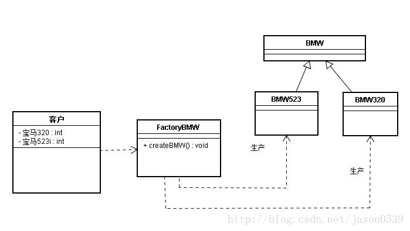

# 1 单例模式（Singleton）

单例模式有以下特点：  

1. 单例类只能有一个实例。  
2. 单例类必须自己创建自己的唯一实例。  
3. 单例类必须给所有其他对象提供这一实例。 


适用场景：

在计算机系统中，线程池、缓存、日志对象、对话框、打印机、显卡的驱动程序对象常被设计成单例。这些应用都或多或少具有资源管理器的功能。


### 

## 1.1 懒汉式

#### 1.1.1 线程不安全

以下实现中，私有静态变量 single被延迟实例化，这样做的好处是，如果没有用到该类，那么就不会实例化 single，从而节约资源。

这个实现在多线程环境下是不安全的，如果多个线程能够同时进入 `if (single== null)` ，并且此时 single为 null，那么会有多个线程执行 `single= new Singleton();` 语句，这将导致实例化多次 Singleton。

```java
public class Singleton {
    private Singleton() {}
    private static Singleton single=null;
    //静态工厂方法 
    public static Singleton getInstance() {
         if (single == null) {  
             single = new Singleton();
         }  
        return single;
    }
}
```


#### 1.1.2 synchronized-线程安全

但是当一个线程进入该方法之后，其它试图进入该方法的线程都必须等待，即使 single已经被实例化了。这会让线程阻塞时间过长，因此该方法有性能问题，不推荐使用。

```java
public class Singleton {
    private Singleton() {}
    private static Singleton single=null;
    //静态工厂方法 
    public static synchronized Singleton getInstance() {
         if (single == null) {  
             single = new Singleton();
         }  
        return single;
    }
}
```


#### 1.1.3 双重校验锁-线程安全

single只需要被实例化一次，之后就可以直接使用了。加锁操作只需要对实例化那部分的代码进行，只有当 single没有被实例化时，才需要进行加锁。

双重校验锁先判断 single是否已经被实例化，如果没有被实例化，那么才对实例化语句进行加锁。

```java
 public class Singleton {
    private Singleton() {}
    private static Singleton single=null;
     
   public static Singleton getInstance() {
        if (single == null) {  
            synchronized (Singleton.class) {  
               if (single == null) {  
                  single = new Singleton(); 
               }  
            }  
        }  
        return single; 
    }
}
```


考虑下面的实现，也就是只使用了一个 if 语句。在 single== null 的情况下，如果两个线程都执行了 if 语句，那么两个线程都会进入 if 语句块内。虽然在 if 语句块内有加锁操作，但是两个线程都会执行 `single= new Singleton();` 这条语句，只是先后的问题，那么就会进行两次实例化。因此必须使用双重校验锁，也就是需要使用两个 if 语句：第一个 if 语句用来避免 single已经被实例化之后的加锁操作，而第二个 if 语句进行了加锁，所以只能有一个线程进入，就不会出现 single== null 时两个线程同时进行实例化操作。

```java
if (single == null) {
    synchronized (Singleton.class) {
        single = new Singleton();
    }
}
```


single采用 **volatile** 关键字修饰也是很有必要的， `single= new Singleton();` 这段代码其实是分为三步执行：

1. 为 single分配内存空间
2. 初始化 single
3. 将 single指向分配的内存地址

但是由于 JVM 具有指令重排的特性，执行顺序有可能变成 1>3>2。指令重排在单线程环境下不会出现问题，但是在多线程环境下会导致一个线程获得还没有初始化的实例。例如，线程 T1 执行了 1 和 3，此时 T2 调用 getInstance() 后发现 single不为空，因此返回 single，但此时 single还未被初始化。

**使用 volatile 可以禁止 JVM 的指令重排，保证在多线程环境下也能正常运行。**


#### 1.1.4 静态内部类实现

当 Singleton 类被加载时，静态内部类 LazyHolder没有被加载进内存。只有当调用 `getInstance()` 方法从而触发 `LazyHolder.INSTANCE` 时 LazyHolder 才会被加载，此时初始化 INSTANCE 实例，并且 JVM 能确保 INSTANCE 只被实例化一次。

这种方式不仅具有延迟初始化的好处，而且由 JVM 提供了对线程安全的支持。

>这种比上面sychronized和双重检索锁方法都好一些，既实现了线程安全，又避免了同步带来的性能影响。 

```java
public class Singleton {  
    private static class LazyHolder {  
       private static final Singleton INSTANCE = new Singleton();  
    }  
    private Singleton (){}  
    public static final Singleton getInstance() {  
       return LazyHolder.INSTANCE;  
    }  
}  
```

#### 


## 1.2 饿汉式-线程安全

线程不安全问题主要是由于 single被实例化多次，采取直接实例化 single 的方式就不会产生线程不安全问题。

但是直接实例化的方式也丢失了延迟实例化带来的节约资源的好处。

```java
//饿汉式单例类.在类初始化时，已经自行实例化 
public class Singleton1 {
    private Singleton1() {}
    private static final Singleton1 single = new Singleton1();
    //静态工厂方法 
    public static Singleton1 getInstance() {
        return single;
    }
}
```


## 1.3 枚举实现单例

```java
public enum Singleton {

    INSTANCE;

    public void doSomething() {
        System.out.println("doSomething");
    }

}
```

```java
public class Main {
    public static void main(String[] args) {
        //调用方法
        Singleton.INSTANCE.doSomething();
    }

}
```

**该实现可以防止反射攻击。枚举是final修饰的。**


# 2 工厂模式

  工厂模式主要是为创建对象提供过渡接口，以便将创建对象的具体过程屏蔽隔离起来，达到提高灵活性的目的。 
工厂模式可以分为三类： 

1. 简单工厂模式（Simple Factory） 

2. 工厂方法模式（Factory Method） 
3. 抽象工厂模式（Abstract Factory） 

这三种模式从上到下逐步抽象，并且更具一般性。 
GOF在《设计模式》一书中将工厂模式分为两类：工厂方法模式与抽象工厂模式

将简单工厂模式看为工厂方法模式的一种特例，两者归为一类。 


**区别 ：**

* 工厂方法模式：

  一个抽象产品类，可以派生出多个具体产品类。   
  一个抽象工厂类，可以派生出多个具体工厂类。   
  每个具体工厂类只能创建一个具体产品类的实例。

* 抽象工厂模式：

  多个抽象产品类，每个抽象产品类可以派生出多个具体产品类。   
  一个抽象工厂类，可以派生出多个具体工厂类。   
  每个具体工厂类可以创建多个具体产品类的实例。   


## 2.1 简单工厂模式



产品类： 

```java
abstract class BMW {
	public BMW(){
		
	}
}
 
public class BMW320 extends BMW {
	public BMW320() {
		System.out.println("制造-->BMW320");
	}
}
public class BMW523 extends BMW{
	public BMW523(){
		System.out.println("制造-->BMW523");
	}
}
```

工厂类： 

```java
public class Factory {
	public BMW createBMW(int type) {
		switch (type) {
		
		case 320:
			return new BMW320();
 
		case 523:
			return new BMW523();
 
		default:
			break;
		}
		return null;
	}
}
```

客户类： 

```java
public class Customer {
	public static void main(String[] args) {
		Factory factory = new Factory();
		BMW bmw320 = factory.createBMW(320);
		BMW bmw523 = factory.createBMW(523);
	}
}
```


## 2.2 工厂方法模式

对于简单工厂模式，每增加一种新型车，都要在工厂类中增加相应的创建业务逻辑，这显然是违背开闭原则的。

于是工厂方法模式出现了。 工厂类定义成了接口,而每新增的车种类型,就增加该车种类型对应工厂类的实现,这样工厂的设计就可以扩展了,而不必去修改原来的代码。 


看到了**五、工厂方法模式**  