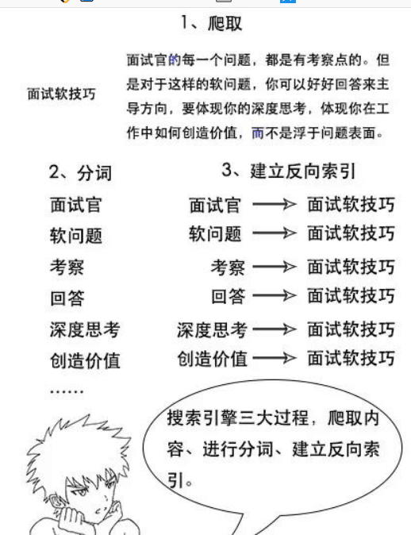
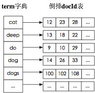
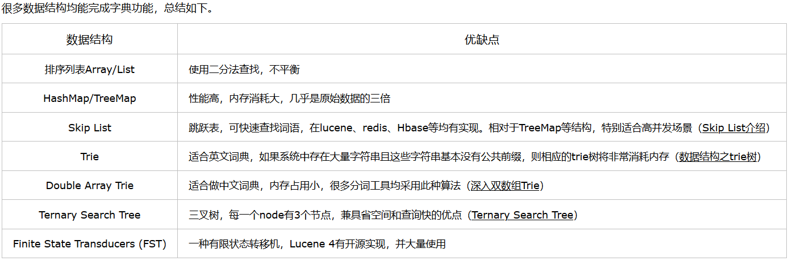
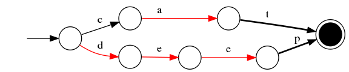
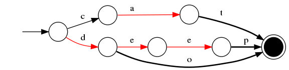
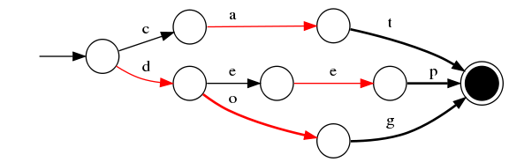
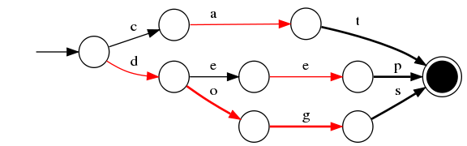

https://blog.csdn.net/achuo/article/details/87865141

https://www.cnblogs.com/heqiyoujing/p/11146178.html

[es原理博客](https://www.cnblogs.com/dreamroute/p/8484457.html)

Elasticsearch 是一个分布式可扩展的实时搜索和分析引擎,一个建立在全文搜索引擎 Apache Lucene(TM)  基础上的搜索引擎.当然 Elasticsearch 并不仅仅是 Lucene 那么简单，它不仅包括了全文搜索功能，还可以进行以下工作:

- 分布式实时文件存储，并将每一个字段都编入索引，使其可以被搜索。
- 实时分析的分布式搜索引擎。
- 可以扩展到上百台服务器，处理PB级别的结构化或非结构化数据。


# 1 前言

**为什么要用es?**

因为在我们商城中的数据，将来会非常多，所以采用以往的模糊查询，模糊查询前置配置，会放弃索引，导致商品查询是全表扫面，在百万级别的数据库中，效率非常低下，而我们使用ES做一个全文索引，我们将经常查询的商品的某些字段，比如说商品名，描述、价格还有id这些字段我们放入我们索引库里，可以提高查询速度。

### 1.1 四种节点

 在生产环境下，如果不修改elasticsearch节点的角色信息，在高数据量，高并发的场景下集群容易出现脑裂等问题。

 这些功能是由两个属性控制的：

-  node.master：这个属性表示节点是否具有成为主节点的资格
- node.data： 这个属性表示节点是否存储数据。

默认情况下这两个属性的值都是true。


> 四种组合

> 1.node.master: true
>
> node.data: true

这种组合表示这个节点即有成为主节点的资格，又存储数据，这个时候如果某个节点被选举成为了真正的主节点，那么他还要存储数据，这样对于这个节点的压力就比较大了。
elasticsearch默认每个节点都是这样的配置，在测试环境下这样做没问题。实际工作中建议不要这样设置.


>2.node.master: false
>
> node.data: true

**数据节点。**这种组合表示这个节点没有成为主节点的资格，也就不参与选举，只会存储数据。
在集群中需要单独设置几个这样的节点负责存储数据。后期提供存储和查询服务。


> 3.node.master: true
>
> node.data: false

**master节点**

**负责管理集群范围内的所有变更，例如增加、删除索引，或者增加、删除节点等。  而主节点并不需要涉及到文档级别的变更和搜索等操作**，所以当集群只拥有一个主节点的情况下，即使流量的增加它也不会成为瓶颈。 

作为用户，我们可以将请求发送到 *集群中的任何节点* ，包括主节点。  每个节点都知道任意文档所处的位置，并且能够将我们的请求直接转发到存储我们所需文档的节点。  无论我们将请求发送到哪个节点，它都能负责从各个包含我们所需文档的节点收集回数据，并将最终结果返回給客户端。 Elasticsearch  对这一切的管理都是透明的。


>4. node.master: false
>
> node.data: false

即不会成为主节点，也不会存储数据，这个节点的意义是作为一个client(客户端)节点，主要是针对海量请求的时候可以进行负载均衡。


> 配置建议

 建议集群中设置3台以上的节点作为master节点。
 这些节点只负责成为主节点，维护整个集群的状态。
 再根据数据量设置一批data节点【node.master: false node.data: true】
 这些节点只负责存储数据，后期提供建立索引和查询索引的服务，这样的话如果用户请求比较频繁，这些节点的压力也会比较大
 所以在集群中建议再设置一批client节点【node.master: false node.data: true】
 这些节点只负责处理用户请求，实现请求转发，负载均衡等功能。

-  master节点：普通服务器即可(CPU 内存 消耗一般)
-  data节点：主要消耗磁盘，内存
-  client节点：普通服务器即可(如果要进行分组聚合操作的话，建议这个节点内存也分配多一点)


### 1.2 基本概念

先说Elasticsearch的文件存储，Elasticsearch是面向文档型数据库，一条数据在这里就是一个文档，用JSON作为文档序列化的格式，比如下面这条用户数据：

```java
{
    "name" :     "John",
    "sex" :      "Male",
    "age" :      25,
    "birthDate": "1990/05/01",
    "about" :    "I love to go rock climbing",
    "interests": [ "sports", "music" ]
}
```

在Elasticsearch里这就是一个*文档*，当然这个文档会属于一个User的*类型*，各种各样的类型存在于一个*索引*当中。这里有一份简易的将Elasticsearch和关系型数据术语对照表:

```
关系数据库     ⇒ 数据库 ⇒ 表    ⇒ 行    ⇒ 列(Columns)

Elasticsearch  ⇒ 索引(Index)   ⇒ 类型(type)  ⇒ 文档(Docments)  ⇒ 字段(Fields)  
```


一个 Elasticsearch  集群可以包含多个索引(数据库)，也就是说其中包含了很多类型(表)。这些类型中包含了很多的文档(行)，然后每个文档中又包含了很多的字段(列)。Elasticsearch的交互，可以使用Java  API，也可以直接使用HTTP的Restful API方式，比如我们打算插入一条记录，可以简单发送一个HTTP的请求：

```
PUT /megacorp/employee/1  
{
    "name" :     "John",
    "sex" :      "Male",
    "age" :      25,
    "about" :    "I love to go rock climbing",
    "interests": [ "sports", "music" ]
}
```


## 2 索引原理

### 2.1 倒排索引

假设有这么几条数据(为了简单，去掉about, interests这两个field):

```mysql
| ID | Name | Age  |  Sex     |
| -- |:------------:| -----:| -----:| 
| 1  | Kate         | 24 | Female
| 2  | John         | 24 | Male
| 3  | Bill         | 29 | Male
```

ID是Elasticsearch自建的文档id，那么Elasticsearch建立的索引如下:

**Name:**

```mysql
| Term | Posting List |
| -- |:----:|
| Kate | 1 |
| John | 2 |
| Bill | 3 |
```

**Age:**

```mysql
| Term | Posting List |
| -- |:----:|
| 24 | [1,2] |
| 29 | 3 |
```

**Sex:**

```mysql
| Term | Posting List |
| -- |:----:|
| Female | 1 |
| Male | [2,3] |
```


##### Posting List

Elasticsearch分别为每个field都建立了一个倒排索引，Kate, John, 24, Female这些叫term，而[1,2]就是**Posting List**。Posting list就是一个int的数组，存储了所有符合某个term的文档id。

通过posting list这种索引方式似乎可以很快进行查找，比如要找age=24的同学，爱回答问题的小明马上就举手回答：我知道，id是1，2的同学。但是，如果这里有上千万的记录呢？如果是想通过name来查找呢？


##### Term Dictionary

Elasticsearch为了能快速找到某个term，将所有的term排个序，二分法查找term，logN的查找效率，就像通过字典查找一样，这就是**Term Dictionary**


##### Term Index

B-Tree通过减少磁盘寻道次数来提高查询性能，Elasticsearch也是采用同样的思路，直接通过内存查找term，不读磁盘，但是如果term太多，term dictionary也会很大，放内存不现实，于是有了**Term Index**，就像字典里的索引页一样，A开头的有哪些term，分别在哪页，可以理解term index是一颗树：




这棵树不会包含所有的term，它包含的是term的一些前缀。通过term index可以快速地定位到term dictionary的某个offset，然后从这个位置再往后顺序查找。


所以term index不需要存下所有的term，而仅仅是他们的一些前缀与Term  Dictionary的block之间的映射关系，再结合FST(Finite State Transducers)的压缩技术，可以使term  index缓存到内存中。从term index查到对应的term  dictionary的block位置之后，再去磁盘上找term，大大减少了磁盘随机读的次数。


## 3 与数据库区别

### 3.1 如果用数据库做搜索会怎么样？

如果用数据库搜索。

1. 例如，每条记录的指定字段的文本，可能会很长，比如说“商品描述”或者“文章详情”字段的长度，有长达数千个，甚至数万个字符，这个时候，每次都要对每条记录的所有文本进行扫描，去判断，你包不包含我指定的这个关键词（比如说“鞋子”）
2. 还不能将搜索词拆分开来，尽可能去搜索更多的符合你的期望的结果，比如输入“暴走事件”，就搜索不出来“暴走大事件”

所以数据量大的时候，用数据库搜索性能会很差的。


## 4 主备机制

### 4.1 分片分布在节点的情况

ES是一个分布式的，那么对于分布式的架构，肯定是由主备机制的。

1. index包含多个分片

2. primary shard不能和自己的replica shard放在同一个节点上（否则节点宕机，primary shard和副本都丢失，起不到容错的作用），但是可以和其他primary shard的replica shard放在同一个节点上

P0 P1 P2为三个主分片，R0 R1 R2为三个副本分片，分别分散在三个节点。


### 4.2 Elasticsearch是如何实现Master选举的？

> Elasticsearch在满足如下时间点的时候会触发选举

1. 集群启动初始化
2. 集群的Master崩溃的时候
3. 任何一个节点发现当前集群中的Master节点没有得到n/2 + 1节点认可的时候，触发选举


> 选举流程

数据节点确定了master以后，会开启MasterPinger线程来与其保持心跳通信的逻辑 如果通信过程中链接断开，会通过监听器进行回调处理 。处理过程中会去调用方法，以便选举出新的master进行通信，大致过程如下：

1. 首先通过ping操作来向其他节点进行学习 ， ping的方式有两种，单播(官方推荐)或组播。
2. 如果ping的结果显示其他节点已选举出了master ，在这些节点所选举的master列表中选取id值最小的一个作为当前节点的master 

1. 如果ping结果显示其他节点还没有选举出master ，对所有可以成为master的节点根据nodeId排序，每次选举每个节点都把自己所知道节点排一次序，然后选出第一个（第0位）节点，暂且认为它是master节点。（注意，可通讯到的节点必须占所有节点的一半以上，防止脑裂）
2. 如果对某个节点的投票数达到一定的值（可以成为master节点数n/2+1）并且该节点自己也选举自己，那这个节点就是master。否则重新选举。


> 事例

假设有三个节点node1, node2,  node3, 假设我们配置每个节点都有机会（node.master: true)可以成为master,刚开始启动的时候，  node1启动了，此时node1去执行findMaster()，由于此时只有一个节点， node1只能发现自己这个节点，  不满足节点数大于n/2+1的条件（配置文件指定的），所以此时找不到master， node1会不断的执行while循环直到找到master位置。 然后此时node2上线启动，node1和node2构成了两个节点，node2选择自己作为master节点, 此时node2 通过ping可以发现node1, 此时 node2还会选举自己一把，这样node2才能真正成为master。 此时node1 的循环又开始了，他就会发现master不是自己而是node2， 这样就会接受node2是master.


### 4.3 脑裂

##### 4.3.1 什么是脑裂

让我们看一个有两个节点的elasticsearch集群的简单情况。集群维护一个单个索引并有一个分片和一个复制节点。节点1在启动时被选举为主节点并保存主分片（在下面的schema里标记为**0P**），而节点2保存复制分片（**0R**） 


现在，如果在两个节点之间的通讯中断了，会发生什么？由于网络问题或只是因为其中一个节点无响应,两个节点都相信对方已经挂了。节点1不需要做什么，因为它本来就被选举为主节点。但是节点2会自动选举它自己为主节点，因为它相信集群的一部分没有主节点了。这样就发生了脑裂。


##### 4.3.2 如何避免脑裂问题

1. 避免脑裂现象，用到的一个参数是：discovery.zen.minimum_master_nodes。**这个参数决定了在选主过程中需要有多少个节点通信。** 

   根据一般经验这个一般设置成  N/2 + 1，N是集群中节点的数量，例如一个有3个节点的集群，minimum_master_nodes 应该被设置成 3/2 + 1 =  2（向下取整）。

2. 用到的另外一个参数是：discovery.zen.ping.timeout，等待ping响应的超时时间，默认值是3秒。如果网络缓慢或拥塞，建议略微调大这个值。这个参数不仅仅适应更高的网络延迟，也适用于在一个由于超负荷而响应缓慢的节点的情况。


## 5 ES的并发控制

### **5.1  悲观锁方案**

### **5.2 乐观锁方案**

**可以通过版本号使用乐观并发控制，以确保新版本不会被旧版本覆盖，由应用层来处理具体的冲突；**

乐观锁是不加锁的，每个线程都可以操作，通过一个version号来识别，看是不是一样的，例如线程A操作后是version=1，库存改为99，同一时间有一个用户B也读到了这数据，下单也把库存变为99件，version=2，线程B去判断，version=1与es中的版本version=2，说明数据已经被其他人修改过了，然后就重新去es中读取最新版本数据，也就是99，然后再减一，就变为98件了。
总之：99—version1 98–version2.

悲观锁的优点：方便，对应用程序来说透明，缺点：并发能力低。
乐观锁：并发能力高，都需要重新比对版本号，然后可能需要重新加载数据，再写，这个过程，可能需要重复好几次

每次执行修改和删除，这个version的版本号会自动加1
在删除一个document之后，并没有物理删除掉的，因为它的版本号信息还是保留着的，先删除一条document，再重新创建这条document，其实会在delete version基础之上，再把version号加1.

es的后台都是多线程异步的，多个修改请求，是没有顺序的，例如后修改的先到。
es内部的多线程异步并发是基于自己的verison版本号进行乐观锁控制的，在后修改的先到时，filed=test3，version =2,修改后到时，先修改filed=test2,veriosn=1,此时会比较veriosn，是否相等，如果不相等的话，就直接丢弃这条数据了。


## 6 document的CRUD原理

### 6.1 **写数据过程**

客户端选择一个 node 发送请求过去，这个 node 就是 coordinating node（协调节点）。

coordinating node 对 document 进行**路由**，将请求转发给对应的 node（有 primary shard）。

实际的 node 上的 primary shard 处理请求，然后将数据同步到 replica node。

coordinating node 如果发现 primary node 和所有 replica node 都搞定之后，就返回响应结果给客户端。

 

### 6.2 **读数据过程**

客户端发送请求到**任意**一个 node，成为 coordinate node。

coordinate node 对 doc id 进行哈希路由，将请求转发到对应的 node，此时会使用 round-robin**随机轮询算法**，在 primary shard 以及其所有 replica 中随机选择一个，让读请求负载均衡。

接收请求的 node 返回 document 给 coordinate node。

coordinate node 返回 document 给客户端。

 

### 6.3 **搜索数据过程** 

es 最强大的是做全文检索，就是比如你有三条数据：

java真好玩儿啊

java好难学啊

j2ee特别牛

你根据 java 关键词来搜索，将包含 java的 document 给搜索出来。es 就会给你返回：java真好玩儿啊，java好难学啊。

客户端发送请求到一个 coordinate node。

协调节点将搜索请求转发到**所有**的 shard 对应的 primary shard 或 replica shard，都可以。

query phase：每个 shard 将自己的搜索结果（其实就是一些 doc id）返回给协调节点，由协调节点进行数据的合并、排序、分页等操作，产出最终结果。

fetch phase：接着由协调节点根据 doc id 去各个节点上**拉取实际**的 document 数据，最终返回给客户端。

写请求是写入 primary shard，然后同步给所有的 replica shard；读请求可以从 primary shard 或 replica shard 读取，采用的是随机轮询算法。

 

##  7 Lucene底层

[博客](https://blog.csdn.net/njpjsoftdev/article/details/54015485)

### 7.1 lucene字典

使用lucene进行查询不可避免都会使用到其提供的字典功能，即根据给定的term找到该term所对应的倒排文档id列表等信息。实际上lucene索引文件后缀名为tim和tip的文件实现的就是lucene的字典功能。

​    怎么实现一个字典呢？我们马上想到排序数组，即term字典是一个已经按字母顺序排序好的数组，数组每一项存放着term和对应的倒排文档id列表。每次载入索引的时候只要将term数组载入内存，通过二分查找即可。这种方法查询时间复杂度为Log(N)，N指的是term数目，占用的空间大小是O(N*str(term))。排序数组的缺点是消耗内存，即需要完整存储每一个term，当term数目多达上千万时，占用的内存将不可接受。




### 7.2 常用字典数据结构




### 7.3 FST原理简析

 lucene从4开始大量使用的数据结构是FST（Finite State Transducer）。FST有两个优点：1）空间占用小。通过对词典中单词前缀和后缀的重复利用，压缩了存储空间；2）查询速度快。O(len(str))的查询时间复杂度。

   下面简单描述下FST的构造过程（工具演示：[http://examples.mikemccandless.com/fst.py?terms=&cmd=Build+it%21](http://examples.mikemccandless.com/fst.py?terms=&cmd=Build+it!)）。我们对“cat”、 “deep”、 “do”、 “dog” 、“dogs”这5个单词进行插入构建FST（注：必须已排序）。

1）插入“cat”

   插入cat，每个字母形成一条边，其中t边指向终点。


2）插入“deep”

  与前一个单词“cat”进行最大前缀匹配，发现没有匹配则直接插入，P边指向终点。



3）插入“do”

  与前一个单词“deep”进行最大前缀匹配，发现是d，则在d边后增加新边o，o边指向终点。



4）插入“dog”

  与前一个单词“do”进行最大前缀匹配，发现是do，则在o边后增加新边g，g边指向终点。




5）插入“dogs”

   与前一个单词“dog”进行最大前缀匹配，发现是dog，则在g后增加新边s，s边指向终点。




 最终我们得到了如上一个有向无环图。利用该结构可以很方便的进行查询，如给定一个term “dog”，我们可以通过上述结构很方便的查询存不存在，甚至我们在构建过程中可以将单词与某一数字、单词进行关联，从而实现key-value的映射。


# 8 ES&Solr

## Elasticsearch 与 Solr 的比较总结

- 二者安装都很简单；
- Solr 利用 Zookeeper 进行分布式管理，而 Elasticsearch 自身带有分布式协调管理功能;
- Solr 支持更多格式的数据，而 Elasticsearch 仅支持json文件格式；
- Solr 官方提供的功能更多，而 Elasticsearch 本身更注重于核心功能，高级功能多有第三方插件提供；
- Solr 在传统的搜索应用中表现好于 Elasticsearch，但在处理实时搜索应用时效率明显低于 Elasticsearch。
- Solr 是传统搜索应用的有力解决方案，但 Elasticsearch 更适用于新兴的实时搜索应用。

 

