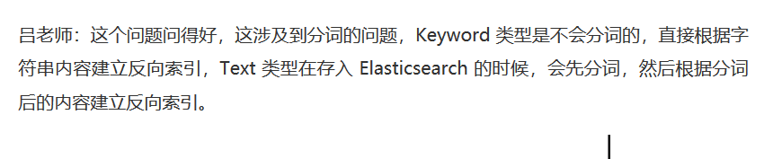
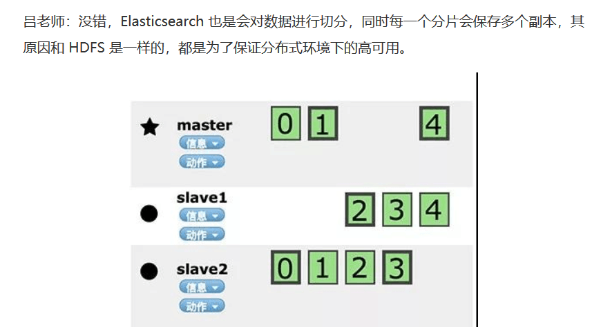
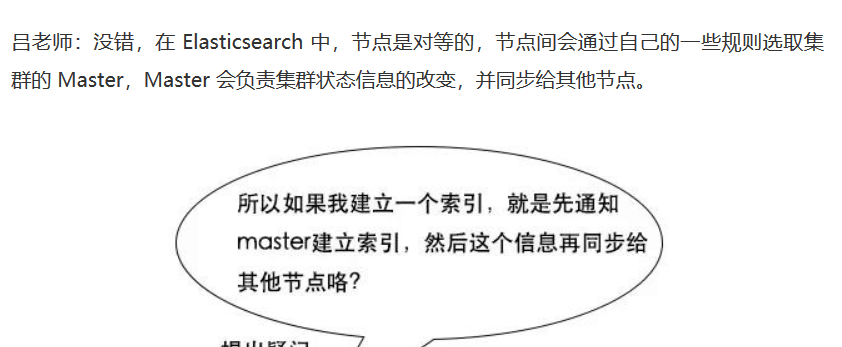
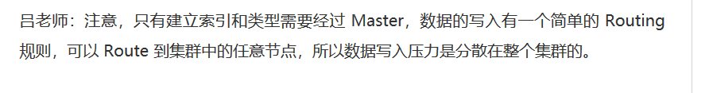

https://blog.csdn.net/achuo/article/details/87865141

https://www.cnblogs.com/heqiyoujing/p/11146178.html

用于全文检索。

- 反向索引又叫倒排索引，是根据文章内容中的关键字建立索引。
- ​    搜索引擎原理就是建立反向索引。
- ​    Elasticsearch 在 Lucene 的基础上进行封装，实现了分布式搜索引擎。
- ​    Elasticsearch 中的索引、类型和文档的概念比较重要，类似于 MySQL 中的数据库、表和行。
- ​    Elasticsearch 也是 Master-slave 架构，也实现了数据的分片和备份。
- ​    Elasticsearch 一个典型应用就是 ELK 日志分析系统。

