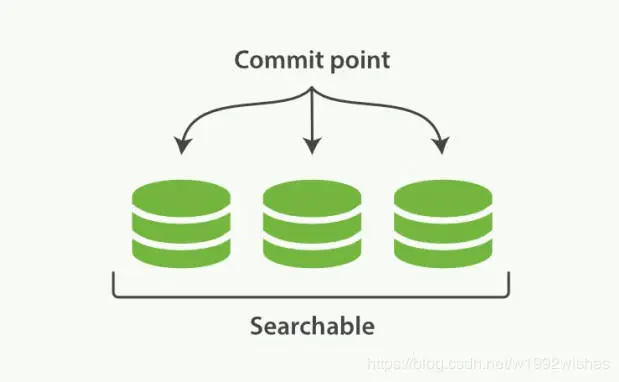
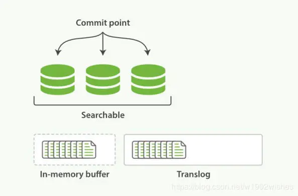
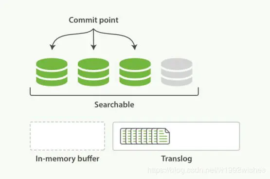
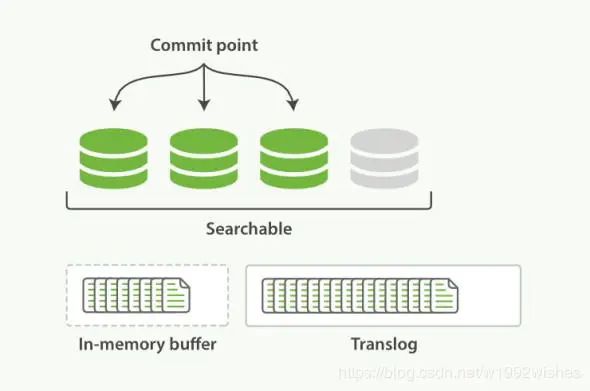
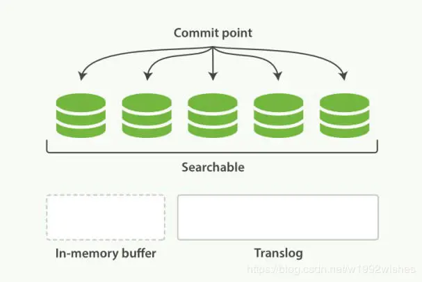
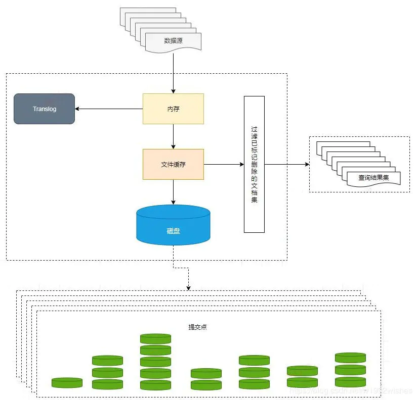
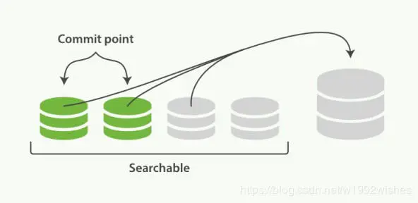

[es原理博客](https://www.cnblogs.com/dreamroute/p/8484457.html)

https://blog.csdn.net/achuo/article/details/87865141

https://www.cnblogs.com/heqiyoujing/p/11146178.html


Elasticsearch 是一个分布式可扩展的实时搜索和分析引擎,一个建立在全文搜索引擎 Apache Lucene(TM)  基础上的搜索引擎.当然 Elasticsearch 并不仅仅是 Lucene 那么简单，它不仅包括了全文搜索功能，还可以进行以下工作:

- 分布式实时文件存储，并将每一个字段都编入索引，使其可以被搜索。
- 实时分析的分布式搜索引擎。
- 可以扩展到上百台服务器，处理PB级别的结构化或非结构化数据。


# 1 前言

**为什么要用es?**

因为在我们商城中的数据，将来会非常多，所以采用以往的模糊查询，模糊查询前置配置，会放弃索引，导致商品查询是全表扫面，在百万级别的数据库中，效率非常低下，而我们使用ES做一个全文索引，我们将经常查询的商品的某些字段，比如说商品名，描述、价格还有id这些字段我们放入我们索引库里，可以提高查询速度。

### 1.1 四种节点

 在生产环境下，如果不修改elasticsearch节点的角色信息，在高数据量，高并发的场景下集群容易出现脑裂等问题。

 这些功能是由两个属性控制的：

-  node.master：这个属性表示节点是否具有成为主节点的资格
- node.data： 这个属性表示节点是否存储数据。

默认情况下这两个属性的值都是true。


> 四种组合

> 1.node.master: true
>
> node.data: true

这种组合表示这个节点即有成为主节点的资格，又存储数据，这个时候如果某个节点被选举成为了真正的主节点，那么他还要存储数据，这样对于这个节点的压力就比较大了。
elasticsearch默认每个节点都是这样的配置，在测试环境下这样做没问题。实际工作中建议不要这样设置.


>2.node.master: false
>
> node.data: true

**数据节点。**这种组合表示这个节点没有成为主节点的资格，也就不参与选举，只会存储数据。
在集群中需要单独设置几个这样的节点负责存储数据。后期提供存储和查询服务。


> 3.node.master: true
>
> node.data: false

**master节点**

**负责管理集群范围内的所有变更，例如增加、删除索引，或者增加、删除节点等。  而主节点并不需要涉及到文档级别的变更和搜索等操作**，所以当集群只拥有一个主节点的情况下，即使流量的增加它也不会成为瓶颈。 

作为用户，我们可以将请求发送到 *集群中的任何节点* ，包括主节点。  每个节点都知道任意文档所处的位置，并且能够将我们的请求直接转发到存储我们所需文档的节点。  无论我们将请求发送到哪个节点，它都能负责从各个包含我们所需文档的节点收集回数据，并将最终结果返回給客户端。 Elasticsearch  对这一切的管理都是透明的。


>4. node.master: false
>
> node.data: false

即不会成为主节点，也不会存储数据，这个节点的意义是作为一个client(客户端)节点，主要是针对海量请求的时候可以进行负载均衡。


> 配置建议

 建议集群中设置3台以上的节点作为master节点。
 这些节点只负责成为主节点，维护整个集群的状态。
 再根据数据量设置一批data节点【node.master: false node.data: true】
 这些节点只负责存储数据，后期提供建立索引和查询索引的服务，这样的话如果用户请求比较频繁，这些节点的压力也会比较大
 所以在集群中建议再设置一批client节点【node.master: false node.data: true】
 这些节点只负责处理用户请求，实现请求转发，负载均衡等功能。

-  master节点：普通服务器即可(CPU 内存 消耗一般)
-  data节点：主要消耗磁盘，内存
-  client节点：普通服务器即可(如果要进行分组聚合操作的话，建议这个节点内存也分配多一点)


### 1.2 基本概念

先说Elasticsearch的文件存储，Elasticsearch是面向文档型数据库，一条数据在这里就是一个文档，用JSON作为文档序列化的格式，比如下面这条用户数据：

```java
{
    "name" :     "John",
    "sex" :      "Male",
    "age" :      25,
    "birthDate": "1990/05/01",
    "about" :    "I love to go rock climbing",
    "interests": [ "sports", "music" ]
}
```

在Elasticsearch里这就是一个*文档*，当然这个文档会属于一个User的*类型*，各种各样的类型存在于一个*索引*当中。这里有一份简易的将Elasticsearch和关系型数据术语对照表:

```
关系数据库     ⇒ 数据库 ⇒ 表    ⇒ 行    ⇒ 列(Columns)

Elasticsearch  ⇒ 索引(Index)   ⇒ 类型(type)  ⇒ 文档(Docments)  ⇒ 字段(Fields)  
```


一个 Elasticsearch  集群可以包含多个索引(数据库)，也就是说其中包含了很多类型(表)。这些类型中包含了很多的文档(行)，然后每个文档中又包含了很多的字段(列)。Elasticsearch的交互，可以使用Java  API，也可以直接使用HTTP的Restful API方式，比如我们打算插入一条记录，可以简单发送一个HTTP的请求：

```
PUT /megacorp/employee/1  
{
    "name" :     "John",
    "sex" :      "Male",
    "age" :      25,
    "about" :    "I love to go rock climbing",
    "interests": [ "sports", "music" ]
}
```


## 2 索引原理

### 2.1 倒排索引

假设有这么几条数据(为了简单，去掉about, interests这两个field):

```mysql
| ID | Name | Age  |  Sex     |
| -- |:------------:| -----:| -----:| 
| 1  | Kate         | 24 | Female
| 2  | John         | 24 | Male
| 3  | Bill         | 29 | Male
```

ID是Elasticsearch自建的文档id，那么Elasticsearch建立的索引如下:

**Name:**

```mysql
| Term | Posting List |
| -- |:----:|
| Kate | 1 |
| John | 2 |
| Bill | 3 |
```

**Age:**

```mysql
| Term | Posting List |
| -- |:----:|
| 24 | [1,2] |
| 29 | 3 |
```

**Sex:**

```mysql
| Term | Posting List |
| -- |:----:|
| Female | 1 |
| Male | [2,3] |
```


##### Posting List

Elasticsearch分别为每个field都建立了一个倒排索引，Kate, John, 24, Female这些叫term，而[1,2]就是**Posting List**。Posting list就是一个int的数组，存储了所有符合某个term的文档id。

通过posting list这种索引方式似乎可以很快进行查找，比如要找age=24的同学，爱回答问题的小明马上就举手回答：我知道，id是1，2的同学。但是，如果这里有上千万的记录呢？如果是想通过name来查找呢？


##### Term Dictionary

Elasticsearch为了能快速找到某个term，将所有的term排个序，二分法查找term，logN的查找效率，就像通过字典查找一样，这就是**Term Dictionary**


##### Term Index

**B-Tree通过减少磁盘寻道次数来提高查询性能**，Elasticsearch也是采用同样的思路，直接通过内存查找term，不读磁盘，但是如果term太多，term dictionary也会很大，放内存不现实，于是有了**Term Index**，就像字典里的索引页一样，A开头的有哪些term，分别在哪页，可以理解term index是一颗树：


这棵树不会包含所有的term，它包含的是term的一些前缀。通过term index可以快速地定位到term dictionary的某个offset，然后从这个位置再往后顺序查找。


所以term index不需要存下所有的term，而仅仅是他们的一些前缀与Term  Dictionary的block之间的映射关系，再结合FST(Finite State Transducers)的压缩技术，可以使term  index缓存到内存中。从term index查到对应的term  dictionary的block位置之后，再去磁盘上找term，大大减少了磁盘随机读的次数。


##### FST

假设我们现在要将mop, moth, pop, star, stop and top(term index里的term前缀)映射到序号：0，1，2，3，4，5(term dictionary的block位置)。最简单的做法就是定义个Map<string, integer="">，大家找到自己的位置对应入座就好了，但从内存占用少的角度想想，有没有更优的办法呢？答案就是：**FST**([理论依据在此，但我相信99%的人不会认真看完的](http://www.cs.nyu.edu/~mohri/pub/fla.pdf))


⭕️表示一种状态

-->表示状态的变化过程，上面的字母/数字表示状态变化和权重

将单词分成单个字母通过⭕️和-->表示出来，0权重不显示。如果⭕️后面出现分支，就标记权重，最后整条路径上的权重加起来就是这个单词对应的序号。

FST以字节的方式存储所有的term，这种压缩方式可以有效的缩减存储空间，使得term index足以放进内存，但这种方式也会导致查找时需要更多的CPU资源。

FST有两个优点：

1）空间占用小。通过对词典中单词前缀和后缀的重复利用，压缩了存储空间；

2）查询速度快。O(len(str))的查询时间复杂度。

   下面简单描述下FST的构造过程（工具演示：[http://examples.mikemccandless.com/fst.py?terms=&cmd=Build+it%21](http://examples.mikemccandless.com/fst.py?terms=&cmd=Build+it!)）。我们对“cat”、 “deep”、 “do”、 “dog” 、“dogs”这5个单词进行插入构建FST（注：必须已排序）。

1）插入“cat”

   插入cat，每个字母形成一条边，其中t边指向终点。


2）插入“deep”

  与前一个单词“cat”进行最大前缀匹配，发现没有匹配则直接插入，P边指向终点。


3）插入“do”

  与前一个单词“deep”进行最大前缀匹配，发现是d，则在d边后增加新边o，o边指向终点。


4）插入“dog”

  与前一个单词“do”进行最大前缀匹配，发现是do，则在o边后增加新边g，g边指向终点。


5）插入“dogs”

   与前一个单词“dog”进行最大前缀匹配，发现是dog，则在g后增加新边s，s边指向终点。


 最终我们得到了如上一个有向无环图。利用该结构可以很方便的进行查询，如给定一个term “dog”，我们可以通过上述结构很方便的查询存不存在，甚至我们在构建过程中可以将单词与某一数字、单词进行关联，从而实现key-value的映射。


##### bitmap

Elasticsearch里除了上面说到用FST压缩term index外，对posting list也有压缩技巧。 

嗯，我们再看回最开始的例子，如果Elasticsearch需要对同学的性别进行索引，会怎样？如果有上千万个同学，而世界上只有男/女这样两个性别，每个posting list都会有至少百万个文档id。 Elasticsearch是如何有效的对这些文档id压缩的呢？

首先，Elasticsearch要求posting list是有序的，这样做的一个好处是方便压缩

如：

>[1,3,4,7,10]
>
>对应的bitmap就是：1~10个数字，对应数组长度为10
>
>[1,0,1,1,0,0,1,0,0,1]

Bitmap的缺点是存储空间随着文档个数线性增长，Roaring bitmaps需要打破这个魔咒就一定要用到某些指数特性：

将posting list按照65535为界限分块，比如第一块所包含的文档id范围在0~65535之间，第二块的id范围是65536~131071，以此类推。再用<商，余数>的组合表示每一组id，这样每组里的id范围都在0~65535内了，剩下的就好办了，既然每组id不会变得无限大，那么我们就可以通过最有效的方式对这里的id存储。

65535 = 2^16-1，是用2个字节能表示的最大数


### 2.2 联合索引

上面说了半天都是单field索引，如果多个field索引的联合查询，倒排索引如何满足快速查询的要求呢？

- 利用跳表(Skip list)的数据结构快速做“与”运算，或者
- 利用上面提到的bitset按位“与”

假设有下面三个posting list需要联合索引：

如果使用跳表，对最短的posting list中的每个id，逐个在另外两个posting list中查找看是否存在，最后得到交集的结果。

如果使用bitset，就很直观了，直接按位与，得到的结果就是最后的交集。


### 2.3 总结与思考

将磁盘里的东西尽量搬进内存，减少磁盘随机读取次数(同时也利用磁盘顺序读特性)，结合各种奇技淫巧的压缩算法，用及其苛刻的态度使用内存。

所以，对于使用Elasticsearch进行索引时需要注意:

- 不需要索引的字段，一定要明确定义出来，因为默认是自动建索引的
- 同样的道理，对于String类型的字段，不需要analysis的也需要明确定义出来，因为默认也是会analysis的
- 选择有规律的ID很重要，随机性太大的ID(比如java的UUID)不利于查询


## 3 与数据库区别

### 3.1 如果用数据库做搜索会怎么样？

如果用数据库搜索。

1. 例如，每条记录的指定字段的文本，可能会很长，比如说“商品描述”或者“文章详情”字段的长度，有长达数千个，甚至数万个字符，这个时候，每次都要对每条记录的所有文本进行扫描，去判断，你包不包含我指定的这个关键词（比如说“鞋子”）
2. 还不能将搜索词拆分开来，尽可能去搜索更多的符合你的期望的结果，比如输入“暴走事件”，就搜索不出来“暴走大事件”

所以数据量大的时候，用数据库搜索性能会很差的。


## 4 主备机制

### 4.1 分片分布在节点的情况

ES是一个分布式的，那么对于分布式的架构，肯定是由主备机制的。

1. index包含多个分片

2. primary shard不能和自己的replica shard放在同一个节点上（否则节点宕机，primary shard和副本都丢失，起不到容错的作用），但是可以和其他primary shard的replica shard放在同一个节点上

P0 P1 P2为三个主分片，R0 R1 R2为三个副本分片，分别分散在三个节点。


### 4.2 Elasticsearch是如何实现Master选举的？

> Elasticsearch在满足如下时间点的时候会触发选举

1. 集群启动初始化
2. 集群的Master崩溃的时候
3. 任何一个节点发现当前集群中的Master节点没有得到n/2 + 1节点认可的时候，触发选举


> 选举流程

数据节点确定了master以后，会开启MasterPinger线程来与其保持心跳通信的逻辑 如果通信过程中链接断开，会通过监听器进行回调处理 。处理过程中会去调用方法，以便选举出新的master进行通信，大致过程如下：

1. 首先通过ping操作来向其他节点进行学习 ， ping的方式有两种，单播(官方推荐)或组播。
2. 如果ping的结果显示其他节点已选举出了master ，在这些节点所选举的master列表中选取id值最小的一个作为当前节点的master 

1. 如果ping结果显示其他节点还没有选举出master ，对所有可以成为master的节点根据nodeId排序，每次选举每个节点都把自己所知道节点排一次序，然后选出第一个（第0位）节点，暂且认为它是master节点。（注意，可通讯到的节点必须占所有节点的一半以上，防止脑裂）
2. 如果对某个节点的投票数达到一定的值（可以成为master节点数n/2+1）并且该节点自己也选举自己，那这个节点就是master。否则重新选举。


> 事例

假设有三个节点node1, node2,  node3, 假设我们配置每个节点都有机会（node.master: true)可以成为master,刚开始启动的时候，  node1启动了，此时node1去执行findMaster()，由于此时只有一个节点， node1只能发现自己这个节点，  不满足节点数大于n/2+1的条件（配置文件指定的），所以此时找不到master， node1会不断的执行while循环直到找到master位置。 然后此时node2上线启动，node1和node2构成了两个节点，node2选择自己作为master节点, 此时node2 通过ping可以发现node1, 此时 node2还会选举自己一把，这样node2才能真正成为master。 此时node1 的循环又开始了，他就会发现master不是自己而是node2， 这样就会接受node2是master.


### 4.3 脑裂

##### 4.3.1 什么是脑裂

让我们看一个有两个节点的elasticsearch集群的简单情况。集群维护一个单个索引并有一个分片和一个复制节点。节点1在启动时被选举为主节点并保存主分片（在下面的schema里标记为**0P**），而节点2保存复制分片（**0R**） 


现在，如果在两个节点之间的通讯中断了，会发生什么？由于网络问题或只是因为其中一个节点无响应,两个节点都相信对方已经挂了。节点1不需要做什么，因为它本来就被选举为主节点。但是节点2会自动选举它自己为主节点，因为它相信集群的一部分没有主节点了。这样就发生了脑裂。


##### 4.3.2 如何避免脑裂问题

1. 避免脑裂现象，用到的一个参数是：discovery.zen.minimum_master_nodes。**这个参数决定了在选主过程中需要有多少个节点通信。** 

   根据一般经验这个一般设置成  N/2 + 1，N是集群中节点的数量，例如一个有3个节点的集群，minimum_master_nodes 应该被设置成 3/2 + 1 =  2（向下取整）。

2. 用到的另外一个参数是：discovery.zen.ping.timeout，等待ping响应的超时时间，默认值是3秒。如果网络缓慢或拥塞，建议略微调大这个值。这个参数不仅仅适应更高的网络延迟，也适用于在一个由于超负荷而响应缓慢的节点的情况。


## 5 ES的并发控制

### **乐观锁方案**

> 对文档的新建、索引和删除请求都是写操作，必须在主分片上面完成之后才能被复制到相关的副本分片，ES 为了提高写入的能力这个过程是并发写的，同时为了解决并发写的过程中数据冲突的问题，ES 通过乐观锁的方式控制，每个文档都有一个 _version （版本）号，当文档被修改时版本号递增。一旦所有的副本分片都报告写成功才会向协调节点报告成功，协调节点向客户端报告成功。

每次执行修改和删除，这个version的版本号会自动加1
在删除一个document之后，并没有物理删除掉的，因为它的版本号信息还是保留着的，先删除一条document，再重新创建这条document，其实会在delete version基础之上，再把version号加1.

es的后台都是多线程异步的，多个修改请求，是没有顺序的，例如后修改的先到。
es内部的多线程异步并发是基于自己的verison版本号进行乐观锁控制的，在后修改的先到时，filed=test3，version =2,修改后到时，先修改filed=test2,veriosn=1,此时会比较version，是否相等，如果不相等的话，就直接丢弃这条数据了。


**可以通过版本号使用乐观并发控制，以确保新版本不会被旧版本覆盖，由应用层来处理具体的冲突；**

悲观锁的优点：方便，对应用程序来说透明，缺点：并发能力低。
乐观锁：并发能力高，都需要重新比对版本号，然后可能需要重新加载数据，再写，这个过程，可能需要重复好几次


## 6 document的CRUD原理

### 6.1 **写数据过程**

> ES 集群中每个节点通过路由都知道集群中的文档的存放位置，所以每个节点都有处理读写请求的能力。
>
> 在一个写请求被发送到某个节点后，该节点即为协调节点，协调节点会根据路由公式计算出需要写到哪个分片上，再将请求转发到该分片的主分片节点上。

过程如下：

客户端选择一个节点发送请求过去，这个节点就是协调节点。

协调节点对文档进行**路由**，将请求转发给对应的节点（有主分片）。

实际的节点上的主分片处理请求，然后将数据同步到副分片。

协调节点如果发现主节点和所有副节点都搞定之后，就返回响应结果给客户端。

 

### 6.2 **读数据过程**

客户端发送请求到**任意**一个节点，成为协调节点。

因为每个节点通过路由都知道集群中的文档的存放位置，所以协调节点对 doc id 进行哈希路由，将请求转发到对应的节点，此时会使用 round-robin**随机轮询算法**，在主节点以及其所有副节点中随机选择一个，让读请求负载均衡。

接收请求的 node 返回 document 给 coordinate node。

coordinate node 返回 document 给客户端。

 

### 6.3 **搜索数据过程** 

es 最强大的是做全文检索，就是比如你有三条数据：

java真好玩儿啊

java好难学啊

j2ee特别牛

你根据 java 关键词来搜索，将包含 java的 document 给搜索出来。es 就会给你返回：java真好玩儿啊，java好难学啊。

客户端发送请求到一个协调节点。

协调节点将搜索请求转发到**所有**的分片对应的主分片或副分片，都可以。

query phase：每个分片将自己的搜索结果（其实就是一些 doc id）返回给协调节点，由协调节点进行数据的合并、排序、分页等操作，产出最终结果。

fetch phase：接着由协调节点根据 doc id 去各个节点上**拉取实际**的 document 数据，最终返回给客户端。

写请求是写入主分片，然后同步给所有的副分片；读请求可以从 primary shard 或 replica shard 读取，采用的是随机轮询算法。

 

##  7 Lucene底层

[博客](https://blog.csdn.net/njpjsoftdev/article/details/54015485)

简单来说，lucene 就是一个 jar 包，里面包含了封装好的各种建立倒排索引的算法代码。我们用 Java 开发的时候，引入 lucene jar，然后基于 lucene 的 api 去开发就可以了。

通过 lucene，我们可以将已有的数据建立索引，lucene 会在本地磁盘上面，给我们组织索引的数据结构。


### 7.1 lucene字典

使用lucene进行查询不可避免都会使用到其提供的字典功能，即根据给定的term找到该term所对应的倒排文档id列表等信息。实际上lucene索引文件后缀名为tim和tip的文件实现的就是lucene的字典功能。

​    怎么实现一个字典呢？我们马上想到排序数组，即term字典是一个已经按字母顺序排序好的数组，数组每一项存放着term和对应的倒排文档id列表。每次载入索引的时候只要将term数组载入内存，通过二分查找即可。这种方法查询时间复杂度为Log(N)，N指的是term数目，占用的空间大小是O(N*str(term))。排序数组的缺点是消耗内存，即需要完整存储每一个term，当term数目多达上千万时，占用的内存将不可接受。


### 7.2 常用字典数据结构


# 8 ES&Solr

## Elasticsearch 与 Solr 的比较总结

- 二者安装都很简单；
- Solr 利用 Zookeeper 进行分布式管理，而 Elasticsearch 自身带有分布式协调管理功能;
- Solr 支持更多格式的数据，而 Elasticsearch 仅支持json文件格式；
- Solr 官方提供的功能更多，而 Elasticsearch 本身更注重于核心功能，高级功能多有第三方插件提供；
- Solr 在传统的搜索应用中表现好于 Elasticsearch，但在处理实时搜索应用时效率明显低于 Elasticsearch。
- Solr 是传统搜索应用的有力解决方案，但 Elasticsearch 更适用于新兴的实时搜索应用。

 

# 9 存储原理

[博客](https://www.jianshu.com/p/cc06f9adbe82)

> 基础概念

- Index（索引）
  这里指ES的索引概念，有1个或多个type，由若干shard分片组成
- Shard（分片）
  是一个Lucene索引。一个ES Index分为多个Shard，可分布到不同节点上
- Doc（文档）
  ES中的最小的、整体的数据单位，比如一条用户订单信息是一个Doc。一个index中存放了很多Doc
- Lucene Index
  注意和Es Index区别。Lucene Index是由若干段和提交点文件组成。
- Segment（段）
  Lucene里面的一个数据集概念
- 提交点
  有一个列表存放着所有已知的所有段


## 9.1 索引的不可变性

写入磁盘的倒排索引是不可变的，优势主要表现在：

- 不需要锁。因为如果从来不需要更新一个索引，就不必担心多个程序同时尝试修改，也就不需要锁。
- 一旦索引被读入内核的文件系统缓存，便会留在哪里，由于其不变性，只要文件系统缓存中还有足够的空间，那么大部分读请求会直接请求内存，而不会命中磁盘。这提供了很大的性能提升。
- 其它缓存(像filter缓存)，在索引的生命周期内始终有效。它们不需要在每次数据改变时被重建，因为数据不会变化。
- 写入单个大的倒排索引，可以压缩数据，较少磁盘 IO 和需要缓存索引的内存大小。

当然，不可变的索引有它的缺点：

- 当对旧数据进行删除时，旧数据不会马上被删除，而是在 `.del`文件中被标记为删除。而旧数据只能等到段更新时才能被移除，这样会造成大量的空间浪费。
- 若有一条数据频繁的更新，每次更新都是新增新的标记旧的，则会有大量的空间浪费。
- 每次新增数据时都需要新增一个段来存储数据。当段的数量太多时，对服务器的资源例如文件句柄的消耗会非常大。
- 在查询的结果中包含所有的结果集，需要排除被标记删除的旧数据，这增加了查询的负担。


## 9.2 段的引入

在全文检索的早些时候，会为整个文档集合建立一个大索引，并且写入磁盘。只有新的索引准备好了，它就会替代旧的索引，最近的修改才可以被检索。这无疑是低效的。

因为索引的不可变性带来的好处，那如何在保持不可变同时更新倒排索引？

答案是，使用多个索引。**不是重写整个倒排索引，而是增加额外的索引反映最近的变化。**每个倒排索引都可以按顺序查询，从最老的开始，最后把结果聚合。

这就引入了**段 （segment）**：

- 新的文档首先写入内存区的索引缓存，这时不可检索。
- 时不时（默认 1s 一次），内存区的索引缓存被 refresh 到文件系统缓存（该过程比直接到磁盘代价低很多），成为一个新的段（segment）并被打开，这时可以被检索。
- 新的段提交，写入磁盘，提交后，新的段加入提交点，缓存被清除，等待接收新的文档。

分片下的索引文件被拆分为多个子文件，每个子文件叫作**段**， 每一个段本身都是一个倒排索引，并且段具有不变性，一旦索引的数据被写入硬盘，就不可再修改。

段被**写入到磁盘**后会生成一个**提交点**，提交点是一个用来记录所有提交后段信息的文件。一个段一旦拥有了提交点，就说明这个段只有读的权限，失去了写的权限。相反，当段在内存中时，就只有写的权限，而不具备读数据的权限，意味着不能被检索。

在 Lucene 中的索引（Lucene 索引是 ES 中的分片，ES 中的索引是分片的集合）指的是段的集合，再加上提交点(commit point)，如下图：



在底层采用了分段的存储模式，使它在读写时几乎完全避免了锁的出现，大大提升了读写性能。

**索引文件分段存储并且不可修改**，那么新增、更新和删除如何处理呢？

- 新增，新增很好处理，由于数据是新的，所以只需要对当前文档新增一个段就可以了。
- 删除，由于不可修改，所以对于删除操作，不会把文档从旧的段中移除，而是通过新增一个 `.del`文件（每一个提交点都有一个 .del 文件），包含了段上已经被删除的文档。当一个文档被删除，它实际上只是在.del文件中被标记为删除，依然可以匹配查询，但是最终返回之前会被从结果中删除。
- 更新，不能修改旧的段来进行反映文档的更新，其实更新相当于是删除和新增这两个动作组成。会将旧的文档在 `.del`文件中标记删除，然后文档的新版本被索引到一个新的段中。可能两个版本的文档都会被一个查询匹配到，但被删除的那个旧版本文档在结果集返回前就会被移除。


## 9.3 延迟写策略--近实时搜索--fresh

**每当有新增的数据时，就将其先写入到内存中，在内存和磁盘之间是文件系统缓存，当达到默认的时间（1秒钟）或者内存的数据达到一定量时，会触发一次刷新（Refresh），将内存中的数据生成到一个新的段上并缓存到文件缓存系统 上，稍后再被刷新到磁盘中并生成提交点**。

这里的内存使用的是ES的JVM内存，而文件缓存系统使用的是操作系统的内存。新的数据会继续的被写入内存，但内存中的数据并不是以段的形式存储的，因此不能提供检索功能。由内存刷新到文件缓存系统的时候会生成了新的段，并将段打开以供搜索使用，而不需要等到被刷新到磁盘。

在 Elasticsearch 中，这种写入和打开一个新段的轻量的过程叫做 refresh （即内存刷新到文件缓存系统）。默认情况下每个分片会每秒自动刷新一次。 **这就是为什么说 Elasticsearch 是近实时的搜索了：文档的改动不会立即被搜索，但是会在一秒内可见。**


## 9.4 持久化--flush

没用`fsync`同步文件系统缓存到磁盘，不能确保电源失效，甚至正常退出应用后，数据的安全。为了 ES 的可靠性，需要确保变更持久化到磁盘。

虽然通过定时 Refresh 获得近实时的搜索，但是 Refresh 只是将数据挪到文件缓存系统，文件缓存系统也是内存空间，属于操作系统的内存，只要是内存都存在断电或异常情况下丢失数据的危险。

为了避免丢失数据，Elasticsearch添加了**事务日志（Translog）**，事务日志记录了所有还没有持久化到磁盘的数据。

有了事务日志，过程现在如下：

1. 当一个文档被索引，它被加入到内存缓存，同时加到事务日志。不断有新的文档被写入到内存，同时也都会记录到事务日志中。这时新数据还不能被检索和查询。

   

   

2. 当达到默认的刷新时间或内存中的数据达到一定量后，会触发一次 refresh：

   

   

   - 将内存中的数据以一个新段形式刷新到文件缓存系统，但没有fsync；
   - 段被打开，使得新的文档可以搜索；
   - 缓存被清除。

3. 随着更多的文档加入到缓存区，写入日志，这个过程会继续。

   

   

4. 随着新文档索引不断被写入，当日志数据大小超过 512M 或者时间超过 30 分钟时，会进行一次全提交：

   

- 内存缓存区的所有文档会写入到新段中，同时清除缓存；
- 文件系统缓存通过`fsync`操作`flush`到硬盘，生成提交点；
- 事务日志文件被删除，创建一个空的新日志。

事务日志记录了没有`flush`到硬盘的所有操作。当故障重启后，ES 会用最近一次提交点从硬盘恢复所有已知的段，并且从日志里恢复所有的操作。

在 ES 中，进行一次提交并删除事务日志的操作叫做`flush`。分片每 30 分钟，或事务日志过大会进行一次`flush`操作。`flush API` 也可用来进行一次手动`flush`，`POST/ _flush`针对所有索引有效，`POST /index/_flush`则指定的索引：

通常很少需要手动`flush`，通常自动的就够了。

总体的流程大致如下：




## 9.5 合并段

由于自动刷新流程每秒会创建一个新的段 ，这样会导致短时间内的段数量暴增。而段数目太多会带来较大的麻烦。每一个段都会消耗文件句柄、内存和 cpu 运行周期。更重要的是，每个搜索请求都必须轮流检查每个段然后合并查询结果，所以段越多，搜索也就越慢。

ES 通过后台合并段解决这个问题。小段被合并成大段，再合并成更大的段。这时旧的文档从文件系统删除的时候，旧的段不会再复制到更大的新段中。合并的过程中不会中断索引和搜索。

段合并在进行索引和搜索时会自动进行，合并进程选择一小部分大小相似的段，并且在后台将它们合并到更大的段中，这些段既可以是未提交的也可以是已提交的。



合并结束后老的段会被删除，新的段被 flush 到磁盘，同时写入一个包含新段且排除旧的和较小的段的新提交点，新的段被打开可以用来搜索。


合并大的段会消耗很多 IO 和 CPU，如果不检查会影响到搜素性能。默认情况下，ES 会限制合并过程，这样搜索就可以有足够的资源进行。


# 10 解决ES的深分页问题 (游标 scroll)

[博客](https://blog.csdn.net/weixin_40341116/article/details/80821655)

## 10.1 作用

ES为了**避免深分页**，不允许使用分页(from&size)查询10000条以后的数据，因此如果要查询第10000条以后的数据，要使用ES提供的 scroll(游标) 来查询

- 假设取的页数较大时(深分页)，如请求第20页，Elasticsearch不得不取出所有分片上的第1页到第20页的所有文档，并做排序，最终再取出from后的size条结果作爲最终的返回值
- 假设你有16个分片，则需要在coordinate node彙总到 shards* (from+size)条记录，即需要16*(20+10)记录后做一次全局排序
- 所以，当索引非常非常大(千万或亿)，是无法使用from + size 做深分页的，分页越深则越容易OOM，即便不OOM，也很消耗CPU和内存资源
- 因此ES使用`index.max_result_window:10000`作爲保护措施 ，即默认 from + size 不能超过10000，虽然这个参数可以动态修改，也可以在配置文件配置，但是最好不要这麽做，应该改用ES游标来取得数据


## 10.2 scroll游标原理

> 不要把 `scroll` 用于实时请求，它主要用于大数据量的场景。例如：将一个索引的内容索引到另一个不同配置的新索引中。

- 可以把 scroll 理解爲关系型数据库里的 cursor，因此，scroll 并不适合用来做实时搜索，而更适用于后台批处理任务，比如群发
- scroll 具体分爲初始化和遍历两步
  - 初始化时将所有符合搜索条件的搜索结果缓存起来，可以想象成快照
  - 在遍历时，从这个快照里取数据
  - 也就是说，在初始化后对索引插入、删除、更新数据都不会影响遍历结果
- 游标可以增加性能的原因，是因为如果做深分页，每次搜索都必须重新排序，非常浪费，使用scroll就是一次把要用的数据都排完了，分批取出，因此比使用from+size还好


具体实例

- 初始化
  - 请求
    - 注意要在URL中的search后加上`scroll=1m`，不能写在request body中，其中`1m`表示这个游标要保持开启1分钟
    - 可以指定size大小，就是每次回传几笔数据，当回传到没有数据时，仍会返回200成功，只是hits裡的hits会是空list
    - 在初始化时除了回传`_scroll_id`，也会回传前100笔(假设size=100)的数据
    - request body和一般搜索一样，因此可以说在初始化的过程中，除了加上scroll设置游标开启时间之外，其他的都跟一般的搜寻没有两样 (要设置查询条件，也会回传前size笔的数据)

```
POST 127.0.0.1:9200/my_index/_search?scroll=1m
{
    "query":{
        "range":{
            "createTime": {
                "gte": 1522229999999
            }
        }
    },
    "size": 1000
}
```

返回结果

```
{
    "_scroll_id": "DnF1ZXJ5VGhlbkZldGNoBQAAAAAAfv5-FjNOamF0Mk1aUUhpUnU5ZWNMaHJocWcAAAAAAH7-gBYzTmphdDJNWlFIaVJ1OWVjTGhyaHFnAAAAAAB-_n8WM05qYXQyTVpRSGlSdTllY0xocmhxZwAAAAAAdsJxFmVkZTBJalJWUmp5UmI3V0FYc2lQbVEAAAAAAHbCcBZlZGUwSWpSVlJqeVJiN1dBWHNpUG1R",
    "took": 2,
    "timed_out": false,
    "_shards": {
        "total": 5,
        "successful": 5,
        "skipped": 0,
        "failed": 0
    },
    "hits": {
        "total": 84,
        "max_score": 1,
        "hits": [
            {
                "_index": "video1522821719",
                "_type": "doc",
                "_id": "84056",
                "_score": 1,
                "_source": {
                    "title": "三个院子",
                    "createTime": 1522239744000
                }
            }
            ....99 data
        ]
    }
}
```


# 11 中文分词器

| 分词器                 | 优势                               | 劣势                             |
| :--------------------- | :--------------------------------- | :------------------------------- |
| Smart Chinese Analysis | 官方插件                           | 中文分词效果惨不忍睹             |
| IKAnalyzer             | 简单易用，支持自定义词典和远程词典 | 词库需要自行维护，不支持词性识别 |
| 结巴分词               | 新词识别功能                       | 不支持词性识别                   |
| Ansj中文分词           | 分词精准度不错，支持词性识别       | 对标hanlp词库略少，学习成本高    |
| Hanlp                  | 目前词库最完善，支持的特性非常多   | 需要更优的分词效果，学习成本高   |

截止到目前为止,他们的分词准确性从高到低依次是:

hanlp> ansj >结巴>IK>Smart Chinese Analysis

结合准确性来看,选用中文分词器基于以下考虑:

官方的Smart Chinese Analysis直接可以不考虑了

对搜索要求不高的建议选用 IK 学习成本低,使用教程多,还支持远程词典

对新词识别要求高的选用结巴分词

Ansj和hanlp均基于自然处理语言,分词准确度高,活跃度来讲hanlp略胜一筹

截止目前,IK分词器插件的优势是支持自定义热更新远程词典。

