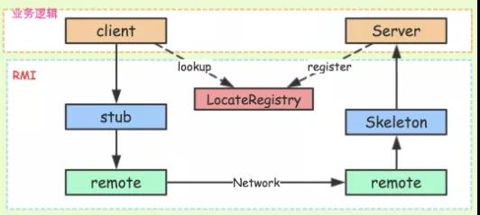

[博客](https://developer.51cto.com/art/201906/597963.htm)

## 1 简介

RPC（Remote Procedure Call）就是远程调用。

RPC 是一种技术思想而非一种规范或协议，常见 RPC 技术和框架有：

- 应用级的服务框架：阿里的 Dubbo/Dubbox、Google gRPC、Spring Boot/Spring Cloud。
- 远程通信协议：RMI、Socket、SOAP(HTTP XML)、REST(HTTP JSON)。
- 通信框架：MINA 和 Netty。

在一个典型 RPC 的使用场景中，包含了服务发现、负载、容错、网络传输、序列化等组件，其中“RPC 协议”就指明了程序如何进行网络传输和序列化。 


举个例子：

说起RPC，就不能不提到**分布式**，这个促使RPC诞生的领域。

假设你有一个计算器接口，Calculator，以及它的实现类CalculatorImpl，那么在系统还是**单体应用**时，你要调用Calculator的add方法来执行一个加运算，直接new一个CalculatorImpl，然后调用add方法就行了，这其实就是非常普通的**本地函数调用**，因为在**同一个地址空间**，或者说在同一块内存，所以通过方法栈和参数栈就可以实现。

 现在，基于高性能和高可靠等因素的考虑，你决定将系统改造为分布式应用，将很多可以共享的功能都单独拎出来，比如上面说到的计算器，你单独把它放到一个服务里头，让别的服务去调用它。 


这下问题来了，服务A里头并没有CalculatorImpl这个类，那它要怎样调用服务B的CalculatorImpl的add方法呢？

有同学会说，可以模仿B/S架构的调用方式呀，在B服务暴露一个Restful接口，然后A服务通过调用这个Restful接口来间接调用CalculatorImpl的add方法。

很好，这已经很接近RPC了，不过如果是这样，那每次调用时，是不是都需要写一串发起http请求的代码呢？比如**httpClient**.sendRequest...之类的，能不能像本地调用一样，去发起远程调用，让使用者感知不到远程调用的过程呢，像这样：

```java
@Reference  // @Reference是dubbo的注解，也是注入，他一般注入的是分布式的远程服务的对象，需要dubbo配置使用。
private Calculator calculator;

...

calculator.add(1,2);

...


```

 这时候，有同学就会说，用**代理模式**呀！而且最好是结合Spring IoC一起使用，通过Spring注入calculator对象，注入时，如果扫描到对象加了@Reference注解，那么就给它生成一个代理对象，将这个代理对象放进容器中。而这个代理对象的内部，就是通过httpClient来实现RPC远程过程调用的。

可能上面这段描述比较抽象，不过这就是很多RPC框架要解决的问题和解决的思路，比如阿里的Dubbo。

总结一下，**RPC要解决的两个问题：**

1. **解决分布式系统中，服务之间的调用问题。**
2. **远程调用时，要能够像本地调用一样方便，让调用者感知不到远程调用的逻辑。**


## **2 RPC 核心之功能实现**

RPC 的核心功能主要由 5 个模块组成，如果想要自己实现一个 RPC，最简单的方式要实现三个技术点，分别是：

- 服务寻址
- 数据流的序列化和反序列化
- 网络传输


#### **2.1 服务寻址**

服务寻址可以使用 Call ID 映射。在本地调用中，函数体是直接通过函数指针来指定的，但是在远程调用中，函数指针是不行的，因为两个进程的地址空间是完全不一样的。

所以在 RPC 中，所有的函数都必须有自己的一个 ID。这个 ID 在所有进程中都是唯一确定的。

客户端在做远程过程调用时，必须附上这个 ID。然后我们还需要在客户端和服务端分别维护一个函数和Call ID的对应表。

当客户端需要进行远程调用时，它就查一下这个表，找出相应的 Call ID，然后把它传给服务端，服务端也通过查表，来确定客户端需要调用的函数，然后执行相应函数的代码。

实现方式：服务注册中心。

要调用服务，首先你需要一个服务注册中心去查询对方服务都有哪些实例。Dubbo 的服务注册中心是可以配置的，官方推荐使用 Zookeeper。

实现案例：RMI(Remote Method Invocation，远程方法调用)也就是 RPC 本身的实现方式。



Registry(服务发现)：借助 JNDI 发布并调用了 RMI 服务。实际上，JNDI 就是一个注册表，服务端将服务对象放入到注册表中，客户端从注册表中获取服务对象。

RMI 服务在服务端实现之后需要注册到 RMI Server 上，然后客户端从指定的 RMI 地址上 Lookup 服务，调用该服务对应的方法即可完成远程方法调用。

Registry 是个很重要的功能，当服务端开发完服务之后，要对外暴露，如果没有服务注册，则客户端是无从调用的，即使服务端的服务就在那里。


#### **2.2 序列化和反序列化**

客户端怎么把参数值传给远程的函数呢?在本地调用中，我们只需要把参数压到栈里，然后让函数自己去栈里读就行。

但是在远程过程调用时，客户端跟服务端是不同的进程，不能通过内存来传递参数。

这时候就需要客户端把参数先转成一个字节流，传给服务端后，再把字节流转成自己能读取的格式。

只有二进制数据才能在网络中传输，序列化和反序列化的定义是：

- 将对象转换成二进制流的过程叫做序列化
- 将二进制流转换成对象的过程叫做反序列化

这个过程叫序列化和反序列化。同理，从服务端返回的值也需要序列化反序列化的过程。


#### **2.3 网络传输**

网络传输：远程调用往往用在网络上，客户端和服务端是通过网络连接的。

所有的数据都需要通过网络传输，因此就需要有一个网络传输层。网络传输层需要把 Call ID 和序列化后的参数字节流传给服务端，然后再把序列化后的调用结果传回客户端。

只要能完成这两者的，都可以作为传输层使用。因此，它所使用的协议其实是不限的，能完成传输就行。

尽管大部分 RPC 框架都使用 TCP 协议，但其实 UDP 也可以，而 gRPC 干脆就用了 HTTP2。

TCP 的连接是最常见的，简要分析基于 TCP 的连接：通常 TCP  连接可以是按需连接(需要调用的时候就先建立连接，调用结束后就立马断掉)，也可以是长连接(客户端和服务器建立起连接之后保持长期持有，不管此时有无数据包的发送，可以配合心跳检测机制定期检测建立的连接是否存活有效)，多个远程过程调用共享同一个连接。

所以，要实现一个 RPC 框架，只需要把以下三点实现了就基本完成了：

- Call ID 映射：可以直接使用函数字符串，也可以使用整数 ID。映射表一般就是一个哈希表。
- 序列化反序列化：可以自己写，也可以使用 Protobuf 或者 FlatBuffers 之类的。
- 网络传输库：可以自己写 Socket，或者用 Asio，ZeroMQ，Netty 之类。


## **3 RPC 核心之网络传输协议** 


在 RPC 中可选的网络传输方式有多种，可以选择 TCP 协议、UDP 协议、HTTP 协议。

每一种协议对整体的性能和效率都有不同的影响，如何选择一个正确的网络传输协议呢?首先要搞明白各种传输协议在 RPC 中的工作方式。


#### **3.1 基于 TCP 协议的 RPC 调用**

由服务的调用方与服务的提供方建立 Socket 连接，并由服务的调用方通过 Socket 将需要调用的接口名称、方法名称和参数序列化后传递给服务的提供方，服务的提供方反序列化后再利用反射调用相关的方法。

将结果返回给服务的调用方，整个基于 TCP 协议的 RPC 调用大致如此。

但是在实例应用中则会进行一系列的封装，如 RMI 便是在 TCP 协议上传递可序列化的 Java 对象。

#### **3.2 基于 HTTP 协议的 RPC 调用**

该方法更像是访问网页一样，只是它的返回结果更加单一简单。

其大致流程为：由服务的调用者向服务的提供者发送请求，这种请求的方式可能是 GET、POST、PUT、DELETE 等中的一种，服务的提供者可能会根据不同的请求方式做出不同的处理，或者某个方法只允许某种请求方式。

而调用的具体方法则是根据 URL 进行方法调用，而方法所需要的参数可能是对服务调用方传输过去的 XML 数据或者 JSON 数据解析后的结果，返回 JOSN 或者 XML 的数据结果。

由于目前有很多开源的 Web 服务器，如 Tomcat，所以其实现起来更加容易，就像做 Web 项目一样。


#### **3.3 两种方式对比**

基于 TCP 的协议实现的 RPC 调用，由于 TCP 协议处于协议栈的下层，能够更加灵活地对协议字段进行定制，减少网络开销，提高性能，实现更大的吞吐量和并发数。

但是需要更多关注底层复杂的细节，实现的代价更高。同时对不同平台，如安卓，iOS 等，需要重新开发出不同的工具包来进行请求发送和相应解析，工作量大，难以快速响应和满足用户需求。

基于 HTTP 协议实现的 RPC 则可以使用 JSON 和 XML 格式的请求或响应数据。

而 JSON 和 XML 作为通用的格式标准(使用 HTTP 协议也需要序列化和反序列化，不过这不是该协议下关心的内容，成熟的 Web 程序已经做好了序列化内容)，开源的解析工具已经相当成熟，在其上进行二次开发会非常便捷和简单。

但是由于 HTTP 协议是上层协议，发送包含同等内容的信息，使用 HTTP 协议传输所占用的字节数会比使用 TCP 协议传输所占用的字节数更高。

因此在同等网络下，通过 HTTP 协议传输相同内容，效率会比基于 TCP 协议的数据效率要低，信息传输所占用的时间也会更长，当然压缩数据，能够缩小这一差距。


## 4 **使用 RabbitMQ 的 RPC 架构**

在 OpenStack 中服务与服务之间使用 RESTful API 调用，而在服务内部则使用 RPC 调用各个功能模块。

正是由于使用了 RPC 来解耦服务内部功能模块，使得 OpenStack 的服务拥有扩展性强，耦合性低等优点。

OpenStack 的 RPC 架构中，加入了消息队列 RabbitMQ，这样做的目的是为了保证 RPC 在消息传递过程中的安全性和稳定性。

下面分析 OpenStack 中使用 RabbitMQ 如何实现 RPC 的调用。


#### **4.1 RabbitMQ 简介**

以下摘录自知乎：

对于初学者，举一个饭店的例子来解释这三个分别是什么吧。不是很恰当，但是应该足以解释这三者的区别。

RPC：假设你是一个饭店里的服务员，顾客向你点菜，但是你不会做菜，所以你采集了顾客要点什么之后告诉后厨去做顾客点的菜，这叫  RPC(remote procedure call)，因为厨房的厨师相对于服务员而言是另外一个人(在计算机的世界里就是 Remote  的机器上的一个进程)。厨师做好了的菜就是RPC的返回值。

任务队列和消息队列：本质都是队列，所以就只举一个任务队列的例子。假设这个饭店在高峰期顾客很多，而厨师只有很少的几个，所以服务员们不得不把单子按下单顺序放在厨房的桌子上，供厨师们一个一个做，这一堆单子就是任务队列，厨师们每做完一个菜，就从桌子上的订单里再取出一个单子继续做菜。

角色分担如下图： 


使用 RabbitMQ 的好处： 

- 同步变异步：可以使用线程池将同步变成异步，但是缺点是要自己实现线程池，并且强耦合。使用消息队列可以轻松将同步请求变成异步请求。
- 低内聚高耦合：解耦，减少强依赖。
- 流量削峰：通过消息队列设置请求值，超过阀值的抛弃或者转到错误界面。
- 网络通信性能提高：TCP 的创建和销毁开销大，创建 3 次握手，销毁 4 次分手，高峰时成千上万条的链接会造成资源的巨大浪费，而且操作系统每秒处理 TCP 的数量也是有数量限制的，必定造成性能瓶颈。

RabbitMQ 采用信道通信，不采用 TCP 直接通信。一条线程一条信道，多条线程多条信道，公用一个 TCP 连接。

一条 TCP 连接可以容纳条信道(硬盘容量足够的话)，不会造成性能瓶颈。


#### **4.2 RabbitMQ 的三种类型的交换器**

RabbitMQ 使用 Exchange(交换机)和 Queue(队列)来实现消息队列。

在 RabbitMQ 中一共有三种交换机类型，每一种交换机类型都有很鲜明的特征。

基于这三种交换机类型，OpenStack 完成两种 RPC 的调用方式。首先简单介绍三种交换机。


##### **①广播式交换器类型(Fanout)**

该类交换器不分析所接收到消息中的 Routing Key，默认将消息转发到所有与该交换器绑定的队列中去。


##### **②直接式交换器类型(Direct)**

该类交换器需要精确匹配 Routing Key 与 Binding Key，如消息的 Routing Key = Cloud，那么该条消息只能被转发至 Binding Key = Cloud 的消息队列中去。


##### **③主题式交换器(Topic Exchange)**

该类交换器通过消息的 Routing Key 与 Binding Key 的模式匹配，将消息转发至所有符合绑定规则的队列中。

Binding Key 支持通配符，其中“*”匹配一个词组，“#”匹配多个词组(包括零个)。


## 5 **简单对比 RPC 和 Restful API**

#### 5.1 **RESTful API 架构**

REST的几个特点为：资源、统一接口、URI 和无状态。

**①资源**

所谓"资源"，就是网络上的一个实体，或者说是网络上的一个具体信息。它可以是一段文本、一张图片、一首歌曲、一种服务，就是一个具体的实在。

**②统一接口**

RESTful 架构风格规定，数据的元操作，即 CRUD(Create，Read，Update 和  Delete，即数据的增删查改)操作，分别对应于 HTTP 方法：GET 用来获取资源，POST 用来新建资源(也可以用于更新资源)，PUT  用来更新资源，DELETE 用来删除资源，这样就统一了数据操作的接口，仅通过 HTTP 方法，就可以完成对数据的所有增删查改工作。

**③URL**

可以用一个 URI(统一资源定位符)指向资源，即每个 URI 都对应一个特定的资源。

要获取这个资源，访问它的 URI 就可以，因此 URI 就成了每一个资源的地址或识别符。

**④无状态**

所谓无状态的，即所有的资源，都可以通过 URI 定位，而且这个定位与其他资源无关，也不会因为其他资源的变化而改变。有状态和无状态的区别，举个简单的例子说明一下。

如查询员工的工资，如果查询工资是需要登录系统，进入查询工资的页面，执行相关操作后，获取工资的多少，则这种情况是有状态的。

因为查询工资的每一步操作都依赖于前一步操作，只要前置操作不成功，后续操作就无法执行。

如果输入一个 URI 即可得到指定员工的工资，则这种情况是无状态的，因为获取工资不依赖于其他资源或状态。

且这种情况下，员工工资是一个资源，由一个 URI 与之对应，可以通过 HTTP 中的 GET 方法得到资源，这是典型的 RESTful 风格。


#### 5.2 **RPC 和 Restful API 对比**

面对对象不同：

- RPC 更侧重于动作。
- REST 的主体是资源。

前者（RESTful）主要用于各组件之间的通信（如nova与glance的通信），或者说用于组件对外提供调用接口而后者（RPC）则用于同一组件中各个不同模块之间的通信（如nova组件中nova-compute与nova-scheduler的通信）。 


使用方式不同：

从使用上来看，HTTP 接口只关注服务提供方，对于客户端怎么调用并不关心。接口只要保证有客户端调用时，返回对应的数据就行了。而RPC则要求客户端接口保持和服务端的一致。

REST 是服务端把方法写好，客户端并不知道具体方法。客户端只想获取资源，所以发起HTTP请求，而服务端接收到请求后根据URI经过一系列的路由才定位到方法上面去；RPC是服务端提供好方法给客户端调用，客户端需要知道服务端的具体类，具体方法，然后像调用本地方法一样直接调用它。


传输效率：

- RPC 效率更高。RPC，使用自定义的 TCP 协议，可以让请求报文体积更小，或者使用 HTTP2 协议，也可以很好的减少报文的体积，提高传输效率。


复杂度：

- RPC 实现复杂，流程繁琐。
- REST 调用及测试都很方便。

RPC 实现需要实现编码，序列化，网络传输等。而 RESTful 不要关注这些，RESTful 实现更简单。


灵活性：

- HTTP 相对更规范，更标准，更通用，无论哪种语言都支持 HTTP 协议。
- RPC 可以实现跨语言调用，但整体灵活性不如 RESTful。


#### 5.3 **总结**

RPC 主要用于公司内部的服务调用，性能消耗低，传输效率高，实现复杂。

HTTP 主要用于对外的异构环境，浏览器接口调用，App 接口调用，第三方接口调用等。

RPC 使用场景(大型的网站，内部子系统较多、接口非常多的情况下适合使用 RPC)：

- 长链接。不必每次通信都要像 HTTP 一样去 3 次握手，减少了网络开销。
- 注册发布机制。RPC 框架一般都有注册中心，有丰富的监控管理;发布、下线接口、动态扩展等，对调用方来说是无感知、统一化的操作。
- 安全性，没有暴露资源操作。
- 微服务支持。就是最近流行的服务化架构、服务化治理，RPC 框架是一个强力的支撑。


## 6 Springcloud&Dubbo

| 功能名称     | Dubbo     | Spring Cloud                 |
| ------------ | --------- | ---------------------------- |
| 服务注册中心 | ZooKeeper | Spring Cloud Netflix Eureka  |
| 服务调用方式 | RPC       | REST API                     |
| 服务网关     | 无        | Spring Cloud Netflix Zuul    |
| 断路器       | 不完善    | Spring Cloud Netflix Hystrix |
| 分布式配置   | 无        | Spring Cloud Config          |
| 服务跟踪     | 无        | Spring Cloud Sleuth          |
| 消息总线     | 无        | Spring Cloud Bus             |
| 数据流       | 无        | Spring Cloud Stream          |
| 批量任务     | 无        | Spring Cloud Task            |


Spring Cloud 抛弃了 Dubbo 的 RPC 通信，采用的是基于 HTTP 的 REST 方式。虽然从一定程度上来说，后者牺牲了服务调用的性能，但也避免了上面提到的原生 RPC 带来的问题。而且 REST 相比 RPC 更为灵活，服务提供方和调用方，不存在代码级别的强依赖，这在强调快速演化的微服务环境下显得更加合适。

很明显，Spring Cloud 的功能比 Dubbo 更加强大，涵盖面更广，而且作为 Spring 的拳头项目，它也能够与 Spring Framework、Spring Boot、Spring Data、Spring Batch 等其他 Spring 项目完美融合，这些对于微服务而言是至关重要的。

前面提到，微服务背后一个重要的理念就是持续集成、快速交付，而在服务内部使用一个统一的技术框架，显然比将分散的技术组合到一起更有效率。

更重要的是，相比于 Dubbo，它是一个正在持续维护的、社区更加火热的开源项目，这就可以保证使用它构建的系统持续地得到开源力量的支持。

> 下面列举 Spring Cloud 的几个优势

- Spring Cloud 来源于 Spring，质量、稳定性、持续性都可以得到保证。
- Spirng Cloud 天然支持 Spring Boot，更加便于业务落地。
- Spring Cloud 发展得非常快，从开始接触时的相关组件版本为 1.x，到现在将要发布 2.x 系列。
- Spring Cloud 是 [Java](http://c.biancheng.net/java/) 领域最适合做微服务的框架。


相比于其他框架，Spring Cloud 对微服务周边环境的支持力度最大。对于中小企业来讲，使用门槛较低。


## 7 如何实现一个简单的RPC

[博客](https://www.jianshu.com/p/5b90a4e70783)

**要实现一个RPC不算难，难的是实现一个高性能高可靠的RPC框架。**

#### 7.1 一个简陋的RPC

首先是Client端的应用层怎么发起RPC，ComsumerApp： 

```java
public class ComsumerApp {
    public static void main(String[] args) {
        Calculator calculator = new CalculatorRemoteImpl();
        int result = calculator.add(1, 2);
    }
}
```


**通过一个CalculatorRemoteImpl，我们把RPC的逻辑封装进去了，客户端调用时感知不到远程调用的麻烦**。下面再来看看CalculatorRemoteImpl，代码有些多，但是其实就是把上面的2、3、4几个步骤用代码实现了而已，CalculatorRemoteImpl：

```java
public class CalculatorRemoteImpl implements Calculator {
    public int add(int a, int b) {
        List<String> addressList = lookupProviders("Calculator.add");
        String address = chooseTarget(addressList);
        try {
            Socket socket = new Socket(address, PORT);

            // 将请求序列化
            CalculateRpcRequest calculateRpcRequest = generateRequest(a, b);
            ObjectOutputStream objectOutputStream = new ObjectOutputStream(socket.getOutputStream());

            // 将请求发给服务提供方
            objectOutputStream.writeObject(calculateRpcRequest);

            // 将响应体反序列化
            ObjectInputStream objectInputStream = new ObjectInputStream(socket.getInputStream());
            Object response = objectInputStream.readObject();

            if (response instanceof Integer) {
                return (Integer) response;
            } else {
                throw new InternalError();
            }

        } catch (Exception e) {
            log.error("fail", e);
            throw new InternalError();
        }
    }
}

```

 最后再来看看Server端的实现，和Client端非常类似，ProviderApp： 

```java
public class ProviderApp {
    private Calculator calculator = new CalculatorImpl();

    public static void main(String[] args) throws IOException {
        new ProviderApp().run();
    }

    private void run() throws IOException {
        ServerSocket listener = new ServerSocket(9090);
        try {
            while (true) {
                Socket socket = listener.accept();
                try {
                    // 将请求反序列化
                    ObjectInputStream objectInputStream = new ObjectInputStream(socket.getInputStream());
                    Object object = objectInputStream.readObject();

                    log.info("request is {}", object);

                    // 调用服务
                    int result = 0;
                    if (object instanceof CalculateRpcRequest) {
                        CalculateRpcRequest calculateRpcRequest = (CalculateRpcRequest) object;
                        if ("add".equals(calculateRpcRequest.getMethod())) {
                            result = calculator.add(calculateRpcRequest.getA(), calculateRpcRequest.getB());
                        } else {
                            throw new UnsupportedOperationException();
                        }
                    }

                    // 返回结果
                    ObjectOutputStream objectOutputStream = new ObjectOutputStream(socket.getOutputStream());
                    objectOutputStream.writeObject(new Integer(result));
                } catch (Exception e) {
                    log.error("fail", e);
                } finally {
                    socket.close();
                }
            }
        } finally {
            listener.close();
        }
    }

}

```

 Server端主要是通过ServerSocket的accept方法，来接收Client端的请求，接着就是反序列化请求->执行->序列化执行结果，最后将二进制格式的执行结果返回给Client。 

 

####  7.2 优化

这个RPC实现只是为了给大家演示一下RPC的原理，要是想放到生产环境去用，那是绝对不行的。

1、缺乏通用性
 我通过给Calculator接口写了一个CalculatorRemoteImpl，来实现计算器的远程调用，下一次要是有别的接口需要远程调用，是不是又得再写对应的远程调用实现类？这肯定是很不方便的。

那该如何解决呢？先来看看使用Dubbo时是如何实现RPC调用的：

 

```java
@Reference
private Calculator calculator;

...

calculator.add(1,2);

...


```

 Dubbo通过和Spring的集成，在Spring容器初始化的时候，如果扫描到对象加了@Reference注解，那么就给这个对象生成一个代理对象，这个代理对象会负责远程通讯，然后将代理对象放进容器中。所以代码运行期用到的calculator就是那个代理对象了。

我们可以先不和Spring集成，也就是先不采用依赖注入，但是我们要做到像Dubbo一样，无需自己手动写代理对象，怎么做呢？那自然是要求所有的远程调用都遵循一套模板，**把远程调用的信息放到一个RpcRequest对象里面，发给Server端，Server端解析之后就知道你要调用的是哪个RPC接口、以及入参是什么类型、入参的值又是什么**，就像Dubbo的RpcInvocation：

 

```java
public class RpcInvocation implements Invocation, Serializable {

    private static final long serialVersionUID = -4355285085441097045L;

    private String methodName;

    private Class<?>[] parameterTypes;

    private Object[] arguments;

    private Map<String, String> attachments;

    private transient Invoker<?> invoker;

```

  2、集成Spring

 在实现了代理对象通用化之后，下一步就可以考虑集成Spring的IOC功能了，通过Spring来创建代理对象，这一点就需要对Spring的bean初始化有一定掌握了。

3、长连接or短连接
 总不能每次要调用RPC接口时都去开启一个Socket建立连接吧？是不是可以保持若干个长连接，然后每次有rpc请求时，把请求放到任务队列中，然后由线程池去消费执行？只是一个思路，后续可以参考一下Dubbo是如何实现的。

4、 服务端线程池
 我们现在的Server端，是单线程的，每次都要等一个请求处理完，才能去accept另一个socket的连接，这样性能肯定很差，是不是可以通过一个线程池，来实现同时处理多个RPC请求？同样只是一个思路。

5、服务注册中心
 正如之前提到的，要调用服务，首先你需要一个服务注册中心，告诉你对方服务都有哪些实例。Dubbo的服务注册中心是可以配置的，官方推荐使用Zookeeper。如果使用Zookeeper的话，要怎样往上面注册实例，又要怎样获取实例，这些都是要实现的。

6、负载均衡
 如何从多个实例里挑选一个出来，进行调用，这就要用到负载均衡了。负载均衡的策略肯定不只一种，要怎样把策略做成可配置的？又要如何实现这些策略？同样可以参考Dubbo，[Dubbo - 负载均衡](https://link.jianshu.com?t=http%3A%2F%2Fdubbo.apache.org%2Fbooks%2Fdubbo-user-book%2Fdemos%2Floadbalance.html)

7、结果缓存
 每次调用查询接口时都要真的去Server端查询吗？是不是要考虑一下支持缓存？

8、多版本控制
 服务端接口修改了，旧的接口怎么办？

9、异步调用
 客户端调用完接口之后，不想等待服务端返回，想去干点别的事，可以支持不？

10、优雅停机
 服务端要停机了，还没处理完的请求，怎么办？

 


 

 

 

 

 