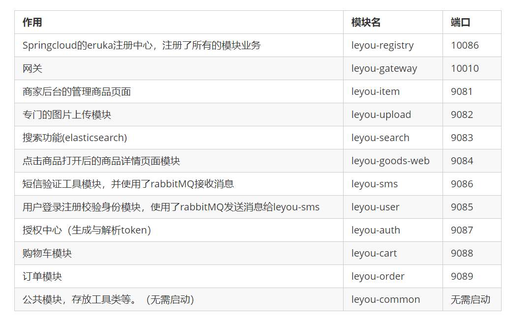
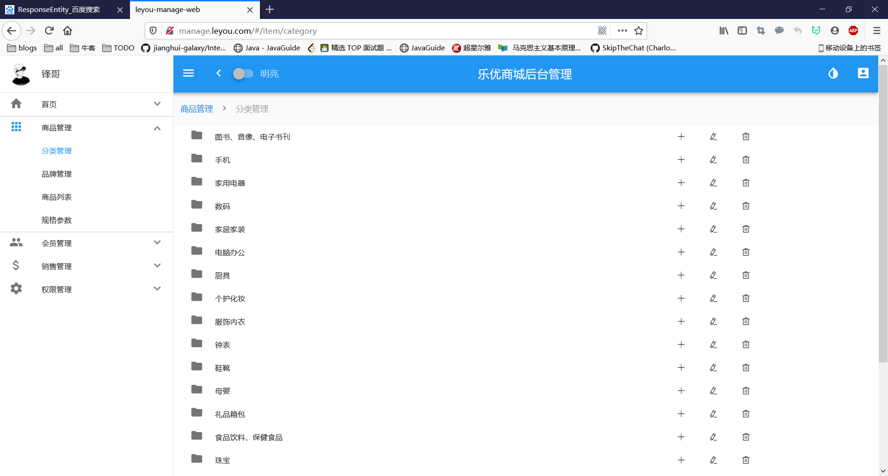
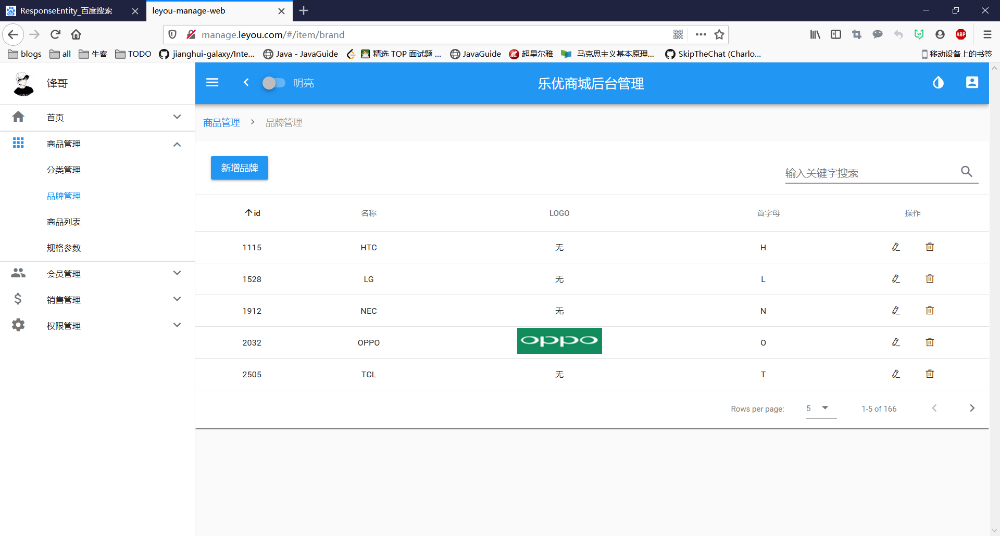
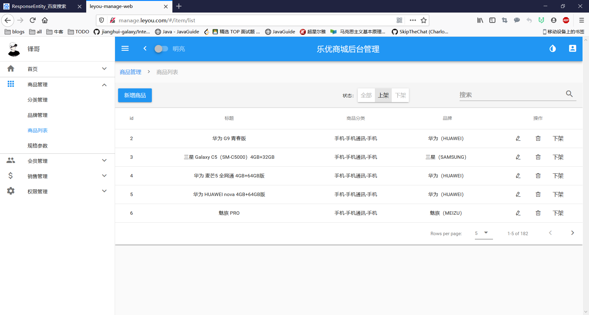

0.先介绍简历上做过的最后一个项目，首先让面试者简介，随后做引导式提问，主要从项目实现的功能及项目解决的问题切入，也就是你做的是啥玩意儿？有什么用？不深问。

1.介绍自己开发的模块。先例举，再取其一二细问，建议面试者挑选自己最熟悉的模块来回答。这里会问具体模块需要实现的功能，有哪些逻辑处理，你是怎么做的，考察面试者业务需求转换为业务代码的能力，期间会针对性的细问，如，涉及的数据表，这些表是如何关联的，你对它们进行了哪些操作，sql语句怎么把他们关联在一起，条件是什么等一系列非常基础基本的问题。

其次，再延伸，问此模块中定义的类，数据格式转换，异常处理，原项目的抽象类，公共类等。
3.技术，这里分两部分，先问面试者使用过的开源框架，再谈本公司目前项目中使用过的框架，对“这个框架如何使用的”进行提问，只问怎么用的，考察面试者是否能快速上手公司的项目，是否可以很快加入到实际开发中。最后，如果觉得面试者不错，再问框架原理，问并发，问调优，问到面试者懵b为止，以此压低期望工资。


> registry，gateway，item，upload，search，goods，sms，user，auth，cart,order


# 1 细节

www.manage.leyou.com ：后台管理页面

www.leyou.com  : 前台搜索界面

www.api.leyou.com：后端接口，前台向后端请求数据所用的网址


```properties
127.0.0.1 manage.leyou.com 

127.0.0.1 api.leyou.com 

192.168.153.129 image.leyou.com 

127.0.0.1 www.leyou.com  

```




## 1 **leyou-common**

* pojo:存储了PageResult，封装了分页对象,用的是泛型，方便通用

```java
public class PageResult<T> {

    private Long total;
    private Integer totalPage;
    private List<T> items;
    ...
    }
```

* utils：工具类


## 2 leyou-item

**leyou-item-interface:** 

- pojo：存放实例

  pojo/spuBo

  ```java
  public class SpuBo extends Spu {
  
      private String cname;
  
      private String bname;
  
      private SpuDetail spuDetail;
  
      private List<Sku> skus;
      ...
  }
  ```

  

- api：feign


**leyou-item-service：**

> controller

* CategoryController



```java
1.请求分级列表：http://api.leyou.com/api/item/category/list?pid=1
点击手机，下面出来一些手机的手机运营商，手机配件等这样的子列表，通过查询数据库表tb_category表的parent_id查询出来的。共同的子列表拥有相同的parent_id

2.http://api.leyou.com/api/item/category/list?pid=0
```

* BrandController:



```java
1.请求品牌（需要有分页效果）：http://api.leyou.com/api/item/brand/page?key=&page=1&rows=5&sortBy=id&desc=false
key:关键字
page:当前页
rows:每页多少行
sortBy:根据什么排列
desc:顺序还是倒序

通过Example复杂查询，用PageHelper分页
  PageHelper.startPage(page, rows);
  //Example复杂查询完成标桩成List
	...
    ...	
  List<Brand> brands = this.brandMapper.selectByExample(example);
  // 包装成pageInfo
  PageInfo<Brand> pageInfo = new PageInfo<>(brands);
  // 包装成分页结果集返回
 return new PageResult<>(pageInfo.getTotal(), pageInfo.getList());
```

* :star: GoodsController



```java
1.请求商品（需要有分页效果）：http://api.leyou.com/api/item/spu/page?key=&saleable=true&page=1&rows=5
和上面请求品牌的差不多，只是参数不一样，而且他需要请求一个品牌分类：手机-手机通讯-手机
这是需要自己组合的，并且他需要进行点击进行编辑需要加载商品的细节，所以通过example复杂查询查到后，需要将spu类转换为spuBo类

Table(name = "tb_spu")
public class Spu {
    @Id
    @GeneratedValue(strategy = GenerationType.IDENTITY)
    private Long id;
    private Long brandId;
    private Long cid1;// 1级类目
    private Long cid2;// 2级类目
    private Long cid3;// 3级类目
    private String title;// 标题
    private String subTitle;// 子标题
    private Boolean saleable;// 是否上架
    private Boolean valid;// 是否有效，逻辑删除用
    private Date createTime;// 创建时间
    private Date lastUpdateTime;// 最后修改时间
    ...
}

public class SpuBo extends Spu {

    private String cname; 

    private String bname;

    private SpuDetail spuDetail;

    private List<Sku> skus;
    ...
}

spu转换为spuBo：
    // spu集合转化成spubo集合
        List<SpuBo> spuBos = spus.stream().map(spu -> {
            SpuBo spuBo = new SpuBo();
            BeanUtils.copyProperties(spu, spuBo);

            // 查询品牌名称-brandMapper
            Brand brand = this.brandMapper.selectByPrimaryKey(spu.getBrandId());
            spuBo.setBname(brand.getName());
            // 查询分类名称-categoryService
            List<String> names = this.categoryService.queryNamesByIds(Arrays.asList(spu.getCid1(), spu.getCid2(), spu.getCid3()));
            spuBo.setCname(StringUtils.join(names, "-"));
            return spuBo;
        }).collect(Collectors.toList());
```

* SpecificationController


```java
用于规格参数查询：
http://api.leyou.com/api/item/spec/params?cid=76

查tb_spec_group和tb_spec_params即可
```

- service
- mapper：提供通用mapper功能， extends Mapper<Brand> 这样就行了


## 3 leyou-upload

上传图片

图片上传是文件的传输，如果也经过Zuul网关的代理，文件就会经过多次网路传输，造成不必要的网络负担。在高并发时，可能导致网络阻塞，Zuul网关不可用。这样我们的整个系统就瘫痪了。

所以，我们上传文件的请求就不经过网关来处理了。


### 3.1 我们这里采用忽略服务

```yaml
zuul:
  ignored-services:
    - upload-service # 忽略upload-service服务
```

上面的配置采用了集合语法，代表可以配置多个。


### 3.2 nginx

虽然zuul设置了忽略upload-service，但是如果发起请求，zuul还是会对所有的应用进行拦截并且加上api前缀。

发起：http://127.0.0.1:8082/upload/image

实际发起：

http://127.0.0.1:8082/api/upload/image


解决这个问题，可以用nginx对网址进行重写：

Nginx提供了rewrite指令，用于对地址进行重写，语法规则：

```nginx
rewrite "用来匹配路径的正则" 重写后的路径 [指令];
```

我们的案例：

```nginx 
	server {
        listen       80;
        server_name  api.leyou.com;

        proxy_set_header X-Forwarded-Host $host;
        proxy_set_header X-Forwarded-Server $host;
        proxy_set_header X-Forwarded-For $proxy_add_x_forwarded_for;

    	# 上传文件拦截，直接拦截/api/upload，转到127.0.0.1:8082，并且将对路径重写，将api去掉，这样就绕过了网关
		location /api/upload {	
			proxy_pass http://127.0.0.1:8082;
			proxy_connect_timeout 600;
			proxy_read_timeout 600;
			
			rewrite "^/api/(.*)$" /$1 break; 
        }
		
        location / {
			proxy_pass http://127.0.0.1:10010;
			proxy_connect_timeout 600;
			proxy_read_timeout 600;
        }
    }
```


### 3.3 跨域

因为绕过了网关，自然也就不能经过网关的跨域拦截处理了，所以leyou-upload这个服务也需要一个跨域处理

放在config下

```java
@Configuration
public class LeyouCorsConfiguration {

    @Bean
    public CorsFilter corsFilter(){

        // 初始化cors配置对象
        CorsConfiguration configuration = new CorsConfiguration();
        // 允许跨域的域名，如果要携带cookie，不能写*。*：代表所有域名都可以跨域访问
        configuration.addAllowedOrigin("http://manage.leyou.com");
        configuration.setAllowCredentials(true); // 允许携带cookie
        configuration.addAllowedMethod("*"); // 代表所有的请求方法：GET POST PUT Delete。。。。
        configuration.addAllowedHeader("*"); // 允许携带任何头信息

        // 初始化cors配置源对象
        UrlBasedCorsConfigurationSource configurationSource = new UrlBasedCorsConfigurationSource();
        configurationSource.registerCorsConfiguration("/**", configuration);

        // 返回corsFilter实例，参数：cors配置源对象
        return new CorsFilter(configurationSource);
    }
}

```


### 3.4 上传文件-分布式文件存储系统

FastDFS

- 文件存储
- 文件同步
- 文件访问（上传、下载）
- 存取负载均衡
- 在线扩容

适合有大容量存储需求的应用或系统


\Marie(2019)\programming\黑马java全套\16项目大全\01乐优商城\day08-品牌新增及fastDFS\笔记\assets\1526205318630.png)


FastDFS两个主要的角色：Tracker Server 和 Storage Server 。

- Tracker Server：跟踪服务器，主要负责调度storage节点与client通信，在访问上起负载均衡的作用，和记录storage节点的运行状态，是连接client和storage节点的枢纽。 
- Storage Server：存储服务器，保存文件和文件的meta data（元数据），每个storage server会启动一个单独的线程主动向Tracker cluster中每个tracker server报告其状态信息，包括磁盘使用情况，文件同步情况及文件上传下载次数统计等信息
- Group：文件组，多台Storage Server的集群。上传一个文件到同组内的一台机器上后，FastDFS会将该文件即时同步到同组内的其它所有机器上，起到备份的作用。不同组的服务器，保存的数据不同，而且相互独立，不进行通信。 
- Tracker Cluster：跟踪服务器的集群，有一组Tracker Server（跟踪服务器）组成。
- Storage Cluster ：存储集群，有多个Group组成。


> 上传

 /Marie(2019)/programming/%E9%BB%91%E9%A9%ACjava%E5%85%A8%E5%A5%97/16%E9%A1%B9%E7%9B%AE%E5%A4%A7%E5%85%A8/01%E4%B9%90%E4%BC%98%E5%95%86%E5%9F%8E/day08-%E5%93%81%E7%89%8C%E6%96%B0%E5%A2%9E%E5%8F%8AfastDFS/%E7%AC%94%E8%AE%B0/assets/1526205664373.png)


> 下载

 /Marie(2019)/programming/%E9%BB%91%E9%A9%ACjava%E5%85%A8%E5%A5%97/16%E9%A1%B9%E7%9B%AE%E5%A4%A7%E5%85%A8/01%E4%B9%90%E4%BC%98%E5%95%86%E5%9F%8E/day08-%E5%93%81%E7%89%8C%E6%96%B0%E5%A2%9E%E5%8F%8AfastDFS/%E7%AC%94%E8%AE%B0/assets/1526205705687.png)


```yaml
fdfs:
  so-timeout: 1501 # 超时时间
  connect-timeout: 601 # 连接超时时间
  thumb-image: # 缩略图
    width: 60
    height: 60
  tracker-list: # tracker地址：你的虚拟机服务器地址+端口（默认是22122）
    - 192.168.153.129:22122
```


引入配置类：放在leyou-upload的config下，和跨域请求处理文件在一个目录

```java
@Configuration
@Import(FdfsClientConfig.class)
// 解决jmx重复注册bean的问题
@EnableMBeanExport(registration = RegistrationPolicy.IGNORE_EXISTING)
public class FastClientImporter {
    
}
```


这样就可以使用了。


### 3.5 使用

uploadController：

```java
package com.leyou.upload.controller;

import com.leyou.upload.service.UploadService;
import org.apache.commons.lang.StringUtils;
import org.springframework.beans.factory.annotation.Autowired;
import org.springframework.http.HttpStatus;
import org.springframework.http.ResponseEntity;
import org.springframework.stereotype.Controller;
import org.springframework.web.bind.annotation.PostMapping;
import org.springframework.web.bind.annotation.RequestMapping;
import org.springframework.web.bind.annotation.RequestParam;
import org.springframework.web.multipart.MultipartFile;

@Controller
@RequestMapping("upload")
public class UploadController {

    @Autowired
    private UploadService uploadService;

    @PostMapping("image")
    public ResponseEntity<String> uploadImage(@RequestParam("file")MultipartFile file){
        String url = this.uploadService.uploadImage(file);
        if (StringUtils.isBlank(url)) {
            return ResponseEntity.badRequest().build();
        }
        return ResponseEntity.status(HttpStatus.CREATED).body(url);
    }
}
```


uploadService：

```java
@Service
public class UploadService {

    private static final List<String> CONTENT_TYPES = Arrays.asList("image/gif", "image/jpeg");

    private static final Logger LOGGER = LoggerFactory.getLogger(UploadService.class);

    @Autowired
    private FastFileStorageClient storageClient;

    public String uploadImage(MultipartFile file) {

        String originalFilename = file.getOriginalFilename();
        // 校验文件类型
        String contentType = file.getContentType();
        if (!CONTENT_TYPES.contains(contentType)) {
            LOGGER.info("文件类型不合法：{}", originalFilename);
            return null;
        }

        try {
            // 校验文件内容
            BufferedImage bufferedImage = ImageIO.read(file.getInputStream());
            if (bufferedImage == null) {
                LOGGER.info("文件内容不合法：{}", originalFilename);
                return null;
            }

            // 保存到服务器
            // file.transferTo(new File("C:\\hm49\\image\\" + originalFilename));
            String ext = StringUtils.substringAfterLast(originalFilename, ".");
            StorePath storePath = this.storageClient.uploadFile(file.getInputStream(), file.getSize(), ext, null);

            // 返回url，进行回显
            // return "http://image.leyou.com/" + originalFilename;
            return "http://image.leyou.com/" + storePath.getFullPath();
        } catch (IOException e) {
            LOGGER.info("服务器内部错误：" + originalFilename);
            e.printStackTrace();
        }
        return null;
    }
}
```


配置host：

```

```


- 首先就是用getOriginalFilename获取图片名称，然后校验文件的类型，拿到文件类型，合法的类型存在了一个list里面，所以用contains可判断list是否存在当前类型，不存在就返回null。
- 然后判断内容是否合法，  ImageIO.read(file.getInputStream());
- 最后调用方法上传到linux服务器，拿到了图片链接加上 "http://image.leyou.com/" 前缀进行返回。

配置host：

```
192.168.153.129 image.leyou.com
```


## 4 leyou-search

elasticsearch

### 4.1导入数据

\Marie(2019)\programming\黑马java全套\16项目大全\01乐优商城\day12-基本搜索\笔记\assets\1526607712207.png)

spuId、SkuId

\Marie(2019)\programming\黑马java全套\16项目大全\01乐优商城\day12-基本搜索\笔记\assets\1526608095471.png)

商品分类id、品牌id、图片、价格、商品的创建时间、sku信息集、可搜索的规格参数

**最终的数据结构：**

我们创建一个类，封装要保存到索引库的数据，并设置映射属性：

```java
@Document(indexName = "goods", type = "docs", shards = 1, replicas = 0)
public class Goods {
    @Id
    private Long id; // spuId
    @Field(type = FieldType.Text, analyzer = "ik_max_word")
    private String all; // 所有需要被搜索的信息，包含标题，分类，甚至品牌
    @Field(type = FieldType.Keyword, index = false)
    private String subTitle;// 卖点
    private Long brandId;// 品牌id
    private Long cid1;// 1级分类id
    private Long cid2;// 2级分类id
    private Long cid3;// 3级分类id
    private Date createTime;// 创建时间
    private List<Long> price;// 价格
    @Field(type = FieldType.Keyword, index = false)
    private String skus;// List<sku>信息的json结构
    private Map<String, Object> specs;// 可搜索的规格参数，key是参数名，值是参数值
}
```

一些特殊字段解释：

- all：用来进行全文检索的字段，里面包含标题、商品分类信息
- price：价格数组，是所有sku的价格集合。方便根据价格进行筛选过滤
- skus：用于页面展示的sku信息，不索引，不搜索。包含skuId、image、price、title字段
- specs：所有规格参数的集合。key是参数名，值是参数值。


**导入数据：**

reponsitory目录下：

```java
public interface GoodsRepository extends ElasticsearchRepository<Goods, Long> {
}
```


调用buildGoods拼接，导入完后数据如下：

> all：表示可搜索的信息，先查询分类名称和品牌，然后再拼接起来就是all了

```java
// 根据分类的id查询分类名称
List<String> names = this.categoryClient.queryNamesByIds(Arrays.asList(spu.getCid1(), spu.getCid2(), spu.getCid3()));
  
// 根据品牌id查询品牌
  Brand brand = this.brandClient.queryBrandById(spu.getBrandId());
```


```json
"all": "华为 G9 青春版  手机 手机通讯 手机 华为（HUAWEI）",
"subTitle": "骁龙芯片！3GB运行内存！索尼1300万摄像头！<a href='https://sale.jd.com/act/DhKrOjXnFcGL.html' target='_blank'>华为新品全面上线，更多优惠猛戳》》</a>",
          "brandId": 8557,
          "cid1": 74,
          "cid2": 75,
          "cid3": 76,
          "createTime": 1524297315000,

```


> prices

```java
 // 初始化一个价格集合，收集所有sku的价格
        List<Long> prices = new ArrayList<>();
```

prices在拿到sku后遍历的时候填充


```json
  "price": [
            84900,
            84900,
            84900
          ],
```


> sku：包括id，title，价格，图片

\Marie(2019)\programming\黑马java全套\16项目大全\01乐优商城\day12-基本搜索\笔记\assets\1526607712207.png)

```java
// 根据spuId查询所有的sku
        List<Sku> skus = this.goodsClient.querySkusBySpuId(spu.getId());

 // 收集sku的必要字段信息
        List<Map<String, Object>> skuMapList = new ArrayList<>();

 skus.forEach(sku -> {
            prices.add(sku.getPrice());

            Map<String, Object> map = new HashMap<>();
            map.put("id", sku.getId());
            map.put("title", sku.getTitle());
            map.put("price", sku.getPrice());
            // 获取sku中的图片，数据库的图片可能是多张，多张是以“,”分隔，所以也以逗号来切割返回图片数组，获取第一张图片
            map.put("image", StringUtils.isBlank(sku.getImages()) ? "" : StringUtils.split(sku.getImages(), ",")[0]);

            skuMapList.add(map);
        });
```

```json
 "skus": """[{"image":"http://image.leyou.com/images/9/15/1524297313793.jpg","price":84900,"id":2600242,"title":"华为 G9 青春版 白色 移动联通电信4G手机 双卡双待"},{"image":"http://image.leyou.com/images/9/5/1524297314398.jpg","price":84900,"id":2600248,"title":"华为 G9 青春版 金色 移动联通电信4G手机 双卡双待"},{"image":"http://image.leyou.com/images/15/15/1524297314800.jpg","price":84900,"id":3385376,"title":"华为 G9 青春版 玫瑰金 移动联通电信4G手机 双卡双待"}]""",
```


>  specs：参数

先根据cid3（也就是分类id）查参数表tb_spec_params，然后设置两个Map<String,Object>，一个用来存方通用规格参数，一个用来存放特殊规格参数，根据getGeneric来判断是通用规格参数还是特殊规格参数。

```java
// 根据spu中的cid3查询出所有的搜索规格参数
        List<SpecParam> params = this.specificationClient.queryParams(null, spu.getCid3(), null, true);

        // 根据spuId查询spuDetail
        SpuDetail spuDetail = this.goodsClient.querySpuDetailBySpuId(spu.getId());
        // 把通用的规格参数值，进行反序列化
        Map<String, Object> genericSpecMap = MAPPER.readValue(spuDetail.getGenericSpec(), new TypeReference<Map<String, Object>>(){});
        // 把特殊的规格参数值，进行反序列化
        Map<String, List<Object>> specialSpecMap = MAPPER.readValue(spuDetail.getSpecialSpec(), new TypeReference<Map<String, List<Object>>>(){});

        Map<String, Object> specs = new HashMap<>();
        params.forEach(param -> {
            // 判断规格参数的类型，是否是通用的规格参数
            if (param.getGeneric()) {
                // 如果是通用类型的参数，从genericSpecMap获取规格参数值
                String value = genericSpecMap.get(param.getId().toString()).toString();
                // 判断是否是数值类型，如果是数值类型，应该返回一个区间
                if (param.getNumeric()) {
                    value = chooseSegment(value, param);
                }
                specs.put(param.getName(), value);
            } else {
                // 如果是特殊的规格参数，从specialSpecMap中获取值
                List<Object> value = specialSpecMap.get(param.getId().toString());
                specs.put(param.getName(), value);
            }
        });
```


```java
          "specs": {
            "CPU核数": "八核",
            "后置摄像头": "1000-1500万",
            "CPU品牌": "骁龙（Snapdragon)",
            "CPU频率": "1.5-2.0GHz",
            "操作系统": "Android",
            "内存": [
              "3GB"
            ],
            "主屏幕尺寸（英寸）": "5.0-5.5英寸",
            "前置摄像头": "500-1000万",
            "电池容量（mAh）": "3000-4000mAh",
            "机身存储": [
              "16GB"
            ]
          }
```


> 放入elasticsearch

```java
   	goods.setId(spu.getId());
        goods.setCid1(spu.getCid1());
        goods.setCid2(spu.getCid2());
        goods.setCid3(spu.getCid3());
        goods.setBrandId(spu.getBrandId());
        goods.setCreateTime(spu.getCreateTime());
        goods.setSubTitle(spu.getSubTitle());
        // 拼接all字段，需要分类名称以及品牌名称
        goods.setAll(spu.getTitle() + " " + StringUtils.join(names, " ") + " " + brand.getName());
        // 获取spu下的所有sku的价格
        goods.setPrice(prices);
        // 获取spu下的所有sku，并转化成json字符串
        goods.setSkus(MAPPER.writeValueAsString(skuMapList));
        // 获取所有查询的规格参数{name:value}
        goods.setSpecs(specs);
        return goods;
```


### 4.2 搜索栏功能实现

>  SearchController

request是一个json，key+page+过滤条件，eg：

```json
{
	key:"华为",
    page:1,
    filter.CPU核数:八核,
    filter.后置摄像头:1000-1500万
}

```


```java
搜索栏功能：http://api.leyou.com/api/search/page
是一个post请求，所以处理也要post处理

   @PostMapping("page")
    public ResponseEntity<SearchResult> search(@RequestBody SearchRequest request){
        SearchResult result = this.searchService.search(request);
        if (result == null || CollectionUtils.isEmpty(result.getItems())) {
            return ResponseEntity.notFound().build();
        }
        return ResponseEntity.ok(result);
    }
```


> SearchService

搜索结果类：这个类继承了PageResult，PageResult封装了分页抽象信息

```java
public class SearchResult extends PageResult<Goods> {
private List<Map<String, Object>> categories;

private List<Brand> brands;

private List<Map<String, Object>> specs;
     public SearchResult(Long total, Integer totalPage, List<Goods> items, List<Map<String, Object>> categories, List<Brand> brands, List<Map<String, Object>> specs) {
        super(total, totalPage, items);
        this.categories = categories;
        this.brands = brands;
        this.specs = specs;
    }
    ...
}
```


```java
public class PageResult<T> {

    private Long total;
    private Integer totalPage;
    private List<T> items;
	...
}
```

调用goodsRepository进行elasticsearch查询，查出的结果

获得结果集后：

```java
return new SearchResult(goodsPage.getTotalElements(), goodsPage.getTotalPages(), goodsPage.getContent(), categories, brands, specs);
```


## 5 leyou-goods-web

### 5.1 Thymeleaf

商品详情浏览量比较大，并发高，我们会独立开启一个微服务，用来展示商品详情。leyou-goods-web

需要配置nginx：

```nginx
  server {
    listen       80;
    server_name  www.leyou.com;

    proxy_set_header X-Forwarded-Host $host;
    proxy_set_header X-Forwarded-Server $host;
    proxy_set_header X-Forwarded-For $proxy_add_x_forwarded_for;


    #如果是/item，就先本地查询html，没有再转给后台的http://127.0.0.1:9084
    #本地nginx存放thymeleaf生成的静态页面
    location /item {
        #proxy_pass http://127.0.0.1:9084;
        #proxy_connect_timeout 600;
        #proxy_read_timeout 600;
        
        # 先找本地
        root html;
        if (!-f $request_filename) { #请求的文件不存在，就反向代理
            proxy_pass http://127.0.0.1:9084;
            break;
        }
    }
```

将静态页面生成在nginx的html/item，nginx会首先本地html找，如果没找到才会反向代理到微服务去请求

\Marie(2019)\programming\黑马java全套\16项目大全\01乐优商城\day14thymeleaf及静态化\笔记\assets\1532757980379.png)


### 5.2 查询

首先当然是将一个模板页面放在`resources/template`下面，**这里放了一个item.html，是详情页面的模板页面，只需要填充数据就可以了。**

> GoodsController

```java
@Controller
public class GoodsController {

    @Autowired
    private GoodsService goodsService;

    @Autowired
    private GoodsHtmlService goodsHtmlService;

    @GetMapping("item/{id}.html")
    public String toItemPage(@PathVariable("id")Long id, Model model){

        Map<String, Object> map = this.goodsService.loadData(id);

        model.addAllAttributes(map);

        this.goodsHtmlService.createHtml(id);
        return "item";
    }
}

```


> GoodsService

Map<String, Object> model = new HashMap<>();

-  根据spuId（传过来的参数，spuId也就是静态页面的名称，如88.html）查询spu
- 查询spuDetail
- 查询分类：Map<String, Object>
- 查询品牌
- skus
- 查询规格参数组
- 查询特殊的规格参数

把以上信息都放到map里面，然后返回给controller

```java
@Service
public class GoodsService {

    @Autowired
    private BrandClient brandClient;
    @Autowired
    private CategoryClient categoryClient;
    @Autowired
    private GoodsClient goodsClient;
    @Autowired
    private SpecificationClient specificationClient;

    public Map<String, Object> loadData(Long spuId){

        Map<String, Object> model = new HashMap<>();

        // 根据spuId查询spu
        Spu spu = this.goodsClient.querySpuById(spuId);

        // 查询spuDetail
        SpuDetail spuDetail = this.goodsClient.querySpuDetailBySpuId(spuId);

        // 查询分类：Map<String, Object>
        List<Long> cids = Arrays.asList(spu.getCid1(), spu.getCid2(), spu.getCid3());
        List<String> names = this.categoryClient.queryNamesByIds(cids);
        // 初始化一个分类的map
        List<Map<String, Object>> categories = new ArrayList<>();
        for (int i = 0; i < cids.size(); i++) {
            Map<String, Object> map = new HashMap<>();
            map.put("id", cids.get(i));
            map.put("name", names.get(i));
            categories.add(map);
        }

        // 查询品牌
        Brand brand = this.brandClient.queryBrandById(spu.getBrandId());

        // skus
        List<Sku> skus = this.goodsClient.querySkusBySpuId(spuId);

        // 查询规格参数组
        List<SpecGroup> groups = this.specificationClient.queryGroupsWithParam(spu.getCid3());

        // 查询特殊的规格参数
        List<SpecParam> params = this.specificationClient.queryParams(null, spu.getCid3(), false, null);
        // 初始化特殊规格参数的map
        Map<Long, String> paramMap = new HashMap<>();
        params.forEach(param -> {
            paramMap.put(param.getId(), param.getName());
        });

        model.put("spu", spu);
        model.put("spuDetail", spuDetail);
        model.put("categories", categories);
        model.put("brand", brand);
        model.put("skus", skus);
        model.put("groups", groups);
        model.put("paramMap", paramMap);

        return model;
    }
}

```


> GoodsHtmlService

- 调用goodsHtmlService方法生成数据
- 调用PrintWriter生成一个文件在本地的nginx目录下面的html\item下面
- 调用TemplateEngine引擎给item.html填充i数据

```java
@Service
public class GoodsHtmlService {

    @Autowired
    private TemplateEngine engine;

    @Autowired
    private GoodsService goodsService;

    public void createHtml(Long spuId){

        // 初始化运行上下文
        Context context = new Context();
        // 设置数据模型
        context.setVariables(this.goodsService.loadData(spuId));

        PrintWriter printWriter = null;
        try {
            // 把静态文件生成到服务器本地
            File file = new File("D:\\downloadapp\\nginx-1.14.0\\html\\item\\" + spuId + ".html");
            printWriter = new PrintWriter(file);

            this.engine.process("item", context, printWriter);
        } catch (FileNotFoundException e) {
            e.printStackTrace();
        } finally {
            if (printWriter != null) {
                printWriter.close();
            }
        }
    }

    public void deleteHtml(Long id) {
        File file = new File("D:\\downloadapp\\nginx-1.14.0\\html\\item\\" + id + ".html");
        file.deleteOnExit();
    }
}

```


## 6 RabbitMQ

如果我们在后台修改了商品的价格，搜索页面（使用了elasticsearch）和商品详情页（使用了thyemeleaf）显示的依然是旧的信息

所以：

- 商品服务对商品增删改以后，无需去操作索引库或静态页面，只是发送一条消息，也不关心消息被谁接收。
- 搜索服务和静态页面服务接收消息，分别去处理索引库和静态页面。
- 

>  什么时候发？

当商品服务对商品进行写操作：增、删、改的时候，需要发送一条消息，通知其它服务。

> 发送什么内容？

对商品的增删改时其它服务可能需要新的商品数据，但是如果消息内容中包含全部商品信息，数据量太大，而且并不是每个服务都需要全部的信息。因此我们**只发送商品id**，其它服务可以根据id查询自己需要的信息。

> 接收方：搜索微服务、静态页微服务

接收消息后如何处理？

- 搜索微服务：
  - 增/改：添加新的数据到索引库 
  - 删：删除索引库数据
- 静态页微服务：
  - 增/改：创建新的静态页
  - 删：删除原来的静态页


接收方配置监听器，发送方&监听方都需要yaml中进行rabbitMQ配置。

每次发生了增删改的事件，需要发送消息给接收方，接收方接收消息后采取必要措施。


## 7 leyou-user 登陆中心

包括注册、登录、发送验证码

但是要注意，登录http://api.leyou.com/api/auth/accredit ，并不是走的leyou-user,而是走的lyou-auth

注册和验证码是走的这里http://api.leyou.com/api/user/code

> 发送验证码

使用common类里面的工具类生成一个验证码

然后使用rabbitMq发送给sms微服务，让sms去调用大于短信的api发短信

```java
  // 发送消息到rabbitMQ
        Map<String, String> msg = new HashMap<>();
        msg.put("phone", phone);
        msg.put("code", code);
this.amqpTemplate.convertAndSend("leyou.sms.exchange", "verifycode.sms", msg);
```


最后把验证码保存到redis，注意这里需要设置过期时间

```java
  // 把验证码保存到redis中
        this.redisTemplate.opsForValue().set(KEY_PREFIX + phone, code, 5, TimeUnit.MINUTES);
```


> 注册

```java
1.查询redis中验证码
2.校验验证码
3.调用common的工具类生成盐
4.加盐加密
 user.setPassword(CodecUtils.md5Hex(user.getPassword(), salt));
5.调用通用mapper新增用户
```


### 7.1 注意点

```java
@Table(name = "tb_user")
public class User {
    @Id
    @GeneratedValue(strategy = GenerationType.IDENTITY)
    private Long id;
    @Length(min = 4, max = 30, message = "用户名只能在4~30位之间")
    private String username;// 用户名

    @JsonIgnore
    @Length(min = 4, max = 30, message = "密码只能在4~30位之间")
    private String password;// 密码

    @Pattern(regexp = "^1[35678]\\d{9}$", message = "手机号格式不正确")
    private String phone;// 电话

    private Date created;// 创建时间

    @JsonIgnore
    private String salt;// 密码的盐值
}
```


1. 为了安全考虑。这里对password和salt添加了注解**@JsonIgnore，这样在json序列化时，就不会把password和salt返回**。
2. 为了减轻数据库压力防止缓存雪崩，这里我们需要数据校验，使用Hibernate-Validator框架完成数据校验，使用注解对其校验


在controller中改造register方法，只需要给User添加 @Valid注解即可。

\Marie(2019)\programming\黑马java全套\16项目大全\01乐优商城\day16用户注册(阿里大于及hibernate-validate)\笔记\01主要笔记\assets\1533030001081.png)


## 8 leyou-sms 短信发送

短信实现：

我们首先把一些常量抽取到application.yml中.这些类都是工具类SmsUtils需要用的信息

```yaml
leyou:
  sms:
    accessKeyId: JWffwFJIwada # 你自己的accessKeyId
    accessKeySecret: aySRliswq8fe7rF9gQyy1Izz4MQ # 你自己的AccessKeySecret
    signName: 乐优商城 # 签名名称
    verifyCodeTemplate: SMS_133976814 # 模板名称
```

然后注入到属性类中：这个类放在config下面

```java
@ConfigurationProperties(prefix = "leyou.sms")
public class SmsProperties {

    String accessKeyId;

    String accessKeySecret;

    String signName;

    String verifyCodeTemplate;

    public String getAccessKeyId() {
        return accessKeyId;
    }

    public void setAccessKeyId(String accessKeyId) {
        this.accessKeyId = accessKeyId;
    }

    public String getAccessKeySecret() {
        return accessKeySecret;
    }

    public void setAccessKeySecret(String accessKeySecret) {
        this.accessKeySecret = accessKeySecret;
    }

    public String getSignName() {
        return signName;
    }

    public void setSignName(String signName) {
        this.signName = signName;
    }

    public String getVerifyCodeTemplate() {
        return verifyCodeTemplate;
    }

    public void setVerifyCodeTemplate(String verifyCodeTemplate) {
        this.verifyCodeTemplate = verifyCodeTemplate;
    }
}
```


- 编写MQ监听类：当用户点击发送验证码，leyou-user微服务端就会首先调用工具类生成一个6位的随机数，然后把随机数和手机号通过MQ发送给sms方
- 我方接收到信息，调用smsUtils工具类调用大于短信的api然后发送验证码

```java
@Component
@EnableConfigurationProperties(SmsProperties.class)
public class SmsListener {

    @Autowired
    private SmsUtils smsUtils;

    @Autowired
    private SmsProperties prop;

    @RabbitListener(bindings = @QueueBinding(
            value = @Queue(value = "leyou.sms.queue", durable = "true"),
            exchange = @Exchange(value = "leyou.sms.exchange", 
                                 ignoreDeclarationExceptions = "true"),
            key = {"sms.verify.code"}))
    public void listenSms(Map<String, String> msg) throws Exception {
        if (msg == null || msg.size() <= 0) {
            // 放弃处理
            return;
        }
        String phone = msg.get("phone");
        String code = msg.get("code");

        if (StringUtils.isBlank(phone) || StringUtils.isBlank(code)) {
            // 放弃处理
            return;
        }
        // 发送消息
        SendSmsResponse resp = this.smsUtils.sendSms(phone, code, 
                                                     prop.getSignName(),
                                                     prop.getVerifyCodeTemplate());
        
    }
}
```


## 9  leyou-auth 授权中心

\Marie(2019)\programming\黑马java全套\16项目大全\01乐优商城\day17授权中心\笔记\assets\1527312464328.png)

用户登录过程：

1. 拿着用户名和密码访问leyou-auth
2. leyou-auth通过feign调用leyou-user的queryUser去数据库验证用户密码是否正确
3. 正确的话，就将user的id和username封装成UserInfo，然后调用工具类`JwtUtils.generateToken(userInfo, this.jwtProperties.getPrivateKey(), this.jwtProperties.getExpire());`其实就是通过jwt工具类结合私钥和用户信息还有过期时间生成一个加密token，返回给客户端
4. 然后用户拿着这个token去访问其他微服务，如果微服务需要密码才能访问的话，就需要通过自己的公钥去解析用户token，如果解析成功，就可以访问。


### 9.1 无状态&有状态登录

**什么是有状态？**

有状态服务，即服务端需要记录每次会话的客户端信息，从而识别客户端身份，根据用户身份进行请求的处理，典型的设计如tomcat中的session。

例如登录：用户登录后，我们把登录者的信息保存在服务端session中，并且给用户一个cookie值，记录对应的session。然后下次请求，用户携带cookie值来，我们就能识别到对应session，从而找到用户的信息。

缺点是什么？

- 服务端保存大量数据，增加服务端压力
- 服务端保存用户状态，无法进行水平扩展
- 客户端请求依赖服务端，多次请求必须访问同一台服务器


**什么是无状态**

微服务集群中的每个服务，对外提供的都是Rest风格的接口。而Rest风格的一个最重要的规范就是：服务的无状态性，即：

- 服务端不保存任何客户端请求者信息
- **客户端的每次请求必须具备自描述信息，通过这些信息识别客户端身份**

带来的好处是什么呢？

- 客户端请求不依赖服务端的信息，任何多次请求不需要必须访问到同一台服务
- 服务端的集群和状态对客户端透明
- 服务端可以任意的迁移和伸缩
- 减小服务端存储压力


### 9.2 JWT

步骤翻译：

- 1、用户登录

- 2、服务的认证，通过后根据secret生成token

- 3、将生成的token返回给浏览器

- 4、用户每次请求携带token

- 5、服务端利用公钥解读jwt签名，判断签名有效后，从Payload中获取用户信息

  

因为JWT签发的token中已经包含了用户的身份信息，并且每次请求都会携带，这样服务的就无需保存用户信息，甚至无需去数据库查询，完全符合了Rest的无状态规范。


加密方式：

加密技术是对信息进行编码和解码的技术，编码是把原来可读信息（又称明文）译成代码形式（又称密文），其逆过程就是解码（解密），加密技术的要点是加密算法，加密算法可以分为三类：  

- 对称加密，如AES
  - 基本原理：将明文分成N个组，然后使用密钥对各个组进行加密，形成各自的密文，最后把所有的分组密文进行合并，形成最终的密文。
  - 优势：算法公开、计算量小、加密速度快、加密效率高
  - 缺陷：双方都使用同样密钥，安全性得不到保证 
- 非对称加密，如RSA
  - 基本原理：同时生成两把密钥：私钥和公钥，私钥隐秘保存，公钥可以下发给信任客户端
    - 私钥加密，持有私钥或公钥才可以解密
    - 公钥加密，持有私钥才可解密
  - 优点：安全，难以破解
  - 缺点：算法比较耗时
- 不可逆加密，如MD5，SHA 
  - 基本原理：加密过程中不需要使用[密钥](https://baike.baidu.com/item/%E5%AF%86%E9%92%A5)，输入明文后由系统直接经过加密算法处理成密文，这种加密后的数据是无法被解密的，无法根据密文推算出明文。


\Marie(2019)\programming\黑马java全套\16项目大全\01乐优商城\day17授权中心\笔记\assets\1527313765010.png)


### 9.3 配置

```yaml
leyou:
  jwt:
    secret: leyou@Login(Auth}*^31)&heiMa% # salt
    pubKeyPath: D:\\tmp\\rsa\\rsa.pub # 公钥地址
    priKeyPath: D:\\tmp\\rsa\\rsa.pri # 私钥地址
    expire: 30 # 过期时间,单位分钟
    cookieName: LY_TOKEN
```


> 编写属性类

使用leyou-auth

-common里面的工具类RsaUtils对公私钥进行处理，首先判断指定位置公私钥匙文件是否生成了，没有生成的先调用generateKey方法生成公私钥

-  RsaUtils.generateKey(pubKeyPath, priKeyPath, secret)：根据密文，生存rsa公钥和私钥,并写入指定文件
- RsaUtils.getPublicKey(pubKeyPath)：根据路径获取公钥
- RsaUtils.getPrivateKey(priKeyPath)：根据路径获取私钥

```java
//读取application.yml配置文件中前缀是leyou.jwt的内容
@ConfigurationProperties(prefix = "leyou.jwt")
public class JwtProperties {

    private String secret; // 密钥

    private String pubKeyPath;// 公钥

    private String priKeyPath;// 私钥

    private int expire;// token过期时间

    private String cookieName;

    private PublicKey publicKey; // 公钥

    private PrivateKey privateKey; // 私钥

    private static final Logger logger = LoggerFactory.getLogger(JwtProperties.class);

    /**
     * @PostContruct：在构造方法执行之后执行该方法
     */
    @PostConstruct
    public void init(){
        try {
            File pubKey = new File(pubKeyPath);
            File priKey = new File(priKeyPath);
            if (!pubKey.exists() || !priKey.exists()) {
                // 生成公钥和私钥
                RsaUtils.generateKey(pubKeyPath, priKeyPath, secret);
            }
            // 获取公钥和私钥
            this.publicKey = RsaUtils.getPublicKey(pubKeyPath);
            this.privateKey = RsaUtils.getPrivateKey(priKeyPath);
        } catch (Exception e) {
            logger.error("初始化公钥和私钥失败！", e);
            throw new RuntimeException();
        }
    }

   ....
}
```


> pojo

pojo下有一个是实例类UserInfo

```java
public class UserInfo {
private Long id;

private String username;
    ...
}
```


> AuthController

完成登录功能：http://api.leyou.com/api/auth/accredit

accredit：authService拿到jwt加密后的token，authService流程如下：

1. 先通过feign调用leyou-user的queryUser查询用户密码是否正确

2. 将user的id和username封装成UserInfo，然后调用工具类`JwtUtils.generateToken(userInfo, this.jwtProperties.getPrivateKey(), this.jwtProperties.getExpire());`生成JWT返回给客户端

   这里的jwt生成用到了私钥，过期时间还有userInfo


其中另一个处理请求@GetMapping("verify")流程如下：

1. 通过 `@CookieValue("LY_TOKEN")String token`拿到token

2. 用jwt工具类加上公钥给token解密，`JwtUtils.getInfoFromToken(token, this.jwtProperties.getPublicKey());`
3. 通过JwtUtils给token刷新过期时间
4. 

```java
@Controller
@EnableConfigurationProperties(JwtProperties.class)  //注意：这里引入了JwtProperties配置文件
public class AuthController {

    @Autowired
    private AuthService authService;

    @Autowired
    private JwtProperties jwtProperties;

    //===================================登录==================================
    @PostMapping("accredit")
    public ResponseEntity<Void> accredit(
            @RequestParam("username")String username,
            @RequestParam("password")String password,
            HttpServletRequest request,
            HttpServletResponse response
            ){
        String token = this.authService.accredit(username, password);

        if (StringUtils.isBlank(token)){
            return ResponseEntity.status(HttpStatus.UNAUTHORIZED).build();
        }

        CookieUtils.setCookie(request, response, this.jwtProperties.getCookieName(), token, this.jwtProperties.getExpire() * 60);

        return ResponseEntity.ok(null);
    }

      //===================================确认token==================================
   
    @GetMapping("verify")
    public ResponseEntity<UserInfo> verify(
            @CookieValue("LY_TOKEN")String token,
            HttpServletRequest request,
            HttpServletResponse response
    ){

        try {
            // 通过jwt工具类使用公钥解析jwt
            UserInfo user = JwtUtils.getInfoFromToken(token, this.jwtProperties.getPublicKey());

            if (user == null){
                return ResponseEntity.status(HttpStatus.UNAUTHORIZED).build();
            }

            // 刷新jwt中有效时间
            token = JwtUtils.generateToken(user, this.jwtProperties.getPrivateKey(), this.jwtProperties.getExpire());

            // 刷新cookie中的有效时间
            CookieUtils.setCookie(request, response, this.jwtProperties.getCookieName(), token, this.jwtProperties.getExpire() * 60);

            return ResponseEntity.ok(user);
        } catch (Exception e) {
            e.printStackTrace();
        }
        return ResponseEntity.status(HttpStatus.UNAUTHORIZED).build();
    }
}

```


> AuthService

1. 先通过feign调用leyou-user的queryUser查询用户密码是否正确

2. 将user的id和username封装成UserInfo，然后调用工具类`JwtUtils.generateToken(userInfo, this.jwtProperties.getPrivateKey(), this.jwtProperties.getExpire());`生成JWT返回给客户端

   这里的jwt生成用到了私钥，过期时间还有userInfo

```java
@Service
public class AuthService {

    @Autowired
    private UserClient userClient;

    @Autowired
    private JwtProperties jwtProperties;

    public String accredit(String username, String password) {
        // 1.根据用户名和密码查询
        User user = this.userClient.queryUser(username, password);

        // 2.判断user
        if (user == null) {
            return null;
        }

        try {
            // 3.jwtUtils生成jwt类型的token
            UserInfo userInfo = new UserInfo();
            userInfo.setId(user.getId());
            userInfo.setUsername(user.getUsername());
            return JwtUtils.generateToken(userInfo, this.jwtProperties.getPrivateKey(), this.jwtProperties.getExpire());
        } catch (Exception e) {
            e.printStackTrace();
        }
        return null;
    }
}

```


## 10 网关

### 10.1 跨域

网关中实现跨域。给前端两个项目manage.leyou.com还有www.leyou.com和允许跨域

```java
@Configuration
public class LeyouCorsConfiguration {

    @Bean
    public CorsFilter corsFilter(){

        // 初始化cors配置对象
        CorsConfiguration configuration = new CorsConfiguration();
        // 允许跨域的域名，如果要携带cookie，不能写*。*：代表所有域名都可以跨域访问
        configuration.addAllowedOrigin("http://manage.leyou.com");
        configuration.addAllowedOrigin("http://www.leyou.com");
        configuration.setAllowCredentials(true); // 允许携带cookie
        configuration.addAllowedMethod("*"); // 代表所有的请求方法：GET POST PUT Delete。。。。
        configuration.addAllowedHeader("*"); // 允许携带任何头信息

        // 初始化cors配置源对象
        UrlBasedCorsConfigurationSource configurationSource = new UrlBasedCorsConfigurationSource();
        configurationSource.registerCorsConfiguration("/**", configuration);

        // 返回corsFilter实例，参数：cors配置源对象
        return new CorsFilter(configurationSource);
    }
}
```


### 10.2 过滤器

配置过滤拦截器，如果用户未登录的话，不可以访问其他页面。当然也要设置可以访问的白名单allowPaths

网关握有私钥

```yaml
#配置拦截，如果用户未登录的话，不可以访问其他页面
leyou:
  jwt:
    pubKeyPath: D:\\tmp\\rsa\\rsa.pub # 公钥地址
    cookieName: LY_TOKEN # cookie的名称
  filter:
    allowPaths:  #配置白名单
      - /api/auth
      - /api/search
      - /api/user/register
      - /api/user/check
      - /api/user/code
      - /api/item

```


> 加载jwt的配置文件

用一个 @PostConstruct在构造方法执行前获取公钥

```java
@ConfigurationProperties(prefix = "leyou.jwt")
public class JwtProperties {

    private String pubKeyPath;// 公钥

    private String cookieName;

    private PublicKey publicKey; // 公钥

    //打印日志
    private static final Logger logger = LoggerFactory.getLogger(JwtProperties.class);

    /**
     * @PostContruct：在构造方法执行之后执行该方法
     */
    @PostConstruct
    public void init() {
        try {
            // 获取公钥
            this.publicKey = RsaUtils.getPublicKey(pubKeyPath);
        } catch (Exception e) {
            logger.error("初始化公钥和私钥失败！", e);
            throw new RuntimeException();
        }
    }
  ...

}
```


> 加载白名单网址

```java
@ConfigurationProperties(prefix = "leyou.filter")
public class FilterProperties {

    private List<String> allowPaths;

    public List<String> getAllowPaths() {
        return allowPaths;
    }

    public void setAllowPaths(List<String> allowPaths) {
        this.allowPaths = allowPaths;
    }
}

```


> 编写过滤器逻辑

shouldFilter基本逻辑：主要用于拦截

1. 用RequestContext拿到当前的网址

2. 加载配置文件 FilterProperties拿到List类型的白名单
3. 通过for循环判断白名单中是否有以当前网址开头的starwith，没有就返回false表示拦截


run基本逻辑：

- 通过工具类CookieUtils的方法加入配置里的cookieName获取cookie中的token
- 通过JwtUtils工具类结合token和公钥对其进行验证
- 通过：则放行；不通过：则重定向到登录页

```java
@Component
@EnableConfigurationProperties({JwtProperties.class, FilterProperties.class})
public class LoginFilter extends ZuulFilter {

    @Autowired
    private JwtProperties jwtProp;

    @Autowired
    private FilterProperties filterProp;

    private static final Logger logger = LoggerFactory.getLogger(LoginFilter.class);

    @Override
    public String filterType() {
        return "pre";
    }

    @Override
    public int filterOrder() {
        return 5;
    }

    @Override
    public boolean shouldFilter() {
        // 获取上下文
        RequestContext ctx = RequestContext.getCurrentContext();
        // 获取request
        HttpServletRequest req = ctx.getRequest();
        // 获取路径
        String requestURI = req.getRequestURI();
        // 判断白名单
        // 遍历允许访问的路径
        for (String path : this.filterProp.getAllowPaths()) {
            // 然后判断是否是符合
            if(requestURI.startsWith(path)){
                return false;
            }
        }
        return true;
    }

    @Override
    public Object run() throws ZuulException {
        // 获取上下文
        RequestContext ctx = RequestContext.getCurrentContext();
        // 获取request
        HttpServletRequest request = ctx.getRequest();
        // 获取token
        String token = CookieUtils.getCookieValue(request, jwtProp.getCookieName());
        // 校验
        try {
            // 校验通过什么都不做，即放行
            JwtUtils.getInfoFromToken(token, jwtProp.getPublicKey());
        } catch (Exception e) {
            // 校验出现异常，返回403
            ctx.setSendZuulResponse(false);
            ctx.setResponseStatusCode(403);
            logger.error("非法访问，未登录，地址：{}", request.getRemoteHost(), e );
        }
        return null;
    }
}
```


## 11 leyou-cart 购物车

> 未登录时是存在localstorage的,前台处理,所以不管.只有登录状态后台才处理，存储和查询都是redis操作


### 11.1 jwt鉴权

购物车需要登录，所以需要jwt鉴权

引入之前写的鉴权工具：`leyou-auth-common`

```xml
<dependency>
    <groupId>com.leyou.auth</groupId>
    <artifactId>leyou-auth-common</artifactId>
    <version>1.0.0-SNAPSHOT</version>
</dependency>
```

配置公钥

```yaml
leyou:
  jwt:
    pubKeyPath: C:/tmp/rsa/rsa.pub # 公钥地址
    cookieName: LY_TOKEN # cookie的名称
```

加载公钥

```java
@ConfigurationProperties(prefix = "leyou.jwt")
public class JwtProperties {

    private String pubKeyPath;// 公钥

    private PublicKey publicKey; // 公钥

    private String cookieName;

    private static final Logger logger = LoggerFactory.getLogger(JwtProperties.class);

    @PostConstruct
    public void init(){
        try {
            // 获取公钥和私钥
            this.publicKey = RsaUtils.getPublicKey(pubKeyPath);
        } catch (Exception e) {
            logger.error("初始化公钥失败！", e);
            throw new RuntimeException();
        }
    }
	...
}
```


### 11.2 编写拦截器

因为很多接口都需要进行登录，我们直接编写SpringMVC拦截器，进行统一登录校验。同时，我们还要把解析得到的用户信息保存起来，以便后续的接口可以使用。


使用ThreadLocal<UserInfo>存储用户

1.请求前需要进行处理：preHandle

- 使用CookieUtils查询token，如果没查询到就拦截
- 否则使用jwtUtils加参数公钥还有token进行鉴权
- 解析成功就将user放入threadlocal，全线程共享

2.getLoginUser：调用方法可获取用户信息

3.afterCompletion：当线程结束调用此方法remove用户，防止内存泄露

`interception/LoginInterceptor`

```java
@Component
@EnableConfigurationProperties(JwtProperties.class)
public class LoginInterceptor extends HandlerInterceptorAdapter {

    private JwtProperties jwtProperties;

    // 定义一个线程域，存放登录用户
    private static final ThreadLocal<UserInfo> tl = new ThreadLocal<>();

    public LoginInterceptor(JwtProperties jwtProperties) {
        this.jwtProperties = jwtProperties;
    }

    @Override
    public boolean preHandle(HttpServletRequest request, HttpServletResponse response, Object handler) throws Exception {
        // 查询token
        String token = CookieUtils.getCookieValue(request, "LY_TOKEN");
        if (StringUtils.isBlank(token)) {
            // 未登录,返回401
            response.setStatus(HttpStatus.UNAUTHORIZED.value());
            return false;
        }
        // 有token，查询用户信息
        try {
            // 解析成功，证明已经登录
            UserInfo user = JwtUtils.getInfoFromToken(token, jwtProperties.getPublicKey());
            // 放入线程域
            tl.set(user);
            return true;
        } catch (Exception e){
            // 抛出异常，证明未登录,返回401
            response.setStatus(HttpStatus.UNAUTHORIZED.value());
            return false;
        }

    }

    @Override
    public void afterCompletion(HttpServletRequest request, HttpServletResponse response, Object handler, Exception ex) throws Exception {
        tl.remove();
    }

    public static UserInfo getLoginUser() {
        return tl.get();
    }
}
```


`config/LeyouWebMvcConfiguration:启用LoginInterceptor方法`


### 11.3 购物车实现

```java
// 1.通过LoginInterceptor静态方法获取用户信息
UserInfo userInfo = LoginInterceptor.getUserInfo();
// 2.redis查询购物车记录
// 3.判断当前的商品是否在redis中
// 4.在，更新数量
// 5.不在，新增购物车，这里需要调用feign查询sku信息
```


## 16 其他

### 16.1 jpa

```java
@Table(name="tb_category")
public class Category {
	@Id
	@GeneratedValue(strategy=GenerationType.IDENTITY)
	private Long id;
	private String name;
	private Long parentId;
	private Boolean isParent; // 注意isParent生成的getter和setter方法需要手动加上Is
	private Integer sort;
	// getter和setter略
}
```

需要注意的是，这里要用到jpa的注解，因此我们在`leyou-item-iterface`中添加jpa依赖

```xml
<dependency>
    <groupId>javax.persistence</groupId>
    <artifactId>persistence-api</artifactId>
    <version>1.0</version>
</dependency>
```


### 16.2 通用mapper

mybatis的内容，极其方便的使用MyBatis单表的增删改查。 

我们使用通用mapper来简化开发：

```java
public interface CategoryMapper extends Mapper<Category> {
}
```

要注意，我们并没有在mapper接口上声明@Mapper注解，那么mybatis如何才能找到接口呢？

我们在启动类上添加一个扫描包功能：

```java
@SpringBootApplication
@EnableDiscoveryClient
@MapperScan("com.leyou.item.mapper") // mapper接口的包扫描
public class LeyouItemServiceApplication {

    public static void main(String[] args) {
        SpringApplication.run(LeyouItemServiceApplication.class, args);
    }
}
```


### 16.3 mapper处理多表

这里要注意，我们不仅要新增品牌，**还要维护品牌和商品分类的中间表tb_category_brand。**

```java
    /**
     * 新增品牌
     *
     * @param brand
     * @param cids
     */
    @Transactional
    public void saveBrand(Brand brand, List<Long> cids) {

        // 先新增brand
        this.brandMapper.insertSelective(brand);

        // 在新增中间表
        cids.forEach(cid -> {
            this.brandMapper.insertCategoryAndBrand(cid, brand.getId());
        });
    }
```

**这里调用了brandMapper中的一个自定义方法，来实现中间表的数据新增**


**通用Mapper只能处理单表**，也就是Brand的数据，因此我们手动编写一个方法及sql，实现中间表的新增：

```java
public interface BrandMapper extends Mapper<Brand> {

    /**
     * 新增商品分类和品牌中间表数据
     * @param cid 商品分类id
     * @param bid 品牌id
     * @return
     */
    @Insert("INSERT INTO tb_category_brand(category_id, brand_id) VALUES (#{cid},#{bid})")
    int insertBrandAndCategory(@Param("cid") Long cid, @Param("bid") Long bid);
}
```

### 

### 16.4 redis

1.保存验证码。验证码有一定有效期，一般是5分钟，我们可以利用Redis的过期机制来保存。

2.保存用户的购物车信息

用的是Spring Data Redis


## 17 表设计

tb_brand：品牌类，用于品牌分类

tb_category：商品类型，用于商品分配，parent_id表示上级列表id，is_parent表示是否有上级列表 sort表示分配

tb_category_brand：中间表

tb_order：订单表，包括

tb_order_detail：

tb_order_status

tb_sku

tb_spec_group

tb_spec_param

tb_spu

tb_spu_detail

tb_stock

tb_user


首先虽然每个产品的规格参数不一样，但是仔细观察可以发现每一类的产品的大致规格是相同的，所以可以根据产品类型来，每个产品分为：

- spu下所有sku共享的规格属性（称为全局属性）
- 每个sku不同的规格属性（称为特有属性）

\Marie(2019)\programming\黑马java全套\16项目大全\01乐优商城\day09-规格参数\笔记\assets\1526087063700.png)


搜索属性：

\Marie(2019)\programming\黑马java全套\16项目大全\01乐优商城\day09-规格参数\笔记\assets\1526090072535.png)


当选定某一类型的产品，过滤条件中的内容其实就是规格参数的一部分，所以可以在规格参数中通过标识来确认是否是搜索属性。

\Marie(2019)\programming\黑马java全套\16项目大全\01乐优商城\day09-规格参数\笔记\assets\1526091216124.png)


> 通用属性

用一个布尔类型字段来标记是否为通用：

- generic来标记是否为通用属性：
  - true：代表通用属性
  - false：代表sku特有属性


> 搜索过滤

与搜索相关的有两个字段：

- searching：标记是否用作过滤
  - true：用于过滤搜索
  - false：不用于过滤
- segments：某些数值类型的参数，在搜索时需要按区间划分，这里提前确定好划分区间
  - 比如电池容量，0~2000mAh，2000mAh~3000mAh，3000mAh~4000mAh


> 数值类型

某些规格参数可能为数值类型，这样的数据才需要划分区间，我们有两个字段来描述：

- numberic：是否为数值类型
  - true：数值类型
  - false：不是数值类型
- unit：参数的单位


表设计：

\Marie(2019)\programming\黑马java全套\16项目大全\01乐优商城\day09-规格参数\笔记\assets\1526092179381.png)

可以看到规格参数是分组的，每一组都有多个参数键值对。不过对于规格参数的模板而言，其值现在是不确定的，不同的商品值肯定不同，模板中只要保存组信息、组内参数信息即可。

因此我们设计了两张表：

- tb_spec_group：组，与商品分类关联
- tb_spec_param：参数名，与组关联，一对多


### 18 JVM 


### 19 nginx


### 
