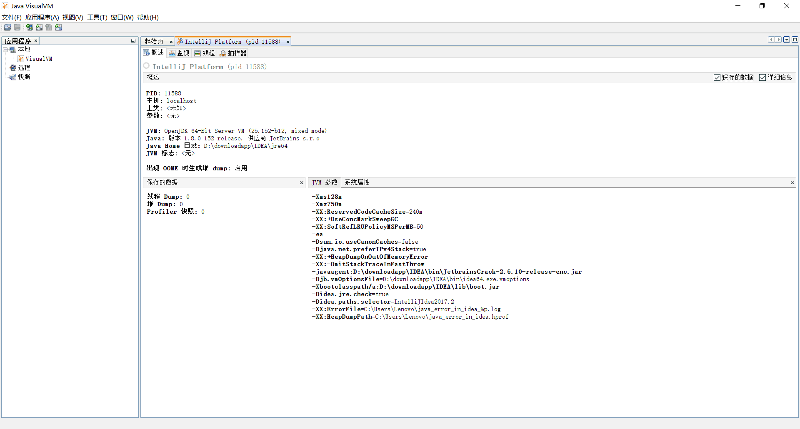
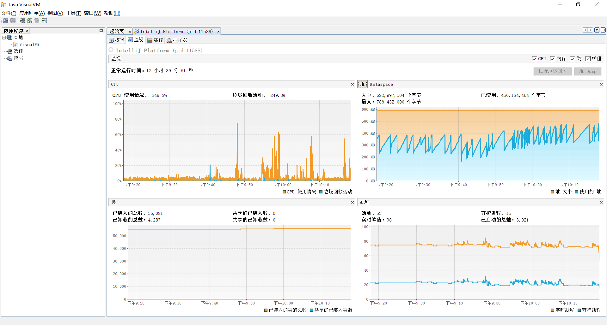

> 模块：

1. leyouload：上传图片功能-fastDFS

2. leyou-item：负责后台管理界面的商品显示，请求分级列表+请求分页品牌+请求分页商品+规格参数查询

3. leyou-search：Elasticsearch

4. leyou-goods-web：详情页静态页面，thymeleaf

5. leyou-user：注册、发送验证码，验证用户密码，登录由leyou-auth负责

6.  leyou-auth：负责登录验证授权

7. leyou-sms ：短信发送

8. leyou-cart：添加购物车（redis），配置登录拦截

9. 详情页静态页面：thymeleaf

   

> 重点组件

rabbitMQ

SpringRedis

elasticsearch

Thymeleaf

nginx

FastDFS


> 开启项目顺序：registry，gateway，item，upload，search，goods，sms，user，auth，cart,order


> host配置

www.manage.leyou.com ：二级域名，后台管理页面

www.leyou.com  :一级域名， 前台搜索界面

www.api.leyou.com：后端接口，前台向后端请求数据所用的网址


```properties
127.0.0.1 manage.leyou.com 

127.0.0.1 api.leyou.com 

192.168.153.129 image.leyou.com 

127.0.0.1 www.leyou.com  

```

/Marie(2019)/programming/08%E6%80%BB%E7%AC%94%E8%AE%B0/%E9%A1%B9%E7%9B%AE/assets/TIM%E6%88%AA%E5%9B%BE20200304123539.png)


# 1 使用技术

使用技术：

- SpringBoot
- SpringCloud
- SpringJPA
- Mybatis
- Elasticsearch ： 搜索
- RabbitMQ ： 
- Thymeleaf ： 详情页
- Redis ： 保存验证码，保存购物车信息
- FastDFS  ： leyou-upload，保存图片
- nginx
- mysql 5.6


## 1.1 SpringBoot+SpringCloud配置

### 1.1.1 leyou-registry

两个注解。`@SpringBootApplication`，`@EnableEurekaServer`

```java
@SpringBootApplication
@EnableEurekaServer //表示当前是注册中心
public class LeyouResgistryApplication {
    public static void main(String[] args) {
        SpringApplication.run(LeyouResgistryApplication.class);
    }
}
```


配置文件，配三个部分，server+spring+eureka

```yaml
server:
  port: 10086
spring:
  application:
    name: leyou-registry
eureka:
  client:
    service-url:
      defaultZone: http://localhost:10086/eureka
    register-with-eureka: false
    fetch-registry: false
  server:
    enable-self-preservation: false
    eviction-interval-timer-in-ms: 10000
```


### 1.1.2 leyou-gateway

> 跨域+拦截过滤+转发请求到相关服务+jwt使用公钥解析token获取用户信息

多配一个网关注解

```java
@SpringBootApplication
@EnableDiscoveryClient //注册eureka
@EnableZuulProxy //网关
public class LeyouGatewayApplication {
    public static void main(String[] args) {
        SpringApplication.run(LeyouGatewayApplication.class);
    }
}
```


> 配置文件，五个部分

- server
- spring
- eureka
- zuul：配置prefix+忽略的服务+路由
- leyou.jwt：配置公钥的位置+cookieName
- filter：配置拦截白名单

```yaml
server:
  port: 10010
spring:
  application:
    name: leyou-gateway
eureka:
  client:
    service-url:
      defaultZone: http://localhost:10086/eureka
    registry-fetch-interval-seconds: 5
zuul:
  prefix: /api
  ignored-services:
    - upload-service # 忽略upload-service服务，网关不处理upload-service，交给nginx
  routes:
    item-service: /item/** # 路由到商品的微服务
    search-service: /search/** # 路由到搜索微服务
    user-service: /user/**
    auth-service: /auth/**
    cart-service: /cart/**
  add-host-header: true
  sensitive-headers:  # 覆盖默认敏感头信息
leyou:
  jwt:
    pubKeyPath: D:\\tmp\\rsa\\rsa.pub # 公钥地址
    cookieName: LY_TOKEN
  filter:
    allowPaths:
      - /api/auth
      - /api/search
      - /api/user/register
      - /api/user/check
      - /api/user/code
      - /api/item

```


> 具体类

* config#：

  FilterProperties：`@ConfigurationProperties(prefix = "leyou.filter")`载入拦截白名单

  JwtProperties：载入jwt相关信息。通过工具类获取公钥publicKey

  LeyouCorsConfiguration：跨域文件，@Configuration标记，解决了前后端的跨域问题，配置了两个前端链接。


* fileter#LoginFilter：

```java
@Component
@EnableConfigurationProperties({JwtProperties.class, FilterProperties.class})
public class LoginFilter extends ZuulFilter {

    @Autowired
    private JwtProperties jwtProperties;

    @Autowired
    private FilterProperties filterProperties;

    @Override
    public String filterType() {
        return "pre"; //设置为前置拦截器
    }

    @Override
    public int filterOrder() { //代表过滤器顺序，越小的值越优先处理
        return 10; 
    }

    @Override
    public boolean shouldFilter() {  //代表这个过滤器是否生效，return false代表不生效，true表示拦截
        // 获取白名单
        List<String> allowPaths = this.filterProperties.getAllowPaths();

        // 初始化运行上下文
        RequestContext context = RequestContext.getCurrentContext();
        // 获取request对象
        HttpServletRequest request = context.getRequest();
        // 获取请求的路径
        String url = request.getRequestURL().toString();

        for (String allowPath : allowPaths) {
            if(StringUtils.contains(url, allowPath)){
                return false;
            }
        }

        return true;
    }

    @Override
    public Object run() throws ZuulException { //拦截器具体逻辑，拿到token

        // 初始化运行上下文
        RequestContext context = RequestContext.getCurrentContext();
        // 获取request对象
        HttpServletRequest request = context.getRequest();

        String token = CookieUtils.getCookieValue(request, this.jwtProperties.getCookieName());//通过工具类，结合CookieName生成token

        try {
            //通过工具类，使用公钥获取token中的用户信息，如果解析错误终止请求的转发
            JwtUtils.getInfoFromToken(token, this.jwtProperties.getPublicKey()); 
        } catch (Exception e) {
            e.printStackTrace();
            context.setSendZuulResponse(false); //出错就终止请求的转发，但是只在pre类型的过滤器中设置才可以。
            context.setResponseStatusCode(HttpStatus.UNAUTHORIZED.value());
        }

        return null;
    }
}

```


### 1.1.3 feign

> 使用方-client目录下

```java
@FeignClient("item-service")
public interface BrandClient extends BrandApi {
}
```


使用者启动器还需要加`@EnableFeignClients`注解


> 提供方法方-api目录下

```java
@RequestMapping("brand")
public interface BrandApi {
    @GetMapping("{id}")
    public Brand queryBrandById(@PathVariable("id") Long id);
}
```


## 1.2 leyou-upload  FastDFS

图片上传是文件的传输，如果也经过Zuul网关的代理，文件就会经过多次网路传输，造成不必要的网络负担。在高并发时，可能导致网络阻塞，Zuul网关不可用。这样我们的整个系统就瘫痪了。

所以，我们上传文件的请求就**不经过网关来处理**了。


### 1.2.1 zuul配置忽略服务

```yaml
zuul:
  ignored-services:
    - upload-service # 忽略upload-service服务
```


### 1.2.2 nginx重写网址

虽然zuul设置了忽略upload-service，但是如果发起请求，zuul还是会对所有的应用进行拦截并且加上api前缀。所以需要使用nginx对网址进行一个重写。

发起：http://127.0.0.1:8082/upload/image

实际发起：

http://127.0.0.1:8082/api/upload/image


解决这个问题，可以用nginx对网址进行重写：

Nginx提供了rewrite指令，用于对地址进行重写，语法规则：

```nginx
rewrite "用来匹配路径的正则" 重写后的路径 [指令];
```

我们的案例：

```nginx 
	server {
        listen       80;
        server_name  api.leyou.com;

        proxy_set_header X-Forwarded-Host $host;
        proxy_set_header X-Forwarded-Server $host;
        proxy_set_header X-Forwarded-For $proxy_add_x_forwarded_for;

    	# 上传文件拦截，直接拦截/api/upload，转到127.0.0.1:8082，并且将对路径重写，将api去掉，这样就绕过了网关
		location /api/upload {	
			proxy_pass http://127.0.0.1:8082;
			proxy_connect_timeout 600;
			proxy_read_timeout 600;
			
			rewrite "^/api/(.*)$" /$1 break; 
        }
		
        location / {
			proxy_pass http://127.0.0.1:10010;
			proxy_connect_timeout 600;
			proxy_read_timeout 600;
        }
    }
```


配置host：

```
192.168.153.129 image.leyou.com
```


### 1.2.3 跨域

因为绕过了网关，自然也就不能经过网关的跨域拦截处理了，所以leyou-upload这个服务也需要一个跨域处理.

放在config下

```java
@Configuration
public class LeyouCorsConfiguration {

    @Bean
    public CorsFilter corsFilter(){

        // 初始化cors配置对象
        CorsConfiguration configuration = new CorsConfiguration();
        // 允许跨域的域名，如果要携带cookie，不能写*。*：代表所有域名都可以跨域访问
        configuration.addAllowedOrigin("http://manage.leyou.com");
        configuration.setAllowCredentials(true); // 允许携带cookie
        configuration.addAllowedMethod("*"); // 代表所有的请求方法：GET POST PUT Delete。。。。
        configuration.addAllowedHeader("*"); // 允许携带任何头信息

        // 初始化cors配置源对象
        UrlBasedCorsConfigurationSource configurationSource = new UrlBasedCorsConfigurationSource();
        configurationSource.registerCorsConfiguration("/**", configuration);

        // 返回corsFilter实例，参数：cors配置源对象
        return new CorsFilter(configurationSource);
    }
}

```


### 1.2.4 分布式文件存储系统FastDFS

- 文件存储
- 文件同步
- 文件访问（上传、下载）
- 存取负载均衡
- 在线扩容

适合有大容量存储需求的应用或系统


\Marie(2019)\programming\黑马java全套\16项目大全\01乐优商城\day08-品牌新增及fastDFS\笔记\assets\1526205318630.png)


FastDFS两个主要的角色：Tracker Server 和 Storage Server 。

- Tracker Server：跟踪服务器，主要负责调度storage节点与client通信，在访问上起负载均衡的作用，和记录storage节点的运行状态，是连接client和storage节点的枢纽。 
- Storage Server：存储服务器，保存文件和文件的meta data（元数据），每个storage server会启动一个单独的线程主动向Tracker cluster中每个tracker server报告其状态信息，包括磁盘使用情况，文件同步情况及文件上传下载次数统计等信息
- Group：文件组，多台Storage Server的集群。上传一个文件到同组内的一台机器上后，FastDFS会将该文件即时同步到同组内的其它所有机器上，起到备份的作用。不同组的服务器，保存的数据不同，而且相互独立，不进行通信。 
- Tracker Cluster：跟踪服务器的集群，有一组Tracker Server（跟踪服务器）组成。
- Storage Cluster ：存储集群，有多个Group组成。


> 上传

 /Marie(2019)/programming/%E9%BB%91%E9%A9%ACjava%E5%85%A8%E5%A5%97/16%E9%A1%B9%E7%9B%AE%E5%A4%A7%E5%85%A8/01%E4%B9%90%E4%BC%98%E5%95%86%E5%9F%8E/day08-%E5%93%81%E7%89%8C%E6%96%B0%E5%A2%9E%E5%8F%8AfastDFS/%E7%AC%94%E8%AE%B0/assets/1526205664373.png)


> 下载

 /Marie(2019)/programming/%E9%BB%91%E9%A9%ACjava%E5%85%A8%E5%A5%97/16%E9%A1%B9%E7%9B%AE%E5%A4%A7%E5%85%A8/01%E4%B9%90%E4%BC%98%E5%95%86%E5%9F%8E/day08-%E5%93%81%E7%89%8C%E6%96%B0%E5%A2%9E%E5%8F%8AfastDFS/%E7%AC%94%E8%AE%B0/assets/1526205705687.png)


> 配置

配置文件配置fdfs，知名服务器的地址

```yaml
fdfs:
  so-timeout: 1501 # 超时时间
  connect-timeout: 601 # 连接超时时间
  thumb-image: # 缩略图
    width: 60
    height: 60
  tracker-list: # tracker地址：你的虚拟机服务器地址+端口（默认是22122）
    - 192.168.153.129:22122
```


config下引入fastDFS的注解配置类

```java
@Configuration
@Import(FdfsClientConfig.class)
// 解决jmx重复注册bean的问题
@EnableMBeanExport(registration = RegistrationPolicy.IGNORE_EXISTING)
public class FastClientImporter {
    
}
```


### 1.2.5 上传逻辑

>UploadController

```java
@Controller
@RequestMapping("upload")
public class UploadController {

    @Autowired
    private UploadService uploadService;

    @PostMapping("image")
    public ResponseEntity<String> uploadImage(@RequestParam("file")MultipartFile file){
        String url = this.uploadService.uploadImage(file);
        if (StringUtils.isBlank(url)) {
            return ResponseEntity.badRequest().build();
        }
        return ResponseEntity.status(HttpStatus.CREATED).body(url);
    }
}

```


>UploadService:检验图片类型，调用api上传到服务器，返回一个url，和image.leyou.com进行拼接。image.leyou.com在本地host进行了配置

```java
@Service
public class UploadService {

    private static final List<String> CONTENT_TYPES = Arrays.asList("image/gif", "image/jpeg");

    private static final Logger LOGGER = LoggerFactory.getLogger(UploadService.class);

    @Autowired
    private FastFileStorageClient storageClient;

    public String uploadImage(MultipartFile file) {

        String originalFilename = file.getOriginalFilename();
        // 校验文件类型
        String contentType = file.getContentType();
        if (!CONTENT_TYPES.contains(contentType)) {
            LOGGER.info("文件类型不合法：{}", originalFilename);
            return null;
        }

        try {
            // 校验文件内容
            BufferedImage bufferedImage = ImageIO.read(file.getInputStream());
            if (bufferedImage == null) {
                LOGGER.info("文件内容不合法：{}", originalFilename);
                return null;
            }

            // 保存到服务器
            // file.transferTo(new File("C:\\hm49\\image\\" + originalFilename));
            String ext = StringUtils.substringAfterLast(originalFilename, ".");
            StorePath storePath = this.storageClient.uploadFile(file.getInputStream(), file.getSize(), ext, null);

            // 返回url，进行回显
            // return "http://image.leyou.com/" + originalFilename;
            return "http://image.leyou.com/" + storePath.getFullPath();
        } catch (IOException e) {
            LOGGER.info("服务器内部错误：" + originalFilename);
            e.printStackTrace();
        }
        return null;
    }
}

```


## 1.3 leyou-item

> 启动类

注意，因为需要操作通用mapper，所以要加入MapperScan注解

```java
@SpringBootApplication
@EnableDiscoveryClient
@MapperScan("com.leyou.item.mapper")
public class LeyouItemApplication {

    public static void main(String[] args) {
        SpringApplication.run(LeyouItemApplication.class);
    }
}

```

>通用mapper(放在service下)

mapper目录下，提供一些默认的操作，如果需要联表查询可以通过注解写sql语句的方式，`@Param`指明参数

```java
public interface BrandMapper extends Mapper<Brand> {

    @Insert("INSERT INTO tb_category_brand (category_id, brand_id) values (#{cid}, #{bid})")
    void insertCategoryAndBrand(@Param("cid") Long cid, @Param("bid") Long bid);

    @Select("SELECT * FROM tb_brand a INNER JOIN tb_category_brand b on a.id=b.brand_id where b.category_id=#{cid}")
    List<Brand> selectBrandsByCid(Long cid);
}

```


> leyou-item-interface

放实例

- pojo：存放实例+feign向外提供方法的接口

  pojo/spuBo

  ```java
  public class SpuBo extends Spu {
  
      private String cname;
  
      private String bname;
  
      private SpuDetail spuDetail;
  
      private List<Sku> skus;
      ...
  }
  ```

  

- api：feign


> leyou-item-service

> controller

- CategoryController

/Marie(2019)/programming/08%E6%80%BB%E7%AC%94%E8%AE%B0/%E9%A1%B9%E7%9B%AE/assets/1.png)

```java
1.请求分级列表：http://api.leyou.com/api/item/category/list?pid=1
点击手机，下面出来一些手机的手机运营商，手机配件等这样的子列表，通过查询数据库表tb_category表的parent_id查询出来的。共同的子列表拥有相同的parent_id

2.http://api.leyou.com/api/item/category/list?pid=0
```

- BrandController:

/Marie(2019)/programming/08%E6%80%BB%E7%AC%94%E8%AE%B0/%E9%A1%B9%E7%9B%AE/assets/2.png)

```java
1.请求品牌（需要有分页效果）：http://api.leyou.com/api/item/brand/page?key=&page=1&rows=5&sortBy=id&desc=false
key:关键字
page:当前页
rows:每页多少行
sortBy:根据什么排列
desc:顺序还是倒序

通过Example复杂查询，用PageHelper分页
  PageHelper.startPage(page, rows);
  //Example复杂查询完成标桩成List
	...
    ...	
  List<Brand> brands = this.brandMapper.selectByExample(example);
  // 包装成pageInfo
  PageInfo<Brand> pageInfo = new PageInfo<>(brands);
  // 包装成分页结果集返回
 return new PageResult<>(pageInfo.getTotal(), pageInfo.getList());
```

- ⭐️ GoodsController

/Marie(2019)/programming/08%E6%80%BB%E7%AC%94%E8%AE%B0/%E9%A1%B9%E7%9B%AE/assets/3.png)

```java
1.请求商品（需要有分页效果）：http://api.leyou.com/api/item/spu/page?key=&saleable=true&page=1&rows=5
和上面请求品牌的差不多，只是参数不一样，而且他需要请求一个品牌分类：手机-手机通讯-手机
这是需要自己组合的，并且他需要进行点击进行编辑需要加载商品的细节，所以通过example复杂查询查到后，需要将spu类转换为spuBo类

Table(name = "tb_spu")
public class Spu {
    @Id
    @GeneratedValue(strategy = GenerationType.IDENTITY)
    private Long id;
    private Long brandId;
    private Long cid1;// 1级类目
    private Long cid2;// 2级类目
    private Long cid3;// 3级类目
    private String title;// 标题
    private String subTitle;// 子标题
    private Boolean saleable;// 是否上架
    private Boolean valid;// 是否有效，逻辑删除用
    private Date createTime;// 创建时间
    private Date lastUpdateTime;// 最后修改时间
    ...
}

public class SpuBo extends Spu {

    private String cname; 

    private String bname;

    private SpuDetail spuDetail;

    private List<Sku> skus;
    ...
}

spu转换为spuBo：
    // spu集合转化成spubo集合
        List<SpuBo> spuBos = spus.stream().map(spu -> {
            SpuBo spuBo = new SpuBo();
            BeanUtils.copyProperties(spu, spuBo);

            // 查询品牌名称-brandMapper
            Brand brand = this.brandMapper.selectByPrimaryKey(spu.getBrandId());
            spuBo.setBname(brand.getName());
            // 查询分类名称-categoryService
            List<String> names = this.categoryService.queryNamesByIds(Arrays.asList(spu.getCid1(), spu.getCid2(), spu.getCid3()));
            spuBo.setCname(StringUtils.join(names, "-"));
            return spuBo;
        }).collect(Collectors.toList());
```

- SpecificationController

/Marie(2019)/programming/08%E6%80%BB%E7%AC%94%E8%AE%B0/%E9%A1%B9%E7%9B%AE/assets/3.png)

```java
用于规格参数查询：
http://api.leyou.com/api/item/spec/params?cid=76

查tb_spec_group和tb_spec_params即可
```


## 1.4 leyou-search

> elasticsearch

用ES做一个全文索引，我们将经常查询的商品的某些字段，比如说商品名，描述、价格还有id这些字段我们放入我们索引库里，可以提高查询速度。 

**每次后台商家添加商品的时候都会通过RabbitMQ中间件，然后触发leyou-search的buildGoods方法，这个方法就是将数据保存到elasticsearch的。**

## 1.4.1 配置

> application.yml

安装在linux，配置文件里面需要配置elasticsearch的地址还有name


> repository目录下配置接口

```java
public interface GoodsRepository extends ElasticsearchRepository<Goods, Long> {
}
```


### 1.4.2 导入数据

\Marie(2019)\programming\黑马java全套\16项目大全\01乐优商城\day12-基本搜索\笔记\assets\1526607712207.png)

spuId、SkuId

\Marie(2019)\programming\黑马java全套\16项目大全\01乐优商城\day12-基本搜索\笔记\assets\1526608095471.png)

商品分类id、品牌id、图片、价格、商品的创建时间、sku信息集、可搜索的规格参数

**最终的数据结构：**

我们创建一个类，封装要保存到索引库的数据，并设置映射属性：

```java
@Document(indexName = "goods", type = "docs", shards = 1, replicas = 0)
public class Goods {
    @Id
    private Long id; // spuId
    @Field(type = FieldType.Text, analyzer = "ik_max_word")
    private String all; // 所有需要被搜索的信息，包含标题，分类，甚至品牌
    @Field(type = FieldType.Keyword, index = false)
    private String subTitle;// 卖点
    private Long brandId;// 品牌id
    private Long cid1;// 1级分类id
    private Long cid2;// 2级分类id
    private Long cid3;// 3级分类id
    private Date createTime;// 创建时间
    private List<Long> price;// 价格
    @Field(type = FieldType.Keyword, index = false)
    private String skus;// List<sku>信息的json结构
    private Map<String, Object> specs;// 可搜索的规格参数，key是参数名，值是参数值
}
```


- `@Document` 作用在类，标记实体类为文档对象，一般有四个属性
  - indexName：对应索引库名称
  - type：对应在索引库中的类型
  - shards：分片数量，默认5
  - replicas：副本数量，默认1
- `@Id` 作用在成员变量，标记一个字段作为id主键
- `@Field` 作用在成员变量，标记为文档的字段，并指定字段映射属性：
  - type：字段类型，取值是枚举：FieldType
  - index：是否索引，布尔类型，默认是true
  - store：是否存储，布尔类型，默认是false
  - analyzer：分词器名称：ik_max_word


调用buildGoods拼接，导入完后数据如下：

> all：表示可搜索的信息，先查询分类名称和品牌，然后再拼接起来就是all了

```java
// 根据分类的id查询分类名称
List<String> names = this.categoryClient.queryNamesByIds(Arrays.asList(spu.getCid1(), spu.getCid2(), spu.getCid3()));
  
// 根据品牌id查询品牌
 Brand brand = this.brandClient.queryBrandById(spu.getBrandId());
```


```json
"all": "华为 G9 青春版  手机 手机通讯 手机 华为（HUAWEI）",
"subTitle": "骁龙芯片！3GB运行内存！索尼1300万摄像头！<a href='https://sale.jd.com/act/DhKrOjXnFcGL.html' target='_blank'>华为新品全面上线，更多优惠猛戳》》</a>",
          "brandId": 8557,
          "cid1": 74,
          "cid2": 75,
          "cid3": 76,
          "createTime": 1524297315000,

```


> prices

```java
 // 初始化一个价格集合，收集所有sku的价格
        List<Long> prices = new ArrayList<>();
```

prices在拿到sku后遍历的时候填充

```json
  "price": [
            84900,
            84900,
            84900
          ],
```


> sku：包括id，title，价格，图片

\Marie(2019)\programming\黑马java全套\16项目大全\01乐优商城\day12-基本搜索\笔记\assets\1526607712207.png)

```java
// 根据spuId查询所有的sku
        List<Sku> skus = this.goodsClient.querySkusBySpuId(spu.getId());

 // 收集sku的必要字段信息
        List<Map<String, Object>> skuMapList = new ArrayList<>();

 skus.forEach(sku -> {
            prices.add(sku.getPrice());

            Map<String, Object> map = new HashMap<>();
            map.put("id", sku.getId());
            map.put("title", sku.getTitle());
            map.put("price", sku.getPrice());
            // 获取sku中的图片，数据库的图片可能是多张，多张是以“,”分隔，所以也以逗号来切割返回图片数组，获取第一张图片
            map.put("image", StringUtils.isBlank(sku.getImages()) ? "" : StringUtils.split(sku.getImages(), ",")[0]);

            skuMapList.add(map);
        });
```

```json
 "skus": """[{"image":"http://image.leyou.com/images/9/15/1524297313793.jpg","price":84900,"id":2600242,"title":"华为 G9 青春版 白色 移动联通电信4G手机 双卡双待"},{"image":"http://image.leyou.com/images/9/5/1524297314398.jpg","price":84900,"id":2600248,"title":"华为 G9 青春版 金色 移动联通电信4G手机 双卡双待"},{"image":"http://image.leyou.com/images/15/15/1524297314800.jpg","price":84900,"id":3385376,"title":"华为 G9 青春版 玫瑰金 移动联通电信4G手机 双卡双待"}]""",
```


> specs：参数

先根据cid3（也就是分类id）查参数表tb_spec_params，然后设置两个Map<String,Object>，一个用来存方通用规格参数，一个用来存放特殊规格参数，根据getGeneric来判断是通用规格参数还是特殊规格参数。

```java
// 根据spu中的cid3查询出所有的搜索规格参数
        List<SpecParam> params = this.specificationClient.queryParams(null, spu.getCid3(), null, true);

        // 根据spuId查询spuDetail
        SpuDetail spuDetail = this.goodsClient.querySpuDetailBySpuId(spu.getId());
        // 把通用的规格参数值，进行反序列化
        Map<String, Object> genericSpecMap = MAPPER.readValue(spuDetail.getGenericSpec(), new TypeReference<Map<String, Object>>(){});
        // 把特殊的规格参数值，进行反序列化
        Map<String, List<Object>> specialSpecMap = MAPPER.readValue(spuDetail.getSpecialSpec(), new TypeReference<Map<String, List<Object>>>(){});

        Map<String, Object> specs = new HashMap<>();
        params.forEach(param -> {
            // 判断规格参数的类型，是否是通用的规格参数
            if (param.getGeneric()) {
                // 如果是通用类型的参数，从genericSpecMap获取规格参数值
                String value = genericSpecMap.get(param.getId().toString()).toString();
                // 判断是否是数值类型，如果是数值类型，应该返回一个区间
                if (param.getNumeric()) {
                    value = chooseSegment(value, param);
                }
                specs.put(param.getName(), value);
            } else {
                // 如果是特殊的规格参数，从specialSpecMap中获取值
                List<Object> value = specialSpecMap.get(param.getId().toString());
                specs.put(param.getName(), value);
            }
        });
```


```java
          "specs": {
            "CPU核数": "八核",
            "后置摄像头": "1000-1500万",
            "CPU品牌": "骁龙（Snapdragon)",
            "CPU频率": "1.5-2.0GHz",
            "操作系统": "Android",
            "内存": [
              "3GB"
            ],
            "主屏幕尺寸（英寸）": "5.0-5.5英寸",
            "前置摄像头": "500-1000万",
            "电池容量（mAh）": "3000-4000mAh",
            "机身存储": [
              "16GB"
            ]
          }
```


> 放入elasticsearch

```java
   	goods.setId(spu.getId());
        goods.setCid1(spu.getCid1());
        goods.setCid2(spu.getCid2());
        goods.setCid3(spu.getCid3());
        goods.setBrandId(spu.getBrandId());
        goods.setCreateTime(spu.getCreateTime());
        goods.setSubTitle(spu.getSubTitle());
        // 拼接all字段，需要分类名称以及品牌名称
        goods.setAll(spu.getTitle() + " " + StringUtils.join(names, " ") + " " + brand.getName());
        // 获取spu下的所有sku的价格
        goods.setPrice(prices);
        // 获取spu下的所有sku，并转化成json字符串
        goods.setSkus(MAPPER.writeValueAsString(skuMapList));
        // 获取所有查询的规格参数{name:value}
        goods.setSpecs(specs);
        return goods;
```


### 1.4.2 搜索栏功能实现

> SearchController

request是一个json，key+page+过滤条件，eg：

```json
{
	key:"华为",
    page:1,
    filter.CPU核数:八核,
    filter.后置摄像头:1000-1500万
}

```


```java
搜索栏功能：http://api.leyou.com/api/search/page
是一个post请求，所以处理也要post处理

   @PostMapping("page")
    public ResponseEntity<SearchResult> search(@RequestBody SearchRequest request){
        SearchResult result = this.searchService.search(request);
        if (result == null || CollectionUtils.isEmpty(result.getItems())) {
            return ResponseEntity.notFound().build();
        }
        return ResponseEntity.ok(result);
    }
```


> SearchService

搜索结果类：这个类继承了PageResult，PageResult封装了分页抽象信息

```java
public class SearchResult extends PageResult<Goods> {
private List<Map<String, Object>> categories;

private List<Brand> brands;

private List<Map<String, Object>> specs;
     public SearchResult(Long total, Integer totalPage, List<Goods> items, List<Map<String, Object>> categories, List<Brand> brands, List<Map<String, Object>> specs) {
        super(total, totalPage, items);
        this.categories = categories;
        this.brands = brands;
        this.specs = specs;
    }
    ...
}
```


```java
public class PageResult<T> {

    private Long total;
    private Integer totalPage;
    private List<T> items;
	...
}
```

调用goodsRepository进行elasticsearch查询，查出的结果

获得结果集后：

```java
return new SearchResult(goodsPage.getTotalElements(), goodsPage.getTotalPages(), goodsPage.getContent(), categories, brands, specs);
```


## 1.5 leyou-goods-web

### 1.5.1 Thymeleaf

商品详情浏览量比较大，并发高，我们会独立开启一个微服务，用来展示商品详情。因为静态页面放在本地，所以

需要配置nginx先从本地看有没有文件：

```nginx
  server {
    listen       80;
    server_name  www.leyou.com;

    proxy_set_header X-Forwarded-Host $host;
    proxy_set_header X-Forwarded-Server $host;
    proxy_set_header X-Forwarded-For $proxy_add_x_forwarded_for;


    #如果是/item，就先本地查询html，没有再转给后台的http://127.0.0.1:9084
    #本地nginx存放thymeleaf生成的静态页面
    location /item {
        #proxy_pass http://127.0.0.1:9084;
        #proxy_connect_timeout 600;
        #proxy_read_timeout 600;
        
        # 先找本地
        root html;
        if (!-f $request_filename) { #请求的文件不存在，就反向代理
            proxy_pass http://127.0.0.1:9084;
            break;
        }
    }
```

将静态页面生成在nginx的html/item，nginx会首先本地html找，如果没找到才会反向代理到微服务去请求

\Marie(2019)\programming\黑马java全套\16项目大全\01乐优商城\day14thymeleaf及静态化\笔记\assets\1532757980379.png)


### 1.5.2 查询

首先当然是将一个模板页面放在`resources/template`下面，**这里放了一个item.html，是详情页面的模板页面，只需要填充数据就可以了。**

> GoodsController

注意看这里的链接`@GetMapping("item/{id}.html")`，参数指定`@PathVariable("id")`

```java
@Controller
public class GoodsController {

    @Autowired
    private GoodsService goodsService;

    @Autowired
    private GoodsHtmlService goodsHtmlService;

    @GetMapping("item/{id}.html")
    public String toItemPage(@PathVariable("id")Long id, Model model){

        Map<String, Object> map = this.goodsService.loadData(id);

        model.addAllAttributes(map);

        this.goodsHtmlService.createHtml(id);
        return "item";
    }
}

```


> GoodsService

Map<String, Object> model = new HashMap<>();

- 根据spuId（传过来的参数，spuId也就是静态页面的名称，如88.html）查询spu
- 查询spuDetail
- 查询分类：Map<String, Object>
- 查询品牌
- skus
- 查询规格参数组
- 查询特殊的规格参数

把以上信息都放到map里面，然后返回给controller

```java
@Service
public class GoodsService {

    @Autowired
    private BrandClient brandClient;
    @Autowired
    private CategoryClient categoryClient;
    @Autowired
    private GoodsClient goodsClient;
    @Autowired
    private SpecificationClient specificationClient;

    public Map<String, Object> loadData(Long spuId){

        Map<String, Object> model = new HashMap<>();

        // 根据spuId查询spu
        Spu spu = this.goodsClient.querySpuById(spuId);

        // 查询spuDetail
        SpuDetail spuDetail = this.goodsClient.querySpuDetailBySpuId(spuId);

        // 查询分类：Map<String, Object>
        List<Long> cids = Arrays.asList(spu.getCid1(), spu.getCid2(), spu.getCid3());
        List<String> names = this.categoryClient.queryNamesByIds(cids);
        // 初始化一个分类的map
        List<Map<String, Object>> categories = new ArrayList<>();
        for (int i = 0; i < cids.size(); i++) {
            Map<String, Object> map = new HashMap<>();
            map.put("id", cids.get(i));
            map.put("name", names.get(i));
            categories.add(map);
        }

        // 查询品牌
        Brand brand = this.brandClient.queryBrandById(spu.getBrandId());

        // skus
        List<Sku> skus = this.goodsClient.querySkusBySpuId(spuId);

        // 查询规格参数组
        List<SpecGroup> groups = this.specificationClient.queryGroupsWithParam(spu.getCid3());

        // 查询特殊的规格参数
        List<SpecParam> params = this.specificationClient.queryParams(null, spu.getCid3(), false, null);
        // 初始化特殊规格参数的map
        Map<Long, String> paramMap = new HashMap<>();
        params.forEach(param -> {
            paramMap.put(param.getId(), param.getName());
        });

        model.put("spu", spu);
        model.put("spuDetail", spuDetail);
        model.put("categories", categories);
        model.put("brand", brand);
        model.put("skus", skus);
        model.put("groups", groups);
        model.put("paramMap", paramMap);

        return model;
    }
}

```


> GoodsHtmlService

- 调用goodsHtmlService方法生成数据
- 调用PrintWriter生成一个文件在本地的nginx目录下面的html\item下面
- 调用TemplateEngine引擎给item.html填充i数据

```java
@Service
public class GoodsHtmlService {

    @Autowired
    private TemplateEngine engine;

    @Autowired
    private GoodsService goodsService;

    public void createHtml(Long spuId){

        // 初始化运行上下文
        Context context = new Context();
        // 设置数据模型
        context.setVariables(this.goodsService.loadData(spuId));

        PrintWriter printWriter = null;
        try {
            // 把静态文件生成到服务器本地
            File file = new File("D:\\downloadapp\\nginx-1.14.0\\html\\item\\" + spuId + ".html");
            printWriter = new PrintWriter(file);

            this.engine.process("item", context, printWriter);
        } catch (FileNotFoundException e) {
            e.printStackTrace();
        } finally {
            if (printWriter != null) {
                printWriter.close();
            }
        }
    }

    public void deleteHtml(Long id) {
        File file = new File("D:\\downloadapp\\nginx-1.14.0\\html\\item\\" + id + ".html");
        file.deleteOnExit();
    }
}

```


###  


## 1.6 RabbitMQ

如果我们在后台修改了商品的价格，搜索页面（使用了elasticsearch）和商品详情页（使用了thyemeleaf）显示的依然是旧的信息

所以：

- 商品服务对商品增删改以后，无需去操作索引库或静态页面，只是发送一条消息，也不关心消息被谁接收。
- 搜索服务和静态页面服务接收消息，分别去处理索引库和静态页面。
- 

> 什么时候发？

当商品服务对商品进行写操作：增、删、改的时候，需要发送一条消息，通知其它服务。

> 发送什么内容？

对商品的增删改时其它服务可能需要新的商品数据，但是如果消息内容中包含全部商品信息，数据量太大，而且并不是每个服务都需要全部的信息。因此我们**只发送商品id**，其它服务可以根据id查询自己需要的信息。


### 1.6.1 leyou-goods-web&leyou-search

> 收听方-leyou-goods-web

> 相关配置

```yaml
spring:
  application:
    name: goods-web
  thymeleaf:
    cache: false
  rabbitmq:
    host: 192.168.153.129
    virtual-host: /leyou
    username: leyou
    password: leyou
```


> 在访问静态页面的时候

```java
@Component
public class GoodsListener {

    @Autowired
    private GoodsHtmlService goodsHtmlService;

    @RabbitListener(bindings = @QueueBinding(
            value = @Queue(value = "LEYOU.ITEM.SAVE.QUEUE", durable = "true"),
            exchange = @Exchange(value = "LEYOU.ITEM.EXCHANGE", ignoreDeclarationExceptions = "true", type = ExchangeTypes.TOPIC),
            key = {"item.insert", "item.update"}
    ))
    public void save(Long id){
        if (id == null) {
            return;
        }
        this.goodsHtmlService.createHtml(id);
    }

    @RabbitListener(bindings = @QueueBinding(
            value = @Queue(value = "LEYOU.ITEM.DELETE.QUEUE", durable = "true"),
            exchange = @Exchange(value = "LEYOU.ITEM.EXCHANGE", ignoreDeclarationExceptions = "true", type = ExchangeTypes.TOPIC),
            key = {"item.delete"}
    ))
    public void delete(Long id){
        if (id == null) {
            return;
        }
        this.goodsHtmlService.deleteHtml(id);
    }
}

```


> leyou-search

```java
@Component
public class GoodsListener {

    @Autowired
    private SearchService searchService;

    @RabbitListener(bindings = @QueueBinding(
            value = @Queue(value = "LEYOU.SEARCH.SAVE.QUEUE", durable = "true"),
            exchange = @Exchange(value = "LEYOU.ITEM.EXCHANGE", ignoreDeclarationExceptions = "true", type = ExchangeTypes.TOPIC),
            key = {"item.insert", "item.update"}
    ))
    public void save(Long id) throws IOException {
        if (id == null) {
            return ;
        }
        this.searchService.save(id);
    }

    @RabbitListener(bindings = @QueueBinding(
            value = @Queue(value = "LEYOU.SEARCH.DELETE.QUEUE", durable = "true"),
            exchange = @Exchange(value = "LEYOU.ITEM.EXCHANGE", ignoreDeclarationExceptions = "true", type = ExchangeTypes.TOPIC),
            key = {"item.delete"}
    ))
    public void delete(Long id) throws IOException {
        if (id == null) {
            return ;
        }
        this.searchService.delete(id);
    }

}

```


> 发送消息方

```java
@Service
public class GoodsService {

    @Autowired
    private SpuMapper spuMapper;

    @Autowired
    private BrandMapper brandMapper;

    @Autowired
    private SpuDetailMapper spuDetailMapper;

    @Autowired
    private CategoryService categoryService;

    @Autowired
    private SkuMapper skuMapper;

    @Autowired
    private StockMapper stockMapper;

    @Autowired
    private AmqpTemplate amqpTemplate;

    //将rabbitMQ封装了sendMsg方法，当增加商品||更新商品||删除商品的时候，调用此方法
    private void sendMsg(String type, Long id) {
        try {
            this.amqpTemplate.convertAndSend("item." + type, id);
        } catch (AmqpException e) {
            e.printStackTrace();
        }
    }
    

    /**
     * 新增商品
     * @param spuBo
     * @return
     */
    @Transactional
    public void saveGoods(SpuBo spuBo) {
        // 先新增spu
        spuBo.setId(null);
        spuBo.setSaleable(true);
        spuBo.setValid(true);
        spuBo.setCreateTime(new Date());
        spuBo.setLastUpdateTime(spuBo.getCreateTime());
        this.spuMapper.insertSelective(spuBo);

        // 再去新增spuDetail
        SpuDetail spuDetail = spuBo.getSpuDetail();
        spuDetail.setSpuId(spuBo.getId());
        this.spuDetailMapper.insertSelective(spuDetail);

        saveSkuAndStock(spuBo);

        sendMsg("insert",spuBo.getId());   //新增商品-发送给key为item.insert的队列
    }

 
    /**
     * 更新商品信息
     * @param spuBo
     * @return
     */
    @Transactional
    public void updateGoods(SpuBo spuBo) {

        // 根据spuId查询要删除的sku
        Sku record = new Sku();
        record.setSpuId(spuBo.getId());
        List<Sku> skus = this.skuMapper.select(record);
        skus.forEach(sku -> {
            // 删除stock
            this.stockMapper.deleteByPrimaryKey(sku.getId());
        });

        // 删除sku
        Sku sku = new Sku();
        sku.setSpuId(spuBo.getId());
        this.skuMapper.delete(sku);

        // 新增sku和stock
        this.saveSkuAndStock(spuBo);

        // 更新spu和spuDetail
        spuBo.setCreateTime(null);
        spuBo.setLastUpdateTime(new Date());
        spuBo.setValid(null);
        spuBo.setSaleable(null);
        this.spuMapper.updateByPrimaryKeySelective(spuBo);

        this.spuDetailMapper.updateByPrimaryKeySelective(spuBo.getSpuDetail());

        sendMsg("update", spuBo.getId()); //更新商品-发送给key为item.update的队列
    }
}
```


### 1.6.2 验证码

> 发送信息方  leyou-user

user发送验证码给sms，调用sms发送短信功能

```java
public void sendVerifyCode(String phone) {

    if (StringUtils.isBlank(phone)) {

        return ;

    }
    // 生成验证码
    String code = NumberUtils.generateCode(6);

    // 发送消息到rabbitMQ
    Map<String, String> msg = new HashMap<>();
    msg.put("phone", phone);
    msg.put("code", code);
    this.amqpTemplate.convertAndSend("leyou.sms.exchange", "verifycode.sms", msg);

    // 把验证码保存到redis中
    this.redisTemplate.opsForValue().set(KEY_PREFIX + phone, code, 5, TimeUnit.MINUTES);
}
```


> 相关配置

```yaml
spring:
  application:
    name: user-service
  datasource:
    url: jdbc:mysql:///hm49
    username: root
    password: admin
  redis:
    host: 192.168.153.129
  rabbitmq:
    host: 192.168.153.129
    virtual-host: /leyou
    username: leyou
    password: leyou
```


> 接受消息方 sms

接受到消息进行验证码的调用

```java
@Component

public class SmsListener {

@Autowired
private SmsUtils smsUtils;

@Autowired
private SmsProperties smsProperties;

@RabbitListener(bindings = @QueueBinding(
        value = @Queue(value = "leyou.sms.queue", durable = "true"),
        exchange = @Exchange(value = "leyou.sms.exchange", ignoreDeclarationExceptions = "true", type = ExchangeTypes.TOPIC),
        key = {"verifycode.sms"}
))
public void sendSms(Map<String, String> msg) throws ClientException {

    if (CollectionUtils.isEmpty(msg)) {
        return ;
    }
    String phone = msg.get("phone");
    String code = msg.get("code");
    if (StringUtils.isNoneBlank(phone) && StringUtils.isNoneBlank(code)){
        this.smsUtils.sendSms(phone, code, this.smsProperties.getSignName(), this.smsProperties.getVerifyCodeTemplate());
    }
}
}
```


## 1.7 leyou-user 登陆中心

> 注册、发送验证码，验证用户密码，leyou-auth负责登录功能

登录http://api.leyou.com/api/auth/accredit ，并不是走的leyou-user,而是走的lyou-auth

注册和验证码是走的这里http://api.leyou.com/api/user/code

### 1.7.1 注册

1.查询redis中验证码
2.校验验证码
3.调用common的工具类生成盐
4.加盐加密
 user.setPassword(CodecUtils.md5Hex(user.getPassword(), salt));
5.调用通用mapper新增用户

> controller

```java
    @PostMapping("register")
    public ResponseEntity<Void> register(@Valid User user, @RequestParam("code")String code){

        this.userService.register(user, code);
        return ResponseEntity.status(HttpStatus.CREATED).build();
    }
```


> service

```java
   @Autowired
    private UserMapper userMapper;

    @Autowired
    private AmqpTemplate amqpTemplate;

    @Autowired
    private StringRedisTemplate redisTemplate;

    private static final String KEY_PREFIX = "user:verify:";

public void register(User user, String code) {

    // 查询redis中验证码
    String redisCode = this.redisTemplate.opsForValue().get(KEY_PREFIX + user.getPhone());
    // 1.校验验证码
    if (!StringUtils.equals(code, redisCode)) {
        return ;
    }

    // 2. 生成盐
    String salt = CodecUtils.generateSalt();
    user.setSalt(salt);

    // 3.加盐加密
    user.setPassword(CodecUtils.md5Hex(user.getPassword(), salt));

    // 4.新增用户
    user.setId(null);
    user.setCreated(new Date());
    this.userMapper.insertSelective(user);

}
```


### 1.7.2  验证用户密码

```java
public User queryUser(String username, String password) {
    User record = new User();
    record.setUsername(username);
    User user = this.userMapper.selectOne(record);

    // 判断user是否为空
    if (user == null) {
        return null;
    }

    // 获取盐，对用户输入的密码加盐加密
    password = CodecUtils.md5Hex(password, user.getSalt());

    // 和数据库中的密码比较
    if (StringUtils.equals(password, user.getPassword())) {
        return user;
    }
    return null;
}
```


### 1.7.3 发送验证码

> 发送验证码

使用rabbitMq发送给sms微服务，让sms去调用大于短信的api发短信

```java
public void sendVerifyCode(String phone) {
    if (StringUtils.isBlank(phone)) {
        return ;
    }

    // 生成验证码
    String code = NumberUtils.generateCode(6);

    // 发送消息到rabbitMQ
    Map<String, String> msg = new HashMap<>();
    msg.put("phone", phone);
    msg.put("code", code);
    this.amqpTemplate.convertAndSend("leyou.sms.exchange", "verifycode.sms", msg);

    // 把验证码保存到redis中
    this.redisTemplate.opsForValue().set(KEY_PREFIX + phone, code, 5, TimeUnit.MINUTES);
}
```


### 1.7.4 注意点(user实例)

```java
@Table(name = "tb_user")
public class User {
    @Id
    @GeneratedValue(strategy = GenerationType.IDENTITY)
    private Long id;
    @Length(min = 4, max = 30, message = "用户名只能在4~30位之间")
    private String username;// 用户名

    @JsonIgnore
    @Length(min = 4, max = 30, message = "密码只能在4~30位之间")
    private String password;// 密码

    @Pattern(regexp = "^1[35678]\\d{9}$", message = "手机号格式不正确")
    private String phone;// 电话

    private Date created;// 创建时间

    @JsonIgnore
    private String salt;// 密码的盐值
}
```


1. 为了安全考虑。这里对password和salt添加了注解**@JsonIgnore，这样在json序列化时，就不会把password和salt返回**。
2. 为了减轻数据库压力防止缓存雪崩，这里我们需要数据校验，使用**Hibernate-Validator**框架完成数据校验，使用注解对其校验


在controller中改造register方法，只需要给User添加 @Valid注解即可。

\Marie(2019)\programming\黑马java全套\16项目大全\01乐优商城\day16用户注册(阿里大于及hibernate-validate)\笔记\01主要笔记\assets\1533030001081.png)


## 1.8 leyou-sms 短信发送

> 先注意一点，sms没配置eureka，看自动配置文件

```java
@SpringBootApplication
public class LeyouSmsApplication {
    public static void main(String[] args) {
        SpringApplication.run(LeyouSmsApplication.class);
    }
```


> 配置文件

我们首先把一些常量抽取到application.yml中.这些类都是工具类SmsUtils需要用的信息

```yaml
leyou:
  sms:
    accessKeyId: JWffwFJIwada # 你自己的accessKeyId
    accessKeySecret: aySRliswq8fe7rF9gQyy1Izz4MQ # 你自己的AccessKeySecret
    signName: 乐优商城 # 签名名称
    verifyCodeTemplate: SMS_133976814 # 模板名称
```


然后注入到属性类中：这个类放在config下面

```java
@ConfigurationProperties(prefix = "leyou.sms")
public class SmsProperties {

    String accessKeyId;

    String accessKeySecret;

    String signName;

    String verifyCodeTemplate;
	....... 
}
```


> 发送短信

```java
@Component
public class SmsListener {

    @Autowired
    private SmsUtils smsUtils;

    @Autowired
    private SmsProperties smsProperties;

    @RabbitListener(bindings = @QueueBinding(
            value = @Queue(value = "leyou.sms.queue", durable = "true"),
            exchange = @Exchange(value = "leyou.sms.exchange", ignoreDeclarationExceptions = "true", type = ExchangeTypes.TOPIC),
            key = {"verifycode.sms"}
    ))
    public void sendSms(Map<String, String> msg) throws ClientException {

        if (CollectionUtils.isEmpty(msg)) {
            return ;
        }
        String phone = msg.get("phone");
        String code = msg.get("code");
        if (StringUtils.isNoneBlank(phone) && StringUtils.isNoneBlank(code)){
            this.smsUtils.sendSms(phone, code, this.smsProperties.getSignName(), this.smsProperties.getVerifyCodeTemplate());
        }
    }
}

```


## 1.9  leyou-auth 授权中心

> 流程

用户登录过程：

1. 拿着用户名和密码访问leyou-auth
2. leyou-auth通过feign调用leyou-user的queryUser去数据库验证用户密码是否正确
3. 正确的话，就将user的id和username封装成UserInfo，然后调用工具类`JwtUtils.generateToken(userInfo, this.jwtProperties.getPrivateKey(), this.jwtProperties.getExpire());`其实就是通过jwt工具类结合私钥和用户信息还有过期时间生成一个加密token，返回给客户端
4. 然后用户拿着这个token去访问其他微服务，如果微服务需要密码才能访问的话，就需要通过自己的公钥去解析用户token，如果解析成功，就可以访问。


\Marie(2019)\programming\黑马java全套\16项目大全\01乐优商城\day17授权中心\笔记\assets\1527312464328.png)


### 1.9.1 无状态&有状态登录

**什么是有状态？**

有状态服务，即服务端需要记录每次会话的客户端信息，从而识别客户端身份，根据用户身份进行请求的处理，典型的设计如tomcat中的session。

例如登录：用户登录后，我们把登录者的信息保存在服务端session中，并且给用户一个cookie值，记录对应的session。然后下次请求，用户携带cookie值来，我们就能识别到对应session，从而找到用户的信息。

缺点是什么？

- 服务端保存大量数据，增加服务端压力
- 服务端保存用户状态，无法进行水平扩展
- 客户端请求依赖服务端，多次请求必须访问同一台服务器


**什么是无状态**

微服务集群中的每个服务，对外提供的都是Rest风格的接口。而Rest风格的一个最重要的规范就是：服务的无状态性，即：

- 服务端不保存任何客户端请求者信息
- **客户端的每次请求必须具备自描述信息，通过这些信息识别客户端身份**

带来的好处是什么呢？

- 客户端请求不依赖服务端的信息，任何多次请求不需要必须访问到同一台服务
- 服务端的集群和状态对客户端透明
- 服务端可以任意的迁移和伸缩
- 减小服务端存储压力


### 1.9.2 JWT-无状态登录的关键

步骤翻译：

- 1、用户登录

- 2、服务的认证，通过后根据secret生成token

- 3、将生成的token返回给浏览器

- 4、用户每次请求携带token

- 5、服务端利用公钥解读jwt签名，判断签名有效后，从Payload中获取用户信息

  

因为JWT签发的token中已经包含了用户的身份信息，并且每次请求都会携带，这样服务的就无需保存用户信息，甚至无需去数据库查询，完全符合了Rest的无状态规范。


加密方式：

加密技术是对信息进行编码和解码的技术，编码是把原来可读信息（又称明文）译成代码形式（又称密文），其逆过程就是解码（解密），加密技术的要点是加密算法，加密算法可以分为三类：  

- 对称加密，如AES
  - 基本原理：将明文分成N个组，然后使用密钥对各个组进行加密，形成各自的密文，最后把所有的分组密文进行合并，形成最终的密文。
  - 优势：算法公开、计算量小、加密速度快、加密效率高
  - 缺陷：双方都使用同样密钥，安全性得不到保证 
- 非对称加密，如RSA
  - 基本原理：同时生成两把密钥：私钥和公钥，私钥隐秘保存，公钥可以下发给信任客户端
    * 如果用`公开密钥`对数据进行`加密`，只有用`对应的私有密钥`才能`解密`。
    * 如果用`私有密钥`对数据进行`加密`，只有用`对应的公开密钥`才能`解密`。
  - 优点：安全，难以破解
  - 缺点：算法比较耗时
- 不可逆加密，如MD5，SHA 
  - 基本原理：加密过程中不需要使用[密钥](https://baike.baidu.com/item/%E5%AF%86%E9%92%A5)，输入明文后由系统直接经过加密算法处理成密文，这种加密后的数据是无法被解密的，无法根据密文推算出明文。


\Marie(2019)\programming\黑马java全套\16项目大全\01乐优商城\day17授权中心\笔记\assets\1527313765010.png)


### 1.9.3 配置

```yaml
leyou:
  jwt:
    secret: leyou@Login(Auth}*^31)&heiMa% # salt
    pubKeyPath: D:\\tmp\\rsa\\rsa.pub # 公钥地址
    priKeyPath: D:\\tmp\\rsa\\rsa.pri # 私钥地址
    expire: 30 # 过期时间,单位分钟
    cookieName: LY_TOKEN
```


> 编写属性类

使用leyou-auth

-common里面的工具类RsaUtils对公私钥进行处理，首先判断指定位置公私钥匙文件是否生成了，没有生成的先调用generateKey方法生成公私钥

- RsaUtils.generateKey(pubKeyPath, priKeyPath, secret)：根据密文，生存rsa公钥和私钥,并写入指定文件
- RsaUtils.getPublicKey(pubKeyPath)：根据路径获取公钥
- RsaUtils.getPrivateKey(priKeyPath)：根据路径获取私钥

```java
//读取application.yml配置文件中前缀是leyou.jwt的内容
@ConfigurationProperties(prefix = "leyou.jwt")
public class JwtProperties {

    private String secret; // 密钥

    private String pubKeyPath;// 公钥

    private String priKeyPath;// 私钥

    private int expire;// token过期时间

    private String cookieName;

    private PublicKey publicKey; // 公钥

    private PrivateKey privateKey; // 私钥

    private static final Logger logger = LoggerFactory.getLogger(JwtProperties.class);

    /**
     * @PostContruct：在构造方法执行之后执行该方法
     */
    @PostConstruct
    public void init(){
        try {
            File pubKey = new File(pubKeyPath);
            File priKey = new File(priKeyPath);
            if (!pubKey.exists() || !priKey.exists()) {
                // 生成公钥和私钥
                RsaUtils.generateKey(pubKeyPath, priKeyPath, secret);
            }
            // 获取公钥和私钥
            this.publicKey = RsaUtils.getPublicKey(pubKeyPath);
            this.privateKey = RsaUtils.getPrivateKey(priKeyPath);
        } catch (Exception e) {
            logger.error("初始化公钥和私钥失败！", e);
            throw new RuntimeException();
        }
    }

   ....
}
```


> pojo

pojo下有一个是实例类UserInfo

```java
public class UserInfo {
private Long id;

private String username;
    ...
}
```


> AuthController

完成登录功能：http://api.leyou.com/api/auth/accredit

accredit：authService拿到jwt加密后的token，authService流程如下：

1. 拿着用户名和密码访问leyou-auth
2. leyou-auth通过feign调用leyou-user的queryUser去数据库验证用户密码是否正确
3. 正确的话，就将user的id和username封装成UserInfo，然后调用工具类`JwtUtils.generateToken(userInfo, this.jwtProperties.getPrivateKey(), this.jwtProperties.getExpire());`其实就是通过jwt工具类结合私钥和用户信息还有过期时间生成一个加密token，返回给客户端
4. 然后用户拿着这个token去访问其他微服务，如果微服务需要密码才能访问的话，就需要通过自己的公钥去解析用户token，如果解析成功，就可以访问。


其中另一个处理请求@GetMapping("verify")流程如下：

1. 通过 `@CookieValue("LY_TOKEN")String token`拿到token
2. 用jwt工具类加上公钥给token解密，`JwtUtils.getInfoFromToken(token, this.jwtProperties.getPublicKey());`
3. 通过JwtUtils给token刷新过期时间

```java
@Controller
@EnableConfigurationProperties(JwtProperties.class)  //注意：这里引入了JwtProperties配置文件
public class AuthController {

    @Autowired
    private AuthService authService;

    @Autowired
    private JwtProperties jwtProperties;

    //===================================登录==================================
    @PostMapping("accredit")
    public ResponseEntity<Void> accredit(
            @RequestParam("username")String username,
            @RequestParam("password")String password,
            HttpServletRequest request,
            HttpServletResponse response
            ){
        String token = this.authService.accredit(username, password);

        if (StringUtils.isBlank(token)){
            return ResponseEntity.status(HttpStatus.UNAUTHORIZED).build();
        }

        CookieUtils.setCookie(request, response, this.jwtProperties.getCookieName(), token, this.jwtProperties.getExpire() * 60);

        return ResponseEntity.ok(null);
    }

      //===================================确认token==================================
   
    @GetMapping("verify")
    public ResponseEntity<UserInfo> verify(
            @CookieValue("LY_TOKEN")String token,
            HttpServletRequest request,
            HttpServletResponse response
    ){

        try {
            // 通过jwt工具类使用公钥解析jwt
            UserInfo user = JwtUtils.getInfoFromToken(token, this.jwtProperties.getPublicKey());

            if (user == null){
                return ResponseEntity.status(HttpStatus.UNAUTHORIZED).build();
            }

            // 刷新jwt中有效时间
            token = JwtUtils.generateToken(user, this.jwtProperties.getPrivateKey(), this.jwtProperties.getExpire());

            // 刷新cookie中的有效时间
            CookieUtils.setCookie(request, response, this.jwtProperties.getCookieName(), token, this.jwtProperties.getExpire() * 60);

            return ResponseEntity.ok(user);
        } catch (Exception e) {
            e.printStackTrace();
        }
        return ResponseEntity.status(HttpStatus.UNAUTHORIZED).build();
    }
}

```


> AuthService

1. 先通过feign调用leyou-user的queryUser查询用户密码是否正确

2. 将user的id和username封装成UserInfo，然后调用工具类`JwtUtils.generateToken(userInfo, this.jwtProperties.getPrivateKey(), this.jwtProperties.getExpire());`生成JWT返回给客户端

   这里的jwt生成用到了私钥，过期时间还有userInfo

```java
@Service
public class AuthService {

    @Autowired
    private UserClient userClient;

    @Autowired
    private JwtProperties jwtProperties;

    public String accredit(String username, String password) {
        // 1.根据用户名和密码查询
        User user = this.userClient.queryUser(username, password);

        // 2.判断user
        if (user == null) {
            return null;
        }

        try {
            // 3.jwtUtils生成jwt类型的token
            UserInfo userInfo = new UserInfo();
            userInfo.setId(user.getId());
            userInfo.setUsername(user.getUsername());
            return JwtUtils.generateToken(userInfo, this.jwtProperties.getPrivateKey(), this.jwtProperties.getExpire());
        } catch (Exception e) {
            e.printStackTrace();
        }
        return null;
    }
}

```


## 1.10 leyou-cart 购物车

> 未登录时是存在localstorage的,前台处理,所以不管.只有登录状态后台才处理，存储和查询都是redis操作


> 包括功能：加购物车，查购物车，修改购物车数量，删除商品


### 1.10.1 jwt鉴权

购物车需要登录，所以需要jwt鉴权

配置公钥

```yaml
leyou:
  jwt:
    pubKeyPath: C:/tmp/rsa/rsa.pub # 公钥地址
    cookieName: LY_TOKEN # cookie的名称
```

加载公钥

```java
@ConfigurationProperties(prefix = "leyou.jwt")
public class JwtProperties {

    private String pubKeyPath;// 公钥

    private PublicKey publicKey; // 公钥

    private String cookieName;

    private static final Logger logger = LoggerFactory.getLogger(JwtProperties.class);

    @PostConstruct
    public void init(){
        try {
            // 获取公钥
            this.publicKey = RsaUtils.getPublicKey(pubKeyPath);
        } catch (Exception e) {
            logger.error("初始化公钥失败！", e);
            throw new RuntimeException();
        }
    }
	...
}
```


> cart实例具体

```java
public class Cart {
    private Long userId;// 用户id
    private Long skuId;// 商品id
    private String title;// 标题
    private String image;// 图片
    private Long price;// 加入购物车时的价格
    private Integer num;// 购买数量
    private String ownSpec;// 商品规格参数
	......
}
```


### 1.10.2 编写拦截器

需要登录的微服务编写SpringMVC拦截器，进行统一登录校验。同时，我们还要把解析得到的用户信息保存起来，以便后续的接口可以使用。


使用ThreadLocal<UserInfo>存储用户

1.请求前需要进行处理：preHandle

- 使用CookieUtils查询token，如果没查询到就拦截
- 否则使用jwtUtils加参数公钥还有token进行鉴权
- 解析成功就将user放入threadlocal，全线程共享

2.getLoginUser：调用方法可获取用户信息

3.afterCompletion：当线程结束调用此方法remove用户，防止内存泄露

`interception/LoginInterceptor`

```java
@Component
@EnableConfigurationProperties(JwtProperties.class)
public class LoginInterceptor extends HandlerInterceptorAdapter {

    private JwtProperties jwtProperties;

    // 定义一个线程域，存放登录用户
    private static final ThreadLocal<UserInfo> tl = new ThreadLocal<>();

    public LoginInterceptor(JwtProperties jwtProperties) {
        this.jwtProperties = jwtProperties;
    }

    @Override
    public boolean preHandle(HttpServletRequest request, HttpServletResponse response, Object handler) throws Exception {
        // 查询token
        String token = CookieUtils.getCookieValue(request, "LY_TOKEN");
        if (StringUtils.isBlank(token)) {
            // 未登录,返回401
            response.setStatus(HttpStatus.UNAUTHORIZED.value());
            return false;
        }
        // 有token，查询用户信息
        try {
            // 解析成功，证明已经登录
            UserInfo user = JwtUtils.getInfoFromToken(token, jwtProperties.getPublicKey());
            // 放入线程域
            tl.set(user);
            return true;
        } catch (Exception e){
            // 抛出异常，证明未登录,返回401
            response.setStatus(HttpStatus.UNAUTHORIZED.value());
            return false;
        }

    }

    @Override
    public void afterCompletion(HttpServletRequest request, HttpServletResponse response, Object handler, Exception ex) throws Exception {
        tl.remove();
    }

    public static UserInfo getLoginUser() {
        return tl.get();
    }
}
```


`config/LeyouWebMvcConfiguration:启用LoginInterceptor方法`:

```java
//使拦截器生效
@Configuration
public class LeyouWebMvcConfiguration implements WebMvcConfigurer {

    @Autowired
    private LoginInterceptor loginInterceptor;

    @Override
    public void addInterceptors(InterceptorRegistry registry) {
        registry.addInterceptor(loginInterceptor).addPathPatterns("/**");
    }
}

```


### 11.3 购物车实现

```java
// 1.通过LoginInterceptor静态方法获取用户信息
UserInfo userInfo = LoginInterceptor.getUserInfo();
// 2.redis查询购物车记录
// 3.判断当前的商品是否在redis中
// 4.在，更新数量
// 5.不在，新增购物车，这里需要调用feign查询sku信息
```


## 1.11 **leyou-common**

- pojo:存储了PageResult，封装了分页对象,用的是泛型，方便通用

```java
public class PageResult<T> {

    private Long total;
    private Integer totalPage;
    private List<T> items;
    ...
    }
```

- utils：工具类


## 1.12 Spring-redis

> 作用

1.保存验证码。验证码有一定有效期，一般是5分钟，我们可以利用Redis的过期机制来保存。

2.保存用户的购物车信息

### 1.12.1 验证码

> 查询验证码的时候从redis里get

```java
   @Autowired
    private UserMapper userMapper;

    @Autowired
    private AmqpTemplate amqpTemplate;

    @Autowired
    private StringRedisTemplate redisTemplate;

    private static final String KEY_PREFIX = "user:verify:";

public void register(User user, String code) {

    // 查询redis中验证码
    String redisCode = this.redisTemplate.opsForValue().get(KEY_PREFIX + user.getPhone());
    // 1.校验验证码
    if (!StringUtils.equals(code, redisCode)) {
        return ;
    }

    // 2. 生成盐
    String salt = CodecUtils.generateSalt();
    user.setSalt(salt);

    // 3.加盐加密
    user.setPassword(CodecUtils.md5Hex(user.getPassword(), salt));

    // 4.新增用户
    user.setId(null);
    user.setCreated(new Date());
    this.userMapper.insertSelective(user);

}
```


> 发送验证码的时候保存redis

```java
public void sendVerifyCode(String phone) {
    if (StringUtils.isBlank(phone)) {
        return ;
    }

    // 生成验证码
    String code = NumberUtils.generateCode(6);

    // 发送消息到rabbitMQ
    Map<String, String> msg = new HashMap<>();
    msg.put("phone", phone);
    msg.put("code", code);
    this.amqpTemplate.convertAndSend("leyou.sms.exchange", "verifycode.sms", msg);

    // 把验证码保存到redis中
    this.redisTemplate.opsForValue().set(KEY_PREFIX + phone, code, 5, TimeUnit.MINUTES);
}
```


### 1.12.2 添加购物车逻辑

```java
@Autowired
private StringRedisTemplate redisTemplate;

@Autowired
private GoodsClient goodsClient;

private static final String KEY_PREFIX = "user:cart:";

public void addCart(Cart cart) {

    // 获取用户信息
    UserInfo userInfo = LoginInterceptor.getUserInfo();

    // 查询购物车记录
    //Object, Object为一个map，String为key
    BoundHashOperations<String, Object, Object> hashOperations = this.redisTemplate.boundHashOps(KEY_PREFIX + userInfo.getId());

    String key = cart.getSkuId().toString();
    Integer num = cart.getNum();

    // 判断当前的商品是否在购物车中
    if(hashOperations.hasKey(key)){
        // 在，更新数量
        String cartJson = hashOperations.get(key).toString();
        //将json字符串转换为对象
        cart = JsonUtils.parse(cartJson, Cart.class);
        cart.setNum(cart.getNum() + num);
    } else {
        // 不在，新增购物车
        Sku sku = this.goodsClient.querySkuBySkuId(cart.getSkuId());
        cart.setUserId(userInfo.getId());
        cart.setTitle(sku.getTitle());
        cart.setOwnSpec(sku.getOwnSpec());
        cart.setImage(StringUtils.isBlank(sku.getImages()) ? "" : StringUtils.split(sku.getImages(), ",")[0]);
        cart.setPrice(sku.getPrice());
    }
    //将对象转换为json字符串，放入redis缓存
    hashOperations.put(key, JsonUtils.serialize(cart));
}
```


## 1.13 nginx

1.**leyou-portal，用户搜索界面**：

- /item：拦截，先找本地html
- /：剩下的全部转到  http://127.0.0.1:9002;

2.**配置商家管理界面**，也就是二级域名，对所有`manage.leyou.com`请求进行拦截转到前端网址 `127.0.0.1:9001`

3.**后台**：

- /api/upload ：上传图片功能，转到http://127.0.0.1:9082，并且 `rewrite "^/api/(.*)$" /$1 break;`将api去掉了 ，绕过了网关，直接转给了微服务处理而不经过网关
- /：剩下的全部转到http://127.0.0.1:10010，也就是网关

4.

```nginx
worker_processes  1;

events {
    worker_connections  1024;
}

http {
    include       mime.types;
    default_type  application/octet-stream;
    sendfile        on;
    keepalive_timeout  65;
    gzip  on;

    #====================1，leyou-portal，用户搜索界面，前端=====================
    server {
        listen       80;
        server_name  www.leyou.com;

        proxy_set_header X-Forwarded-Host $host;
        proxy_set_header X-Forwarded-Server $host;
        proxy_set_header X-Forwarded-For $proxy_add_x_forwarded_for;


        #如果是/item，就先本地查询html，没有再转给后台的http://127.0.0.1:9084也就是leyou-goods-web去处理加载
        #本地存放thymeleaf生成的静态页面
        location /item {
            # 先找本地
            root html;
            if (!-f $request_filename) { #请求的文件不存在，就反向代理
                proxy_pass http://127.0.0.1:9084;
                break;
            }
        }


        #不符合/item的，从leyou-portal项目过

        location / {
            proxy_pass http://127.0.0.1:9002;
            proxy_connect_timeout 600;
            proxy_read_timeout 600;
        }

    }

    #===============================2前端vue界面============================
    #配置前端，对所有manage.leyou.com请求进行拦截转到前端网址 127.0.0.1:9001
    server {
        listen       80;
        server_name  manage.leyou.com;

        proxy_set_header X-Forwarded-Host $host;
        proxy_set_header X-Forwarded-Server $host;
        proxy_set_header X-Forwarded-For $proxy_add_x_forwarded_for;

        location / {
            proxy_pass http://127.0.0.1:9001;
            proxy_connect_timeout 600;
            proxy_read_timeout 600;
        }
    }


    #===============================3后台管理界面============================
    #配置后端，首先拦截api.leyou.com/api/upload的请求转到http://127.0.0.1:9082，也就是图片处理的微服务
    #剩下所有api.leyou.com请求转到 http://127.0.0.1:10010，也就是网关
    server {
        listen       80;
        server_name  api.leyou.com;

        proxy_set_header X-Forwarded-Host $host;
        proxy_set_header X-Forwarded-Server $host;
        proxy_set_header X-Forwarded-For $proxy_add_x_forwarded_for;
        #为了能够设置cookie
        proxy_set_header Host $host;


        #配置上传图片leyou-upload
        location /api/upload {
            proxy_pass http://127.0.0.1:9082;
            proxy_connect_timeout 600;
            proxy_read_timeout 600;
            rewrite "^/api/(.*)$" /$1 break; 
        }
    }

    location / {
        proxy_pass http://127.0.0.1:10010;
        proxy_connect_timeout 600;
        proxy_read_timeout 600;
    }
}

#===============================4 上传图片============================
#上传图片
server {
    listen       80;
    server_name  image.leyou.com;

    proxy_set_header X-Forwarded-Host $host;
    proxy_set_header X-Forwarded-Server $host;
    proxy_set_header X-Forwarded-For $proxy_add_x_forwarded_for;

    location / {
        root D:\\hm49\\image;
    }
}

}

```


## 1.14 通用mapper

mybatis的内容，极其方便的使用MyBatis单表的增删改查。 

我们使用通用mapper来简化开发：

```java
@Table(name="tb_category")
public class Category {
	@Id
	@GeneratedValue(strategy=GenerationType.IDENTITY)
	private Long id;
	private String name;
	private Long parentId;
	private Boolean isParent; // 注意isParent生成的getter和setter方法需要手动加上Is
	private Integer sort;
	// getter和setter略
}
```


```java
public interface CategoryMapper extends Mapper<Category> {
}
```

要注意，我们并没有在mapper接口上声明@Mapper注解，那么mybatis如何才能找到接口呢？

我们在启动类上添加一个扫描包功能：

```java
@SpringBootApplication
@EnableDiscoveryClient
@MapperScan("com.leyou.item.mapper") // mapper接口的包扫描
public class LeyouItemServiceApplication {

    public static void main(String[] args) {
        SpringApplication.run(LeyouItemServiceApplication.class, args);
    }
}
```


###  mapper处理多表

这里要注意，我们不仅要新增品牌，**还要维护品牌和商品分类的中间表tb_category_brand。**

```java
    /**
     * 新增品牌
     *
     * @param brand
     * @param cids
     */
    @Transactional
    public void saveBrand(Brand brand, List<Long> cids) {

        // 先新增brand
        this.brandMapper.insertSelective(brand);

        // 在新增中间表
        cids.forEach(cid -> {
            this.brandMapper.insertCategoryAndBrand(cid, brand.getId());
        });
    }
```

**这里调用了brandMapper中的一个自定义方法，来实现中间表的数据新增**


**通用Mapper只能处理单表**，也就是Brand的数据，因此我们手动编写一个方法及sql，实现中间表的新增：

```java
public interface BrandMapper extends Mapper<Brand> {

    /**
     * 新增商品分类和品牌中间表数据
     * @param cid 商品分类id
     * @param bid 品牌id
     * @return
     */
    @Insert("INSERT INTO tb_category_brand(category_id, brand_id) VALUES (#{cid},#{bid})")
    int insertBrandAndCategory(@Param("cid") Long cid, @Param("bid") Long bid);
}
```

###  


# 2 表设计

* tb_brand：品牌类，用于品牌分类

> 包括id，name，image，letter

* tb_category：商品类型，用于商品分配，parent_id表示上级列表id，is_parent表示是否有上级列表 sort表示分配

> 包括id
>
> name
>
> parent_id：根据此id可以根据夫列表查出所有子列表，完成三级列表功能
>
> is_parent
>
> sort

* tb_category_brand：中间表

> 中间表

* tb_spu:商品spu表，包括了标题，副标题，所属分类（cid1,cid2,cid3），所属品牌，创建时间，最后更新时间

> id
>
> title
>
> sub_tite
>
> cid1，cid2，cid3：所属分类
>
> brand_id：所属品牌
>
> saleable，valid，
>
> create_time，last_update_time


* tb_spu_detail：spu分出去的一张表，装一些比较长，不是马上要用到的字段。

> generic_spec
>
> special_spec：generic_spec(通用属性):{"1":"其它1","2":"G9青春版（全网通版）","3":"2017","5":"1431","6":"其它","7":"Android","8":"骁龙special_spec（特殊属性）：（Snapdragon)","9":"骁龙617（msm8952）","10":"八核","11":1.5,"14":5.2,"15":"1920*1080(FHD)","16":800,"17":1300,"18":3000}{"4":["黑色","金色","玫瑰金"],"12":["3GB"],"13":["16GB"]}
>
> packing_list
>
> after_service


* tb_sku：和spu不相同的，sku特有的属性

> title
>
> images
>
> price
>
> indexes
>
> own_spec
>
> create_time，last_update_time,enable


* tb_spec_group:参数信息组

> name：参数名，cid：此参数所属类型

* tb_spec_param：参数组内具体参数

> id
>
> group_id：所属参数组
>
> cid：所属类别
>
> name：参数名
>
> numeric：是否是数字
>
> unit：单位
>
> generic：是否是通用参数
>
> serching：是否是首页过滤部分的参数
>
> segments：数字类型的区间
>
> 

* tb_user

> id,username，password，phone，created，salt


首先虽然每个产品的规格参数不一样，但是仔细观察可以发现每一类的产品的大致规格是相同的，所以可以根据产品类型来，每个产品分为：

- spu下所有sku共享的规格属性（称为全局属性）
- 每个sku不同的规格属性（称为特有属性）

\Marie(2019)\programming\黑马java全套\16项目大全\01乐优商城\day09-规格参数\笔记\assets\1526087063700.png)


搜索属性：

\Marie(2019)\programming\黑马java全套\16项目大全\01乐优商城\day09-规格参数\笔记\assets\1526090072535.png)


当选定某一类型的产品，过滤条件中的内容其实就是规格参数的一部分，所以可以在规格参数中通过标识来确认是否是搜索属性。

\Marie(2019)\programming\黑马java全套\16项目大全\01乐优商城\day09-规格参数\笔记\assets\1526091216124.png)


> 通用属性

用一个布尔类型字段来标记是否为通用：

- generic来标记是否为通用属性：
  - true：代表通用属性
  - false：代表sku特有属性


> 搜索过滤

与搜索相关的有两个字段：

- searching：标记是否用作过滤
  - true：用于过滤搜索
  - false：不用于过滤
- segments：某些数值类型的参数，在搜索时需要按区间划分，这里提前确定好划分区间
  - 比如电池容量，0~2000mAh，2000mAh~3000mAh，3000mAh~4000mAh


> 数值类型

某些规格参数可能为数值类型，这样的数据才需要划分区间，我们有两个字段来描述：

- numberic：是否为数值类型
  - true：数值类型
  - false：不是数值类型
- unit：参数的单位


表设计：

\Marie(2019)\programming\黑马java全套\16项目大全\01乐优商城\day09-规格参数\笔记\assets\1526092179381.png)

可以看到规格参数是分组的，每一组都有多个参数键值对。不过对于规格参数的模板而言，其值现在是不确定的，不同的商品值肯定不同，模板中只要保存组信息、组内参数信息即可。

因此我们设计了两张表：

- tb_spec_group：组，与商品分类关联
- tb_spec_param：参数名，与组关联，一对多


# 3 JVM 

Xms 128m  

Xmx 750m

CMS+Parnew




巅峰的时候是456，134，464 ≈ 435m




### 
